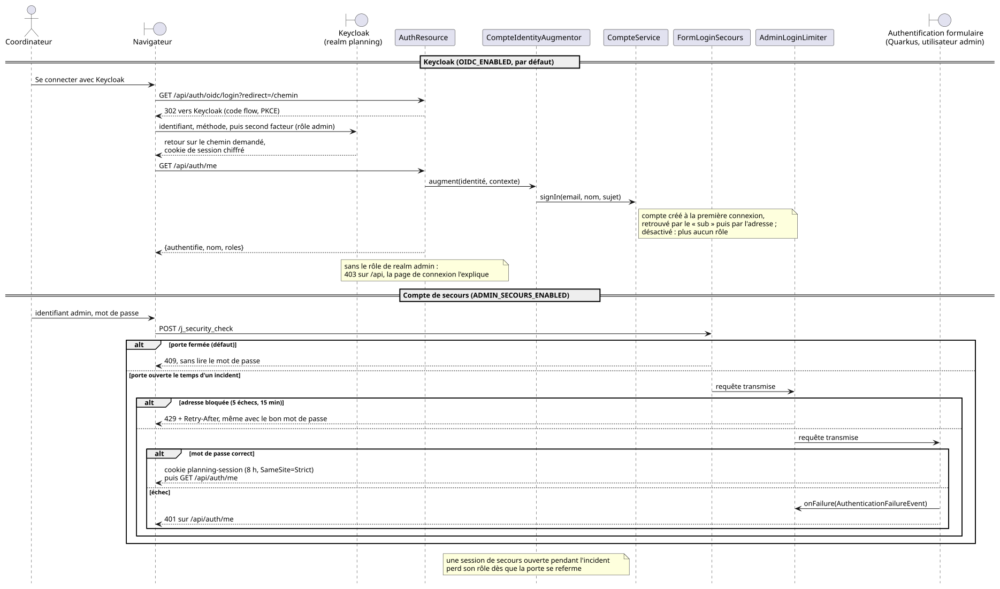
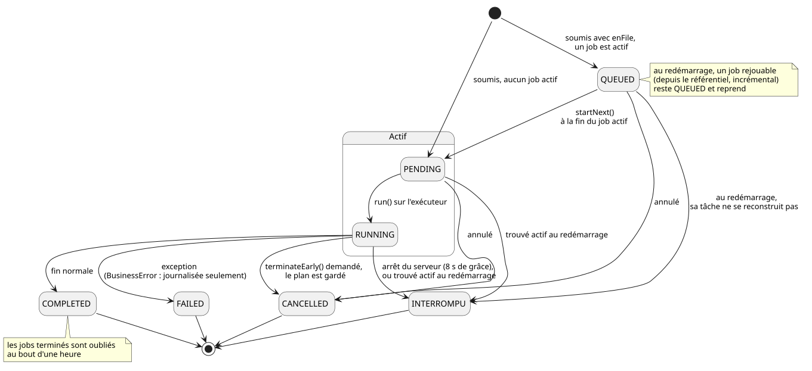
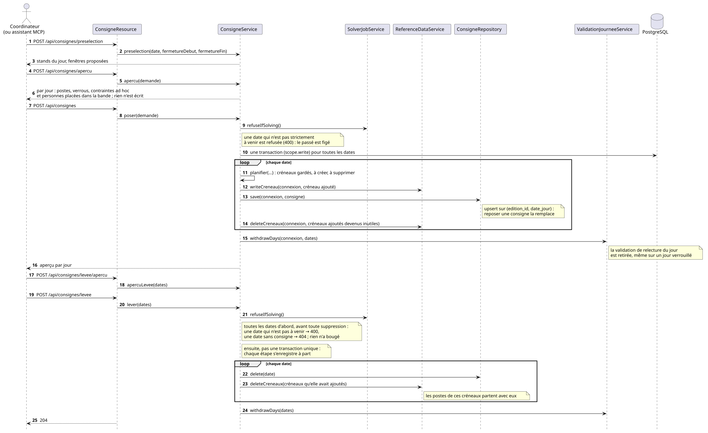
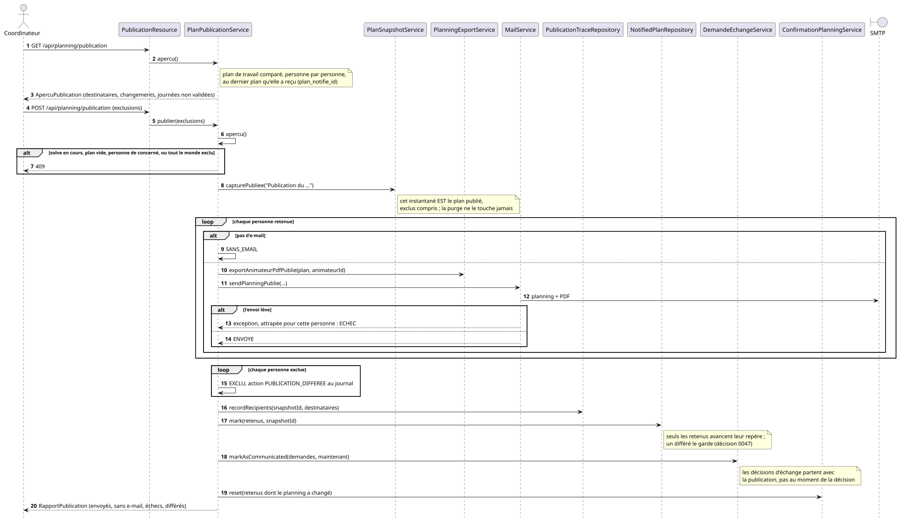
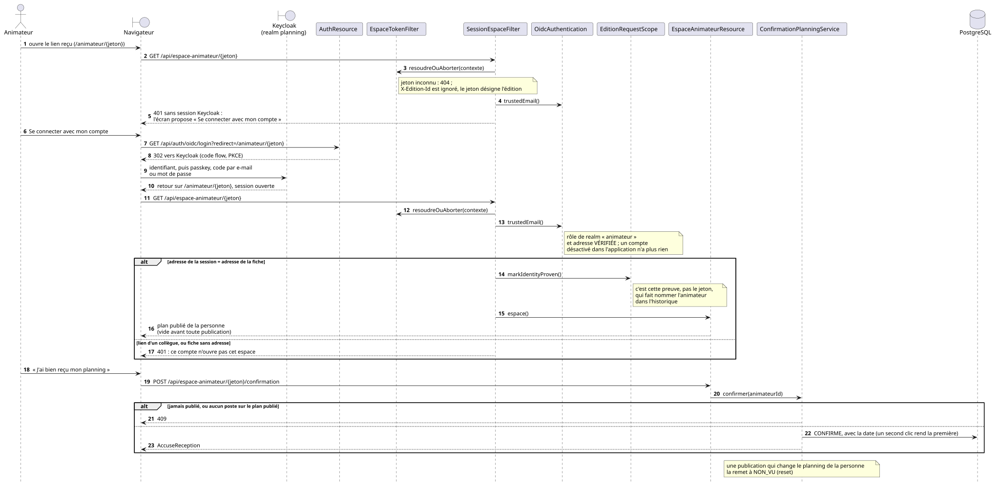
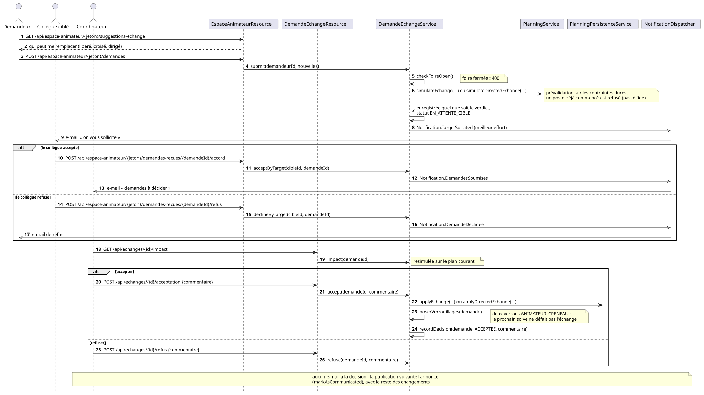
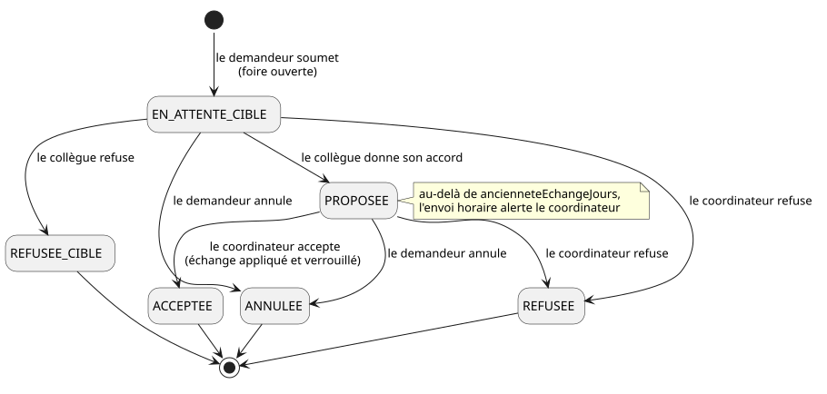
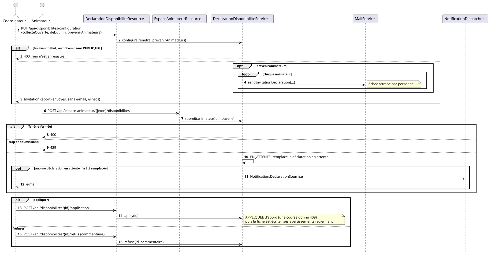

# API REST

Tout est sous `/api`, en JSON. **La liste des endpoints, leurs schémas et leurs
codes de retour sont dans la spécification générée** : `/q/openapi`, ou
`/q/swagger-ui` pour l'explorer. Ce document ne la recopie pas : il porte ce
qu'elle ne peut pas exprimer — les invariants transverses, les arbitrages
métier, et les pièges qui coûtent une demi-journée.

Le serveur MCP (`/mcp`) a sa propre porte et sa propre clé : [`mcp.md`](mcp.md).

## L'édition, désignée à chaque requête

Tout le référentiel est cloisonné par édition (« Année 2025 », « Année 2026 »),
et **rien ne circule de l'une à l'autre** — voir
[`decisions/0001-cloisonnement-par-edition.md`](decisions/0001-cloisonnement-par-edition.md).

Le client la désigne par l'en-tête `X-Edition-Id`, sur **tous** les endpoints
sauf le dump SQL (`/api/database/*`), qui ignore l'en-tête et emporte toutes les
éditions. Ce n'est pas pour autant une sauvegarde de la base : **six tables en
restent absentes**, et délibérément — l'horloge, les paramètres de sauvegarde,
les accès et sessions d'espace, la file de jobs et le journal d'actions. Elles
décrivent la machine, qui a le droit d'y toucher en ce moment, ou ce qu'on lui a
demandé de faire ensuite ; aucune ne décrit le jeu de données. Le journal est
dehors pour la raison inverse des autres : l'inclure ferait qu'un import
**efface** le journal local, puisqu'un dump supprime ce qu'il emporte.

La sauvegarde qui couvre tout, journal et sessions compris, est le `pg_dump` de
nuit ([ADR 0015](decisions/0015-sauvegarde-par-pg-dump-restauration-hors-application.md)).

Deux propriétés qui expliquent la plupart des surprises :

- un en-tête absent ou nommant une édition inconnue **retombe silencieusement**
  sur l'édition `defaut`, jamais une erreur — un onglet resté ouvert sur une
  édition supprimée continue de fonctionner. `GET /api/editions/courant` est la
  façon de découvrir que son en-tête a été ignoré ;
- ce n'est pas un état global : deux onglets travaillent sur deux éditions
  différentes en même temps.

Le verrou « un solveur à la fois » reste, lui, **global à l'instance**.

## Authentification

Toute l'API est réservée à la session admin, avec cinq exceptions
volontaires : l'espace animateur (le jeton d'URL est la clé), l'abonnement ICS
(`/api/abonnements/*`, voir plus bas), les routes de
session, `/api/config` et `/api/branding` — lus par le frontend avant son
démarrage, page de connexion comprise — et `/api/mentions-legales`. Un appel
non authentifié répond **401, jamais une redirection HTML**.



<sub>Source : [`diagrammes/authentification.puml`](diagrammes/authentification.puml).</sub>

Le form login `/j_security_check` répond `429` après cinq échecs depuis la même
adresse, **y compris avec le bon mot de passe** ([`securite.md`](securite.md)).

`POST /api/mcp/cle` échange le mot de passe admin contre la clé MCP : la
session ne suffit pas, parce que cette clé donne un accès complet en écriture et
**survit à la session** d'où elle a été copiée. La révélation doit être liée à
quelqu'un présent au clavier.

`GET /api/mcp/prompts` sert les prompts que le serveur MCP annonce — nom,
description, texte — pour que la page MCP les propose aux clients qui ne savent
pas les récupérer eux-mêmes. Rien de secret ici : c'est la session admin qui
protège la route, comme le reste de l'API. Elle existe pour que la page **ne
recopie pas** ces textes ; voir [`mcp.md`](mcp.md).

### Derrière un reverse proxy qui termine le TLS

Quarkus fabrique la redirection de connexion en **absolu**, depuis le schéma de
la requête reçue. Derrière un proxy qui termine le TLS, cette requête arrive en
clair : la redirection repartait en `http://`, que le navigateur refuse de
suivre depuis une page `https` — connexion impossible.

`PROXY_ADDRESS_FORWARDING` (**activé par défaut**) fait suivre les
`X-Forwarded-*` : schéma, hôte et chiffrement correspondent alors à ce que le
visiteur a demandé, et le cookie de session est marqué `Secure`. Sans proxy en
amont, rien ne change.

Deux compléments : `QUARKUS_HTTP_PROXY_TRUSTED_PROXIES` — **à renseigner si
l'origine est joignable sans passer par le proxy**, sinon n'importe quel client
annonce le schéma et l'adresse de son choix — et
`QUARKUS_HTTP_PROXY_ENABLE_FORWARDED_HOST` si le proxy réécrit `Host`.

### Mode « remote user » (facultatif, désactivé par défaut)

Pour un proxy d'accès qui authentifie lui-même ses visiteurs et transmet
l'adresse retenue. Le form login reste disponible en parallèle : une origine
atteinte directement, ou un proxy mal configuré, laisse toujours `/login`
utilisable. Variables `REMOTE_USER_*`.

**Le secret partagé n'est pas une option.** Un en-tête est une affirmation, pas
une preuve : sans lui, quiconque atteint l'origine sans passer par le proxy
devient administrateur en envoyant une ligne d'en-tête — et une origine
joignable en direct est l'état ordinaire (un port publié pour déboguer, une
seconde ingress, un réseau interne). Activer le mode sans secret **fait échouer
le démarrage**. Le secret doit voyager sur un en-tête que le proxy **écrase
inconditionnellement** en entrée.

Qui est qui : `REMOTE_USER_ADMIN_EMAIL` obtient le rôle admin ; **toute autre
adresse est un animateur**, et l'attestation du proxy remplace alors le code à
6 chiffres — c'est exactement le fait que ce code prouve, établi une étape plus
tôt. Le jeton reste nécessaire et doit désigner la fiche portant cette adresse :
l'attestation d'un animateur n'ouvre pas l'espace d'un collègue dont il aurait
ramassé le lien. Si l'adresse admin est aussi celle d'un animateur, l'admin
l'emporte et la personne perd son espace — collision signalée au démarrage.

## Résolution

Les quatre façons de lancer un solve — synchrone, asynchrone depuis un problème
envoyé, asynchrone depuis le référentiel, incrémentale — passent toutes par
`SolvePipeline` et font donc **toujours** la même chose : capturer le plan sur
le point d'être écrasé, construire le problème, résoudre, persister,
diagnostiquer, alimenter l'écran Contraintes, écrire la ligne de KPI, annoncer
la fin si l'édition l'a demandé.

Un chemin qui s'arrêterait avant la fin laisserait l'écran Contraintes sur
l'analyse du solve précédent, sans lever d'erreur : le seul symptôme serait un
écran qui ment. `SolveSynchronePipelineTest` verrouille les deux bouts.

**Le passé est figé** ([ADR 0044](decisions/0044-le-passe-est-fige.md)).
Pendant l'événement, chaque construction de problème depuis le référentiel
reprend du plan enregistré les places des créneaux déjà commencés — date
passée, ou aujourd'hui avec un début effectif atteint — et les épingle,
titulaire gardé même devenu indisponible, place vide restée vide. « Aujourd'hui »
est celui de [l'horloge du jour J](#figer-la-date-du-jour--développement-et-recette-uniquement).
Ces places comptent dans les règles et ne sont jamais reprochées ; le score
d'un solve pendant l'événement se lit donc sur ce qui reste à jouer. Un
problème envoyé dans le corps de la requête voit ses places passées épinglées
aussi, sans réamorçage : le serveur ne connaît pas le point de départ de
l'appelant. Une résolution dont **toutes** les places sont passées — édition
terminée, date simulée après l'événement — est refusée plutôt que de produire
un plan vide : le job finit `FAILED` avec « Rien à planifier : tous les
créneaux sont déjà commencés… » en `error`, sans être remonté comme une panne.
`PASSE_FIGE=false` coupe la règle.

**Un seul job de résolution à la fois pour toute l'application**, verrou porté
par le serveur. Toute autre session voit le même job actif via
`/api/jobs/active` et se voit refuser un second lancement en `409`, le corps
portant le job en cours.

### Budget de calcul

La durée et l'arrêt sur plateau d'une résolution sont **décidés par le
serveur, au lancement**, à partir de `GET /api/parametres-solveur` de
l'édition : un `null` y suit le défaut du déploiement
(`planning.solver.seconds-limit`, `planning.solver.unimproved-seconds-limit`),
que la réponse expose sous `instance` avec les deux plafonds de l'exploitant
(`SOLVER_SECONDS_LIMIT_MAX`, `SOLVER_UNIMPROVED_SECONDS_LIMIT_MAX`). L'écran
n'envoie donc plus de `?seconds=` : quiconque lance — écran, script, MCP —
obtient le même budget.

Trois pièges :

- **refuser n'est pas tronquer.** Une valeur au-dessus du plafond est refusée
  en `400` qui cite le plafond, à l'enregistrement comme sur un `?seconds=` ou
  un `secondes` MCP. Seule exception, voulue : une valeur **déjà enregistrée**
  quand l'exploitant abaisse le plafond tourne au plafond, et le job le dit
  (`cappedFromSecondsLimit` / `cappedFromPlateauSeconds` : la valeur coupée,
  que l'écran met en phrase dans la langue du lecteur ; `avertissement` en
  toutes lettres côté MCP) — l'édition n'a rien fait de mal.
  Le plafond ne vaut donc que pour une moitié que l'écriture **change** : un
  `PUT` qui renvoie la durée enregistrée telle quelle (l'interrupteur du mail
  de fin le fait) passe, même au-dessus. Un scénario importé s'enregistre tel
  qu'il est écrit, plafond compris, et tourne plafonné de la même façon ;
- **le plateau reste conditionné à la faisabilité** (sous-terminaison
  « faisable ET N secondes sans amélioration ») : il ne coupe jamais un calcul
  qui a encore des places à pourvoir. Il s'applique quelle que soit la durée de
  l'édition. Un `?seconds=` explicite sans plateau réglé par l'édition garde
  son sens historique, « exactement cette durée » : c'est ce qui tient le
  plateau de deux secondes du profil de test à l'écart des scénarios résolus
  avec un budget explicite plus long ;
- **un job garde le budget de son lancement.** Il est résolu à la soumission,
  persisté avec la file (`plateau_seconds` à côté de `seconds_limit`) et rejoué
  tel quel après un redémarrage ; un réglage changé pendant l'attente vaut
  pour le suivant. La replanification incrémentale garde sa durée propre
  (60 s sans `?seconds=`), sous le même plafond, avec le plateau de l'édition.

### Volumétrie du problème

`GET /api/planning/volumetrie` (et l'outil MCP `volumes`) décrit le problème
que la prochaine résolution construirait, calculé sur ce problème même — jamais
sur un produit stands × créneaux :

| Clé | Ce qu'elle compte |
| --- | --- |
| `animateurCount` | les valeurs possibles d'un poste, au sens Timefold |
| `posteCount` | les entités : un poste par siège à pourvoir |
| `contrainteAdHocCount` | les ajustements manuels appliqués par-dessus |
| `hoursToFill` | la somme des durées effectives des postes, fermetures de stands déduites — la base de l'écran Heures |
| `hoursAvailable` | le plafond légal de ce que les animateurs peuvent travailler sur les jours de l'événement : par animateur et par semaine ISO, les jours où il n'est pas indisponible (six au plus), chacun au plafond quotidien de son âge ce jour-là, le tout borné par le plafond hebdomadaire des paramètres légaux |

Le rapport des deux dernières est un taux de remplissage. C'est un plafond,
pas une prévision : compétences, repos entre vacations et règle de pause en
retranchent encore, si bien qu'un taux proche de 1 annonce déjà un planning
infaisable. Les postes ne dépendent que des stands et des créneaux : ils sont
comptés avant la saisie d'aucun animateur (`hoursAvailable` vaut alors zéro),
et tout est à zéro sans stand ou sans créneau. Même règle pour
`GET /api/staffing` (et `analyser_effectifs`), dont `referentielsManquants`
nomme ce qui n'est pas encore saisi, et à l'inverse pour `GET /api/feasibility`
et `GET /api/fragilite` : sans aucun animateur, rien n'est réalisable, et les
deux rapports le disent explicitement plutôt que de ne détecter aucun problème.
`GET /api/feasibility` dit de même, avec son propre message, une édition **sans
créneau** et une édition dont **aucun stand n'ouvre** sur les créneaux : rien à
pourvoir n'est pas un feu vert. Et sa capacité par créneau ne compte un mineur
qu'aux côtés d'un majeur, hors de sa nuit légale, d'un jour férié et des stands
réservés aux majeurs — une équipe de mineurs seuls n'y couvre plus rien.

### File d'attente



<sub>Source : [`diagrammes/job-etats.puml`](diagrammes/job-etats.puml).</sub>

`enFile=true` met la tâche en file au lieu de la refuser. Trois propriétés :

- **le problème est construit au démarrage effectif**, pas au clic : on peut
  continuer à préparer l'édition visée entre-temps ;
- **une tâche en file ne tient pas le solveur** : la saisie reste ouverte sur
  l'édition visée, le verrou de saisie étant par édition ;
- **un doublon est refusé en `409`** — même édition, même type, *déjà
  planifié*. Planifier une résolution de l'édition **en cours de calcul** reste
  autorisé : le calcul en cours a démarré avant les dernières corrections, en
  planifier un autre est la façon de dire « refais-le avec ce que je viens de
  corriger ».

FIFO. Statuts : `QUEUED` → `PENDING` → `RUNNING` → `COMPLETED` / `FAILED` /
`CANCELLED` / `INTERROMPU`.

### Point de départ d'une résolution complète

`POST /api/solve/async/reference-data?reamorcage=AUTO|PLAN_COURANT|AUCUN`
(#174). `AUTO`, le défaut, **repart du plan enregistré** s'il en existe un et
part de zéro sinon ; `PLAN_COURANT` l'exige et fait échouer le job quand il
n'y a rien d'où repartir ; `AUCUN` est le départ à froid, par son nom. Une
valeur inconnue répond `400`.

Repartir du plan, ce n'est **pas** l'épingler : chaque siège reçoit
l'animateur que le plan lui donnait et reste mobile, seuls les verrouillages
explicites sont figés. C'est ce qui distingue ce réamorçage de la
replanification incrémentale, qui fige tout ce qui reste valable. Le solveur
score la solution de départ en premier et conserve la meilleure qu'il ait
vue : à données égales, le résultat ne descend jamais sous le plan de départ.

Pourquoi le défaut n'est pas le départ à froid, y compris pour un script ou
un assistant : mesuré sur une édition réelle (3 499 postes, 600 s), un solve
à froid a fini **1 202 points de medium sous** le plan déjà en base, quand le
réamorçage l'a conservé et amélioré de ~3 %. Le départ à froid est le cas qui
détruit l'acquis, il se demande. Un siège dont le titulaire a disparu, ou qui
s'est déclaré indisponible depuis, repart vide — semer une violation que le
solveur devrait d'abord défaire est un moins bon départ qu'un trou. Un plan
de départ infaisable n'achète aucun raccourci : la terminaison sur
faisabilité ne se déclenche pas, le budget est consommé en entier.

Chaque résultat porte aussi `impactPublication: { personnes, publieLe }` —
combien de personnes verraient leur emploi du temps changer par rapport au
dernier plan publié, compté comme la publication le compte — ou `null` tant
que rien n'a été publié. C'est le compte à lire avant de publier ; la règle
`stabiliteDuPlanPublie` (voir [`contraintes.md`](contraintes.md#stabilité-du-plan-publié))
est ce qui le tient bas.

Le choix est **persisté avec le job** (`solver_job.reamorcage`, V68) : une
résolution en file rejouée après un redémarrage démarre comme on le lui avait
demandé. Le résultat le restitue — `reamorcage: { mode, postes, postesLiberes, postesPasses, postesPassesVides }`,
où `mode` vaut ce qui a été fait (`PLAN_COURANT` ou `AUCUN`, jamais `AUTO`,
et `reamorcage` est absent quand le problème est venu dans le corps de la
requête : son point de départ est celui de l'appelant, que le serveur ne peut
pas nommer)
— à côté de `previousPlan`, qui dit si le plan remplacé était meilleur.
`postesPasses` compte les places des créneaux déjà commencés, épinglées
telles que travaillées quel que soit le mode, départ à froid compris
([ADR 0044](decisions/0044-le-passe-est-fige.md)) ; 0 tant que l'événement
n'a pas commencé. `postesPassesVides` compte, parmi elles, celles qui ne
tiennent personne — un premier calcul lancé pendant l'événement les a toutes
vides — : un avertissement sur le compte rendu, jamais un point dur. Les
deux sont absents d'un résultat enregistré avant la règle. La même brique servira la reprise d'un job `INTERROMPU`
(#183) : elle n'est spécifique à aucun écran.

### La file survit au redémarrage

Ce qui est persisté (`solver_job`) est l'**intention** — type, budget, édition,
périmètre —, jamais l'état du solveur Timefold. C'est suffisant précisément
parce qu'une tâche en file construit déjà son problème au démarrage.

Deux conséquences :

- **le calcul en cours est perdu** : le job revient en `INTERROMPU`, un état
  terminal, pour ne pas garder le verrou global indéfiniment ;
- **le résultat d'un job n'est pas stocké** : un job restauré expose
  `result: null`. Ce qu'il décrivait est déjà en base.

Désactivable par `planning.jobs.reprise-au-demarrage=false`.

### Un arrêt du serveur n'écrase pas le plan

Le cas ci-dessus est celui de la JVM qui meurt. Quand c'est le conteneur qui
s'arrête **sous** un calcul en cours — arrêt gracieux de l'application, live
reload en développement —, Timefold rend sa meilleure solution du moment comme
si le budget était épuisé. Ce résultat n'est pas un calcul abouti, et il est
traité comme tel :

- le job finit `INTERROMPU`, jamais `COMPLETED`, avec un message `error` qui
  dit ce qu'il est advenu du plan partiel ;
- ce plan partiel **ne remplace le plan enregistré que s'il le bat
  strictement** (dur, puis medium, puis soft) — ou s'il n'y avait aucun plan.
  Un calcul de quelques secondes interrompu par un redémarrage ne défait
  donc plus un plan à 0 dur ;
- `result.interruption: { partialPlanKept, partialScore, persistedScore }`
  porte la même information pour un script ; ni ligne d'historique KPI, ni
  courriel de fin de résolution ne sont produits quand le plan est écarté.

Le serveur laisse au solveur quelques secondes pour s'arrêter et écrire ce
verdict ; un calcul qui ne les respecte pas est retrouvé `RUNNING` au
démarrage suivant et passe par le cas précédent.

### Suivi poussé, et pourquoi le polling reste

`GET /api/jobs/stream` pousse en *server-sent events* l'agrégat
`{ active, file }`. Le premier événement **arrive à la connexion**, sans
attendre une transition : un solveur au repos n'en produirait aucune, et un
client resterait sur « état inconnu ». Chaque événement est un instantané
entier, jamais un delta.

Un `heartbeat` toutes les 20 s porte aussi la ligne `:keep-alive`, sans
laquelle un proxy inverse ferme une connexion silencieuse. Le commentaire seul
n'aurait pas suffi : `EventSource` ne l'expose jamais au JavaScript, il ne peut
donc pas servir de preuve de vie.

**Le flux ne remplace pas le polling, il le double** : SSE échoue en silence
(proxy qui bufferise, coupure non reconnectée) et l'IHM resterait figée sur un
état périmé sans rien signaler. Le navigateur garde un poll lent (30 s) et
reprend la main après ~45 s de silence.

### Courbe de score en direct

Le même flux porte un troisième type d'événement, `score` : les points
(temps écoulé, hard, medium, soft) que Timefold annonce déjà par son
`bestSolutionChanged`. `GET /api/jobs/score` rend la même courbe d'un bloc.

**Ce qui est tracé est la résolution en cours** — ou la dernière, jusqu'à ce
que la suivante la remplace. Rien n'est persisté : un redémarrage oublie tout,
et rejouer les solves passés est hors périmètre.

### Pourquoi la durée voyage à part des points

Timefold ne déclenche `bestSolutionChanged` **que lorsque le meilleur score
s'améliore strictement**. Une résolution qui plafonne cesse donc de produire
des points — et c'est exactement l'état que l'écran existe pour montrer. Une
courbe normalisée sur ses seuls points toucherait toujours le bord droit : un
solve dont la dernière amélioration date de t=200 s sur un budget de 900 s se
dessinerait comme s'il progressait encore.

D'où `dureeMs`, mesuré à l'horloge et non aux événements : c'est le bord droit
de la courbe. Le navigateur y prolonge la dernière valeur à plat — ce segment
*est* le plateau — et en déduit depuis combien de temps chaque niveau ne bouge
plus. L'alternative (ajouter un point « rien de neuf » chaque seconde) mettrait
le plateau dans la série au prix d'un ordonnanceur, de mémoire et de points sur
le fil qui ne portent aucune information. `dureeMs` est **figé à la fin du
run**, pour qu'une courbe laissée à l'écran cesse de s'élargir.

Conséquence sur le flux : **une résolution en cours émet un événement à chaque
tick, même sans nouveau point** — c'est `dureeMs` qui bouge. L'événement est
alors minuscule (`points: []`). Une courbe terminée, elle, se tait.

### Deux bornes d'échantillonnage

Un solve annonce bien plus d'améliorations par seconde qu'une courbe n'a de
pixels. **Deux bornes, toutes deux côté serveur** :

| Borne | Effet |
| --- | --- |
| un point par seconde au plus | c'est **le plus récent** de la fenêtre qui est retenu, jamais le premier — le score ne fait que s'améliorer |
| 400 points au plus | au-delà, la série est **divisée par deux** et l'intervalle d'échantillonnage double avec elle |

Un solve de 15 min et un de 4 h coûtent donc la même mémoire et le même volume
sur le fil, et la courbe garde sa forme. Les annonces portant une solution
**non encore initialisée** sont ignorées : leur score décrit une affectation
partielle — un planning aux trois quarts vide ne viole presque rien — et les
tracer dessinerait une falaise au moment précis où le plan devient complet.

Les événements `score` sont des **deltas**, seuls voyagent les points que cette
connexion n'a pas encore reçus. `depuis` est l'indice du premier point envoyé :
`0` veut dire « remplace ce que tu as » (connexion neuve, nouvelle résolution,
série qui vient d'être divisée), toute autre valeur « ajoute à cet indice ».
`generation` bouge dès que la série cesse d'être une extension de elle-même,
c'est ce qui rend la lecture incrémentale sûre. Un tick sans rien de neuf
n'émet rien du tout.

**Cloisonnement.** `EventSource` ne peut pas poser d'en-tête, donc le flux n'a
pas d'édition : chaque événement `score` porte l'`editionId` de la résolution
et le navigateur n'affiche la courbe que si c'est la sienne — exactement ce
qu'il fait déjà de `JobView.editionId`. La lecture qui, elle, porte un en-tête
— `GET /api/jobs/score` — applique le filtre **côté serveur** et répond `204`
pour une courbe d'une autre édition. C'est elle que la page Solveur appelle à
son ouverture.

**Un événement `score` sans `jobId` veut dire « il n'y a plus de courbe »**,
et il est envoyé une fois par connexion. Le cas visé est un redémarrage : le
client tient une courbe dont le dernier événement disait `termine: false`, le
serveur auquel il se reconnecte n'a plus de trace, et le silence laisserait ce
graphe à l'écran comme s'il était vivant — pour une résolution que le serveur
rapporte déjà en `INTERROMPU`.

La courbe se ferme à la fin du job, dans les trois cas — succès, échec,
annulation à la main : le dernier score annoncé est ajouté même si la fenêtre
d'échantillonnage n'était pas écoulée, `dureeMs` est figé, et `termine` passe à
`true`. Un job annulé **avant même que son solveur démarre** ne touche pas à la
courbe : ouvrir une trace vide effacerait celle du run précédent, et l'écran
annoncerait « pas encore de première solution » pour une résolution déjà
terminée.

Réglage : `planning.jobs.stream.score` (1 s par défaut,
`JOBS_STREAM_SCORE`).

### Replanification incrémentale

Repart du plan persisté, épingle ce qu'un changement tardif n'a pas invalidé,
ne recalcule que le reste. Le corps est facultatif et **élargit** le périmètre :
les trois axes (`animateurIds`, `jours`, `standIds`) sont une **union**. Sans
corps, le périmètre est ce que les changements ont invalidé plus les postes
vides.

Budget par défaut court (60 s), pas celui d'une résolution complète. Le job
échoue explicitement s'il n'y a aucun plan à reprendre : la replanification part
d'un résultat, pas de rien. Mécanique dans
[`domaine.md`](domaine.md#replanification-incrémentale).

Les places des créneaux déjà commencés sont réglées **avant** le périmètre :
épinglées telles que travaillées, jamais rouvertes — `jours` nommant une
journée passée ne rouvre rien — et comptées à part dans
`statistiques.postesPasses`, celles restées vides dans
`statistiques.postesPassesVides` ([ADR 0044](decisions/0044-le-passe-est-fige.md)).
Une replanification dont toutes les places sont passées est refusée comme la
résolution complète.

### Instantanés et comparateur A/B

Un seul plan est persisté à la fois par édition. Les instantanés sont la seule
persistance capable d'en garder plusieurs.

**Un instantané est pris automatiquement avant chaque solve** — c'est le vrai
filet anti-écrasement, celui qui protège l'utilisateur qui n'a pas pensé à
enregistrer. Les automatiques sont purgés au-delà des N derniers (5 par
défaut) ; ceux créés à la main, jamais.

**Le résultat d'un solve nomme cet instantané et le score qu'il porte**
(`previousPlan : { snapshotId, score, degraded }`). Un solve n'annonçait que
son propre score : relancer une résolution sur une édition qui avait déjà un
bon plan pouvait le dégrader sans que rien ne le dise, le score dur restant à
zéro. `degraded` compare les deux scores dans l'ordre de Timefold — dur, puis
medium, puis souple — et vaut `false` dès qu'un des deux scores manque ou est
illisible : mieux vaut ne rien affirmer qu'une fausse alerte. `previousPlan`
est `null` au premier solve d'une édition, et absent des résultats produits
avant cette version.

Le score d'un instantané est copié à la capture depuis la dernière analyse, qui
vit en mémoire : après un redémarrage, elle est vide, et la première lecture la
redérive du plan persisté — une analyse par édition et par redémarrage (voir
*Rafraîchir l'analyse* plus bas). La capture la trouve donc en place. Quand elle
manque quand même — l'analyse n'a pas pu être produite —, le solve suivant
rétablit ce score en analysant le plan persisté avant de le remplacer et l'écrit
dans l'instantané, devant un calcul qui va durer des minutes.

**Deux plans calculés sous des dosages différents ne se comparent pas à poids
égaux** : `dosagesDifferents` le dit quand les deux `kpi.dosage` sont connus et
diffèrent, et l'écran liste les règles en cause. Une restauration remet le plan
avec le dosage sous lequel il avait été calculé.

Une restauration répond `409` **sans rien écrire** si des références ont
disparu, en listant lesquelles. Elle répond aussi `409` — même corps que les
écritures du référentiel, le job en cause nommé — tant qu'une résolution tient
le solveur **de cette édition** : le solve écraserait en se terminant le plan
qu'on vient de remettre en place. La garde est dans le service, pas dans
l'écran : l'API et l'outil MCP `restaurer_instantane` la partagent. Une
résolution sur une autre édition ne refuse rien.

**Un instantané dit s'il est encore à jour** (`perime`, `referenceModifieLe`).
Le référentiel d'une édition porte la date de sa dernière mutation
(`edition.reference_modifie_le`, écrite par `ReferenceDataChangeTracker` que
tous les services de référentiel appellent déjà) ; un instantané capturé avant
elle est périmé. La date est **persistée**, pas tenue en mémoire comme le
bandeau `dataStale` du shell : après un redémarrage une carte vide se lirait
« jamais modifié », donc « à jour », et c'est précisément devant un bouton
*Restaurer* qu'un « à jour » faux coûte le plus cher (ADR
[0038](decisions/0038-fraicheur-du-referentiel-persistee.md)). La reprise de
l'existant se fait à la migration, depuis le `max(modifie_le)` des six
référentiels et le `cree_le` des verrouillages ; une bascule de contrainte ou un
poids ne portant aucune date, une édition qui en a un prend l'instant de la
migration — ses instantanés antérieurs passent « périmés », sens prudent. Restent
hors d'atteinte, et seulement pour les éditions existant au déploiement : une
fiche supprimée (aucune ligne, donc la date reprise est celle de la dernière
écriture *survivante*) et les paramètres légaux ou solveur, dont la ligne est
créée d'office pour chaque édition.

Restaurer un instantané périmé répond donc `409` avec `perime: true` et la date
en cause, **sans rien écrire**, et le geste se rejoue avec `?forcer=true` :
c'est une question, pas un mur — le plan est restaurable, il ne décrit
simplement plus le référentiel d'aujourd'hui. `forcer` ne lève que ce
refus-là : une référence disparue reste refusée, et elle est vérifiée en
premier, un instantané étant le plus souvent périmé *parce que* des ids ont
disparu — nommer lesquels est la seule information actionnable. La fraîcheur se
lit par instantané et non pour l'édition courante, puisque `/comparables`
traverse les éditions.

**Un instantané peut porter l'état « publié »** (`publieLe`). C'est le plan que
les animateurs ont reçu, et celui que leur espace affiche — voir *Publication*
ci-dessous. Un instantané publié sort de la purge de rétention.

**Seule la *dernière* publication refuse d'être supprimée** (`409`) : c'est elle
que l'espace lit, et la supprimer reprendrait sans un mot ce qui a été annoncé.
Une édition publie autant de fois qu'elle en a besoin, et les publications
qu'une autre a remplacées ne sont plus lues par personne : elles se suppriment
comme n'importe quel instantané. Les protéger toutes — ce que faisait le
prédicat `publie_le IS NULL` — rendait l'écran inutilisable dès la deuxième
publication (issue #34). L'écran Instantanés le dit avant le clic : badge
« plan publié » sur celle en cours, bouton *Supprimer* désactivé avec le motif,
badge « publié, remplacé » sur les précédentes.

Le repère de comparaison d'une personne différée (`plan_notifie_id`, issue #503)
peut désigner une de ces publications : la supprimer la fait relire comme
« jamais prévenue », et sa prochaine publication lui annoncera son planning
entier au lieu de ses seuls écarts. C'est le comportement assumé depuis la V97 —
une référence disparue retombe sur « rien à comparer » plutôt que d'inventer un
plan.

La comparaison A/B **ne déclenche aucune résolution** : elle lit des KPI
mesurés à la capture, jamais un score recalculé. `editionsDifferentes` n'est
**pas** une anomalie — depuis la suppression des groupes de créneaux, une
variante *est* une autre édition — mais l'IHM doit le dire. Dans `diffViolations`,
`null` signifie **non mesuré**, jamais zéro. `kpiRecalcule` marque le mode
dégradé d'un instantané qui ne porte pas de KPI stockés : couverture et
volumétrie exactes, écarts non mesurés.

**Un instantané porte les consignes en vigueur à sa capture** (`consignes` :
par date, la bande et le motif). `null` sur un instantané antérieur veut dire
**inconnu**, jamais « aucune » ; un tableau vide dit qu'il n'y en avait pas.
Le comparateur en tire `consignesDifferentes`, et le laisse à `false` dès
qu'un côté ne sait pas : une différence de sièges ou d'heures vient alors
d'une bande qu'un arrêté a fermée, pas d'un réglage du solveur.

## Consignes

Une consigne ferme une bande horaire pour **tous** les stands d'une date, et
rouvre ceux qu'on nomme sur des fenêtres de compensation ; le modèle est dans
[`domaine.md`](domaine.md#consigne-dédition--la-quatrième-couche), le
raisonnement dans
[ADR 0043](decisions/0043-consigne-d-edition-fermer-une-bande-sans-rien-detruire.md).
Ce qui suit est ce que le schéma ne dit pas.



<sub>Source : [`diagrammes/consigne.puml`](diagrammes/consigne.puml).</sub>

**Jours à venir seulement.** Poser, modifier et lever refusent (`400`) une
date qui n'est pas strictement après *aujourd'hui* — et *aujourd'hui* est
celui de l'horloge du jour J, donc de la date figée par
`/api/debug/date-du-jour` en développement et en recette (voir
[*Figer la date du jour*](#figer-la-date-du-jour--développement-et-recette-uniquement)).
`GET /api/consignes` renvoie `aujourdhui` pour que l'écran calcule la même
frontière que le serveur. Une date déjà travaillée garde pour toujours la
consigne qui l'a gouvernée ; une date sans créneau est refusée (« rien à
fermer ce jour-là »).

**La même requête pose, remplace ou prolonge.** `POST /api/consignes` prend
des dates ; une date qui ne portait rien reçoit la consigne, une date qui en
portait une la voit **remplacée en place** (`dejaSousConsigne` dans l'aperçu),
et prolonger une alerte est le même appel avec des dates en plus. Un créneau
que la consigne précédente avait ajouté est conservé — avec ses sièges —
quand une fenêtre l'exige encore exactement, retiré sinon
(`creneauxARetirer`). Les heures s'acceptent en `HH:mm` ; une fin absente ou
à `00:00` se lit « jusqu'à minuit », et **s'enregistre comme fin ouverte** —
la bande, une fenêtre par défaut, une ouverture : `00:00` écrit, `null` relu,
sur l'écran, en MCP et à l'import de scénario pareillement. Les tables ne
connaissent que cette forme. Les dates d'une même requête s'écrivent en **une
seule transaction** : un arrêté sur cinq jours dont la troisième date échoue
ne laisse rien des deux premières.

**L'aperçu vaut validation complète, sans écriture.** `POST /api/consignes/apercu`
rejoue toute la validation de la requête — bande, motif, fenêtres hors de la
bande, stands connus, effectifs sous le maximum du stand, un stand par
fenêtre — et rend une ligne par date. **L'effectif est celui de l'ouverture**,
pas du stand : un même stand rouvert le matin à 2 et le soir à 7 porte deux
ouvertures, chacune avec le sien ; absent, il hérite du plus fort effectif que
le stand perd dans la bande, sinon de son minimum. L'aperçu rend : sièges et minutes avant et après,
créneaux à ajouter et à retirer, vacations qui perdent leurs sièges, stands
entrants et sortants, exceptions cochées, mineurs et majeurs disponibles,
validation retirée, verrous et règles ad hoc qui nomment une vacation de la
bande, personnes du plan enregistré assises dans la bande. `POST /api/consignes`
renvoie le même aperçu, **calculé avant l'écriture** : une fois les créneaux
ajoutés, rien ne les distingue plus de la grille nominale. `creneauxDuJour`
est là pour lever une ambiguïté : une date où l'édition n'a pas de grille se
lirait sinon comme une date que la consigne a vidée. Les deux écritures sont
refusées (`409`) pendant une résolution de l'édition, comme celles du
référentiel.

**La pré-sélection écarte sans interdire.** `POST /api/consignes/preselection`
propose cochés les stands qui perdent des minutes dans la bande ; un stand qui
a posé ses horaires **à la main** ce jour-là (`exceptionDatee`, avec son
`motif`) est écarté mais reste cochable — quelqu'un a décidé quelque chose
pour cette date, et la consigne ne le contredit pas en silence. La liste est
recalculée à chaque ouverture du formulaire, jamais reprise par inertie ;
`ouvertures` dit ce que la consigne existante de la date ouvre déjà sur ce
stand.

**Lever supprime les créneaux ajoutés, avec leurs sièges.** C'est la seule
suppression de toute la fonctionnalité, et elle est annoncée :
`POST /api/consignes/levee/apercu` nomme les vacations qui partent et compte
les personnes qui y sont assises, et la publication suivante les dit
« retirées » depuis l'instantané publié, comme toute vacation disparue de la
grille. Les vacations nominales de la bande, elles, n'ont jamais bougé : elles
retrouvent leurs sièges à la levée, et la stabilité du plan publié rend
l'après-midi à son titulaire à la résolution suivante.

**Poser ou lever retire la validation de relecture** des journées touchées,
**verrou ou non** — là où une résolution la conserve sur une journée
verrouillée ([*Publication*](#publication), ADR 0039). Un verrou fige des
sièges ; ceux de la bande n'existent plus. L'aperçu le dit
(`validationRetiree`).

**`POST /api/planning/reset` efface aussi les consignes et les préréglages**
de l'édition, comme tout ce qu'un solve reçoit. L'export et l'import de base
les emportent ([`import-export.md`](import-export.md#dump-sql)).

**Les préréglages sont copiés à la duplication d'édition, les consignes
non.** Un préréglage (« Plan canicule ») décrit la forme de l'événement ; une
consigne appartient aux jours d'une édition, comme le plan. Le nom du
préréglage porté par une consigne est un nom, pas une clé : supprimer le
préréglage ne réécrit pas l'histoire des dates qu'il a gouvernées. Son `id`
est **facultatif à la création** (`POST /api/consignes/prereglages`, comme
dans un fichier de scénario) : le serveur en frappe un, et tout ce qui est
relu en porte un.

**Le motif atteint la personne dont la bande vide la journée.** Les lignes
« journées aux horaires modifiés » du courriel de publication sont lues sur
les dates où la personne tient un siège dans le plan publié **ou dans celui
qu'il remplace** ; l'espace animateur et le PDF individuel portent le motif
sur ses jours de repos aussi. Sans cela, quelqu'un dont l'arrêté a fermé
toute la journée lisait une « vacation retirée » nue — le repos d'une
personne et la décision d'une autorité sont deux choses.

**`GET /api/consignes` porte aussi les indicateurs.** Une ligne par journée
sous consigne — sièges nominaux et sous consigne, minutes fermées, minutes
rouvertes, animateurs concernés — lue sur les sièges, jamais sur la saisie ;
`animateursConcernes` compte les personnes du plan enregistré qui tiennent un
siège ce jour-là. Le KPI du plan en dérive `journeesSousConsigne` et
`heuresFermeesParConsigne`, `null` sur une mesure antérieure à la colonne.
`GET /api/journees-types` renvoie `datesSousConsigne` : ces dates ne sont ni
« en écart » ni touchées par une application, puisque les créneaux ajoutés
par une consigne appartiennent à la consigne.

**Une consigne peut porter ses propres fenêtres repas** (`repas` sur la
consigne, la demande et le préréglage : `midiDebut`/`midiFin`,
`soirDebut`/`soirFin`, `coupureMinutes`, `justification`). Chaque champ
absent garde la valeur de l'édition ; une fenêtre se donne avec ses deux
bornes ou aucune, **et doit contenir la coupure** — celle de la consigne,
sinon celle de l'édition : un soir 19 h-19 h 30 sous une coupure de 60 min
est refusé (`400`), car le solveur écarte une fenêtre trop courte pour sa
coupure comme intenable, et la date se retrouverait sans aucune règle au
lieu d'une règle plus stricte ; la `justification`, en termes métier, est
obligatoire dès qu'un champ est renseigné (`400` sinon) et s'affiche à côté
de la journée.
La surcharge est **datée par construction** : elle ne gouverne que la date de
la consigne — le solveur, les écrans Pauses, Besoin et Intendance et le
contrôle de grille lisent, ce jour-là, la fenêtre de la consigne et, les
autres jours, celle de l'édition — et elle part avec la consigne à la levée.
`GET /api/parametres-legaux` ne bouge jamais : rien à remettre en place, rien
à oublier. Seules les fenêtres repas sont surchargeables — la coupure repas
est la règle de l'organisateur ; les plafonds légaux (repos quotidien,
durées, jours par semaine) restent hors d'atteinte d'une consigne. Le cas
d'usage est le soir de canicule : une compensation 18 h-22 h derrière un
14 h-20 h devenu 18 h-20 h demanderait deux personnes par siège sous la
fenêtre 19 h-21 h de l'édition ; « soir 18 h-22 h, les équipes mangent
pendant la fermeture » ramène le besoin à une personne par siège.

## Publication

`GET /api/planning/publication` — qui serait prévenu, et ce qu'il lirait.
N'envoie rien. `POST` publie.



<sub>Source : [`diagrammes/publication.puml`](diagrammes/publication.puml).</sub>

Publier, c'est **marquer le plan de travail comme le plan communiqué** et
n'écrire qu'aux personnes dont l'emploi du temps a changé depuis la dernière
publication. Le décompte est **par personne** : renommer un stand ne réveille
personne, échanger deux vacations réveille exactement deux personnes. Chaque
destinataire arrive avec les phrases exactes de son courriel (`changements`),
que l'administrateur relit **avant** tout envoi.

L'aperçu se lit **à la demande** : rien n'est poussé, rien n'est scruté. Le
seul garde-fou est de concurrence, pas de temps — publier pendant un solve
figerait un plan sur le point d'être réécrit, donc `409`. Idem quand personne
n'est concerné (`409`) : ce n'est pas une erreur à contourner, c'est le but.

`premiereDiffusion` distingue quelqu'un à qui rien n'a jamais été envoyé : son
planning entier est la nouvelle, pas une liste de corrections. Tant que
`jamaisPublie` vaut `true`, **l'espace animateur est vide** — l'application ne
peut pas prétendre avoir communiqué un plan qu'elle n'a pas envoyé.

Un envoi qui échoue ne revient **pas** dans le décompte suivant : le compteur
mesure ce qui a changé, pas ce qui a été délivré. Le rapport nomme les manqués,
et `POST /api/planning/envoi/animateur/{id}` est le rattrapage — il renvoie le
plan **publié**, refusé (`400`) tant que rien ne l'a été.

### Différer le message de quelqu'un

Le `POST` prend un corps JSON — `{"exclusions": ["id", …]}` — et **demande
désormais un `Content-Type: application/json`**, là où il acceptait n'importe
quoi : la liste est de longueur libre, et un id d'animateur est fourni par le
client, donc ni un séparateur ni une URL n'est un endroit sûr pour la porter.
Un corps vide suffit à dire « je n'exclus personne ».

Ce que l'exclusion fait, et ce qu'elle ne fait pas (ADR 0047) : elle **diffère**
le message, elle ne le supprime pas. La capture a lieu pour tout le monde —
l'espace suit le plan publié —, mais le **repère de comparaison de la personne**
(`animateur.plan_notifie_id`) ne bouge pas. La publication suivante la nomme à
nouveau, avec l'écart cumulé depuis ce qu'elle a réellement reçu, et
`reporte` vaut `true` sur sa ligne d'aperçu. Exclure *tous* les destinataires
est un `409` : publier sans prévenir personne n'a pas de sens.

Chaque ligne d'aperçu porte de quoi trier et filtrer sans lire de français :
`ajouts`, `retraits`, `deplacements`, et `mineur` — la même vacation, sur le
même stand, glissée d'un quart d'heure au plus, sans décision d'échange en
attente. `mineur` est un **critère de lecture**, jamais une exclusion
automatique : décider de ne pas prévenir quelqu'un est un acte.

`GET /api/planning/publication/export` rend la même liste en CSV, une ligne par
personne, les phrases dans une cellule.

`GET /api/planning/publication/destinataires` rend la trace : qui a été prévenu
de quoi, et quand, y compris ceux qu'on n'a pas pu joindre (`SANS_EMAIL`,
`ECHEC`). Sans paramètre, celle de la dernière publication ; liste vide quand
il n'y en a jamais eu.

La trace **range les deux moitiés du message séparément** — `changements` pour
l'emploi du temps, `demandes` pour les échanges — comme l'aperçu les a toujours
distinguées. Ce n'est pas un détail de forme : elles ne vieillissent pas
pareil. Une phrase d'emploi du temps dit ce qui a été annoncé et le dira
toujours ; « votre demande est en attente de décision » cesse d'être vraie
**dès que l'organisation tranche**, sans qu'aucune publication n'ait à partir.
Les lignes écrites avant cette colonne gardent tout dans `changements`, comme
elles sont parties : rien ne permet de les découper après coup.

Cette trace a **un second lecteur depuis #532 : l'espace animateur lui-même**.
`GET /api/espace-animateur/{jeton}` renvoie, dans `changements`, les phrases de
la dernière ligne qui concerne le porteur du jeton — **celles de son emploi du
temps**, et rien d'autre — avec `changementsLe`, l'instant de cet envoi. Elles
ne sont **jamais recalculées** : c'est ce qui a été lu, pas un diff refait sur
le référentiel d'aujourd'hui, et un stand renommé depuis ne réécrit donc pas ce
qui a été annoncé. La ligne est servie quel que soit le sort de l'envoi — sans
adresse, ou après un échec, l'espace est le seul endroit où ces phrases existent
encore. Les phrases d'échange, elles, n'y sont **pas rejouées** : l'onglet
Échanges porte le statut vivant de chaque demande, et une phrase d'attente
recopiée à côté le contredirait — la contradiction même que #531 retire. Une
publication qui n'annonce qu'une décision ne fait donc aucun bandeau.
Une **première diffusion** (`premiere_diffusion` sur la trace) renvoie une liste
vide : un planning annoncé en entier n'est pas une liste de corrections. Les
lignes écrites avant cette colonne valent `false` et s'affichent donc comme un
diff jusqu'à la publication suivante.

**Une décision d'échange n'est plus annoncée au moment où elle est prise**,
mais par la publication qui la porte : accepter un échange change le plan de
travail, pas le plan publié, et prévenir tout de suite promettrait un planning
que l'espace ne montre pas encore.

### Les changements d'une journée

`GET /api/journees/{jour}/changements?reference=publication|resolution` — ce
qui a bougé sur une journée, lu deux fois sur les mêmes faits : par siège
(stand, heures, titulaire avant et après : `nouveau`, `retiré`, `remplacé`,
`horaires modifiés`) et par animateur, dans les phrases mêmes que
`GET /api/planning/publication` met dans le courriel. La seconde lecture
**est** le diff de publication filtré sur la date, jamais une comparaison
refaite : l'onglet Journée et l'écran Publication ne peuvent pas raconter deux
histoires sur la même journée. Une nuance : ce diff est calculé sans le cadre
de première diffusion (`premiereDiffusion`) — l'onglet lit des changements,
jamais un planning annoncé en entier. La première lecture apparie les sièges
sur leur clé naturelle — stand, jour, heures — comme la règle de stabilité du
plan publié, et les sièges d'une même case sont interchangeables, comme les
compte déjà la replanification incrémentale.

**Une personne gardée sur son stand à d'autres heures** — un créneau rogné par
une consigne — est une ligne `HORAIRES` (`heureDebutAvant`/`heureFinAvant`
portent les heures de la référence, `heureDebut`/`heureFin` celles du plan),
comptée dans `horairesModifies`, et non un siège retiré plus un siège nouveau.
La règle est celle de la lecture par animateur : même jour, même stand,
exactement un siège de chaque côté pour cette personne — deux sièges rognés
sur un même stand restent deux retraits et deux nouveaux, des deux côtés. Les
compteurs des deux lectures disent donc la même chose.

Deux références, et **aucune n'est inventée** : `publication` compare au dernier
instantané publié, `resolution` à l'instantané automatique pris juste avant la
dernière résolution **effective** — celle qui a réellement remplacé le plan
enregistré, ce que `planning_resolution` retient à l'écriture
(`snapshot_avant_solve_id`). Un solve interrompu par le serveur ou refusé sur
son problème capture lui aussi le plan puis n'écrit rien : il ne déplace pas
la référence, sinon l'onglet comparerait le plan à lui-même et annoncerait une
journée sans changement. Une restauration ou un import faits entre deux
résolutions n'y touchent pas non plus : ce qu'ils ont changé se lit comme
changé depuis la résolution. La purge des instantanés automatiques épargne
celui que la référence désigne ; une suppression à la main ramène à « rien à
comparer ». Sans paramètre, la publication quand il y en a une, la
résolution sinon — la réponse dit laquelle (`reference`). Quand la référence
n'existe pas — jamais publié, ou aucune résolution n'a encore remplacé un plan —
la réponse porte `referenceDisponible: false` et des compteurs à zéro qui ne
disent rien : « rien à comparer » n'est pas « aucun changement ». Une journée
que la grille ne porte pas répond vide, pas `404`. Une lecture, sans trace au
journal ; l'outil MCP `changements_journee` rend la même chose par ids.

## Accusé de réception du planning

`POST /api/espace-animateur/{jeton}/confirmation` — « j'ai lu et je serai là ».
La seule chose que l'espace écrit à propos du planning lui-même. Cliquer deux
fois répond `200` avec la **première** date, jamais une erreur : c'est un geste
normal sur une page rafraîchie. Confirmer avant toute publication répond `409`
— il n'y a rien à confirmer.

`GET /api/animateurs/confirmations` — une ligne par animateur, `NON_VU`
compris, pour la colonne de la page Animateurs.

`GET /api/animateurs/confirmations/synthese` — les mêmes réponses en trois
nombres (confirmés, relancés, silencieux), comptés parmi les personnes qui ont
un poste sur le plan publié, avec la date de cette publication.

Trois statuts, et l'absence de ligne en base **vaut** `NON_VU` : la remise à
zéro est une suppression, il n'y a donc jamais deux façons d'écrire « cette
personne n'a pas répondu ».

| Statut | Ce qu'il dit |
| --- | --- |
| `NON_VU` | Rien n'est revenu — personne n'a encore été interrogé, ou le plan a bougé depuis |
| `CONFIRME` | Le bouton a été cliqué, avec la date |
| `RELANCE` | Une relance est partie — de nuit ou à la main — et reste sans réponse |

`affecte` distingue quelqu'un qui n'a **aucun poste** dans le plan publié : il
n'est pas silencieux, on ne lui a rien demandé. La colonne ne le compte pas
parmi les gens à relancer.

**Republier ne remet à `NON_VU` que les personnes dont l'emploi du temps a
réellement changé** (`PublicationDiffService`). Quelqu'un qu'on prévient
seulement d'une décision d'échange lit les mêmes journées qu'avant : lui
redemander de confirmer transformerait le bouton en réflexe plutôt qu'en
réponse.

**Une personne ne reçoit jamais deux fois la même relance, de nuit ou à la
main.** `POST /api/animateurs/relances` (corps `{ "animateurIds": […] }`)
envoie le rappel de confirmation sans attendre la nuit — même texte, même
gabarit — et **réserve la même clé** que le job nocturne
(`animateurId|date de publication`) dans le journal des envois planifiés,
avant de faire partir le courriel. Conséquence dans les deux sens : quelqu'un
relancé à la main n'est pas relancé par la nuit suivante, et quelqu'un que la
nuit a déjà écrit est rendu dans `dejaRelancesPourCettePublication` plutôt
qu'écrit une seconde fois. La clé porte la date de la **dernière**
publication de l'édition : elle change donc pour tout le monde à chaque
republication, y compris pour ceux à qui rien n'a été renvoyé. C'est le statut
qui ferme cette porte-là — une personne déjà en `RELANCE` est refusée, et seule
une republication qui bouge réellement son emploi du temps la remet à `NON_VU`,
ce qui rouvre la relance. Le compte rendu ne
porte que des ids, un par liste — `envoyes`, `dejaConfirmes`, `sansEmail`,
`dejaRelancesPourCettePublication`, `echecs`, `sansPoste` — et un envoi
échoué est **compté**, pas avalé : le geste est explicite, contrairement à
la notification de nuit. Un échec **rend la clé** et laisse une alerte sur
l'écran Notifications : le statut n'a pas bougé, la personne reste silencieuse,
et réessayer est possible — de la main comme de la nuit. Une fiche sans adresse
laisse la même trace. Refusé `400` tant que rien n'a jamais été publié, ou si
un id ne désigne personne — alors rien ne part, pas même aux ids valides qui le
précédaient.

## Historique des actions

`GET /api/historique?limite=200` — ce qui a été fait dans l'édition courante,
du plus récent au plus ancien, plafonné à 500 lignes. `nature=exports` ne
rend que les fichiers sortis de l'application, **choisis par la base** : la
recherche porte sur toute la rétention, et non sur la dernière page toutes
actions confondues — un export enfoui sous deux cents modifications plus
récentes est retrouvé. `GET /api/historique/actions` rend l'inventaire des
actions que l'application sait décrire, pour que l'écran propose un filtre
qu'il n'a pas inventé ; son drapeau `export` est la classification que ce
paramètre applique, tenue par `CatalogueActions` et non devinée d'après
l'orthographe du code.

Lecture seule, et cette forme est définitive : un journal qu'on peut modifier
n'est pas un journal. Aucune suppression non plus — ce qui borne la table est
une **rétention** (`JOURNAL_RETENTION`, 90 jours par défaut) appliquée par la
tâche de nuit, pas un bouton.

Une ligne porte : quand, **qui** (`ADMIN`, `ANIMATEUR` quand l'appel a
**prouvé** être l'animateur — session ouverte par le code e-mail, code juste
échangé contre elle, adresse attestée par le proxy, ou jeton d'abonnement
dédié —, `ANONYME` sinon sur les routes ouvertes : le lien de l'espace seul ne
prouve pas qui le tient, et l'auteur se décide sur cette preuve, jamais sur le
code HTTP — un mauvais code est un 400, une demande de code bridée un 429 —,
l'animateur désigné par le jeton restant la cible de la ligne ; `ASSISTANT`
pour un appel MCP, `SYSTEME` pour la nuit), l'action et sa phrase en français,
ce qu'elle visait, **les noms des champs qu'une modification a réellement
changés** (pour l'archive CSV des référentiels, les noms des référentiels
emportés), et si elle a abouti ou été refusée — avec son code HTTP.

Deux choses n'y sont pas, et c'est le contrat :

- **aucune valeur.** « nom, email » dit ce qui a bougé, jamais ce que c'est
  devenu ;
- **aucune identité.** La table stocke un identifiant ; `acteurNom` et
  `entiteNom` sont résolus depuis le référentiel **à la lecture**, si bien
  qu'une fiche supprimée laisse une ligne qui ne nomme plus personne.

Sont tracées les écritures et les sorties de données (exports PDF, ICS, CSV,
archive des référentiels, scénario YAML, dump de base, envois de courriel),
jamais les simples consultations : un
`POST` qui ne fait que calculer — une prévisualisation, une simulation,
l'analyse préalable d'un fichier — est déclaré **sans trace, avec son motif**,
dans `CatalogueActions`.

Un téléchargement est un `GET`, et il est tracé quand même : il emporte des
données de personnes. Les actions `EXPORT_*` (administration) et
`TELECHARGEMENT_ESPACE_*` (planning téléchargé par l'animateur depuis son
espace, attribué à l'animateur) ne comptent **pas** dans
`/api/historique/changements` : sortir une copie ne rend aucune résolution
périmée. Un téléchargement d'espace n'est tracé **qu'une fois l'identité
prouvée** : refusé avant — jeton inconnu (404), session absente (401) —, il
n'écrit rien, car c'est une lecture gratuite que n'importe qui peut répéter,
et une ligne par tentative livrerait la table au premier venu. Ses réussites,
et les refus rencontrés par un animateur authentifié, restent tracés. Deux familles de `GET` restent sans
trace, avec leur motif : les fichiers d'exemple, qui ne portent personne, et
`/api/abonnements/{token}/planning.ics`, relu seul par l'agenda toutes les
quelques heures — une ligne par relecture serait du bruit.

## Notifications planifiées

`GET` / `PUT /api/parametres-notifications` — ce que les envois de nuit ont le
droit de faire **sur cette édition**.

| Champ | Rôle |
| --- | --- |
| `actives` | Le garde-fou. `false` par défaut : rien ne part d'une édition que personne n'a armée |
| `heureRappelVeille` | Heure locale à partir de laquelle le rappel J-1 peut partir. **23h00 au plus tard** : la tâche s'exécute une fois par heure et la fenêtre se ferme à minuit (après, « demain » serait faux), donc une heure plus tardive tomberait entre deux exécutions et ne partirait jamais. Refusée (`400`) plutôt qu'acceptée et silencieuse |
| `delaiRelanceHeures` | Silence toléré après la publication avant une relance (1 à 720) |
| `ancienneteEchangeJours` | Attente d'une demande d'échange avant alerte (1 à 60) |

`actives` est un booléen explicite parce qu'une `Edition` ne porte **ni dates ni
drapeau « en cours »** : aucun job ne peut deviner que les animateurs de
l'édition 2025 ne sont pas ceux qu'il faut prévenir pour demain. La duplication
d'une édition ne recopie pas ce réglage — une édition neuve naît muette.

Le rythme de la machine, lui, n'est pas dans l'API : `NOTIFICATIONS_CRON` et
`NOTIFICATIONS_TIMEZONE` (voir [`exploitation.md`](exploitation.md)).

`GET /api/alertes` — ce que ces jobs ont laissé sur le bureau, plus récent
d'abord. `limite` s'applique **par type** (50 par défaut, 500 au maximum), et
c'est le point : une fiche sans adresse produit une alerte *chaque soir*, si
bien qu'un plafond global laissait une poignée d'injoignables enterrer les
`ALERTE_ECHANGE` en quelques jours — les seules qui appellent une **décision**,
et dont cet écran est le seul point de sortie. En lecture seule : une
alerte se referme en traitant ce qu'elle signale, pas en l'effaçant. Le journal
ne stocke qu'un `animateurId` ; `nomAffiche` est résolu **à la lecture** depuis
le référentiel, donc une fiche supprimée laisse une alerte qui ne nomme plus
personne.

**Chaque envoi est réservé en base avant de partir**, sur une clé primaire
`(edition_id, type, cle)` : le job insère, et n'envoie que si l'insertion a
écrit une ligne. Tourner toutes les heures, redémarrer au milieu ou rejouer le
job à la main n'écrit donc à personne deux fois — et une demande d'échange
n'est signalée **qu'une seule fois**, quel que soit son âge ensuite.

## Contraintes

Chaque entrée du catalogue porte `poids` (la valeur du déploiement, écrasée par
ce que l'édition a enregistré), `protegee` (règle d'ordre public ou de sécurité
des mineurs : l'IHM confirme avant désactivation) et `dosable` (les MEDIUM de
« Qualité d'organisation », les seules dont l'importance relative varie
réellement d'un organisateur à l'autre).

Le poids va de **1 à 100** ; `0` est refusé. Une règle pesée zéro serait éteinte
*en fait* tout en s'affichant active — et, pour une règle légale, sans passer
par la confirmation. Éteindre passe par l'interrupteur. `poids: null` supprime
la surcharge et rend la règle à la valeur du déploiement.

Une désactivation insère une ligne dans `constraint_toggle`, une réactivation la
supprime : c'est tout ce que la table porte.

`GET /api/constraints` porte aussi `contraintesAdHocEnCause` : les exceptions
saisies à la main que la dernière analyse a trouvées encore en écart, la plus
en écart d'abord, avec leur id, leur raison et le nombre d'écarts qu'elles
portent. C'est ce qui répond à « *lesquelles* de mes exceptions » quand une
règle ad hoc affiche douze correspondances. Liste vide quand le plan les honore
toutes — et quand rien n'a jamais été analysé.

### Historique des réglages de pondération

`GET /api/constraints/{name}/historique` et `GET /api/constraints/historique`
(toutes les règles) répondent `{ changes, resolutions }`. `changes` : chaque
changement de poids ou d'activation dans l'édition, **valeurs effectives**
avant et après, défaut du déploiement compris (`backToDefault` pour
« 20 → défaut (1) »), `origin` (`SCREEN`, `ASSISTANT`, `SCENARIO`,
`DUPLICATION`, cette dernière avec `sourceEdition`) et l'`actor` du journal qui
s'en déduit. Une ligne n'est écrite **que si la valeur effective change** : un
`PUT` qui remet la même valeur n'écrit rien, un import de scénario qui ne bouge
rien non plus. `resolutions` : les lignes de l'Autopsie de l'édition, avec
leur score, le `dosage` sous lequel chacune a tourné, et pour une règle donnée
`ruleViolations`, son nombre d'écarts.

Trois pièges :

- **ce n'est pas le journal.** Le journal des actions ne garde que des noms de
  champs et expire à 90 jours ; cette table garde les valeurs, dure autant que
  l'édition et ne porte rien de nominatif — l'origine est typée, jamais une
  personne ;
- **le dosage est celui du lancement.** Il est pris juste avant que le solveur
  ne démarre et stocké avec la ligne KPI (`kpi.dosage`) et avec le plan
  (`planning_resolution.dosage`, recopié par chaque instantané) : un poids
  changé pendant la résolution vaut pour la suivante. `dosage` ne garde que ce
  qui s'écarte d'un défaut — `weights` (écart au déploiement), `disabled` /
  `enabled` (écart au catalogue) — plus `instanceWeights`, les poids du
  déploiement, qui disent quand c'est **l'instance** qui a changé et non
  l'édition. `null` sur une ligne antérieure : dosage inconnu, jamais
  « défaut » ;
- **juxtaposer n'est pas expliquer.** L'écran pose les scores qui ont suivi un
  réglage, sans prétendre isoler son effet : le référentiel a pu bouger entre
  deux résolutions.

### Le plancher : signalé par règle, jamais appliqué

Chaque entrée non dure porte `postesEvalues` — le nombre d'éléments que la
règle a évalués sur la dernière analyse, **au grain de la règle** (sièges
pourvus, groupes stand × créneau, paires consécutives…), pas un nombre de
postes malgré le nom, gardé pour rester lisible côté écran — et, quand la
règle a matché au moins 95 % de ces éléments, un objet `plancher` (sans motif, il demande au moins dix éléments évalués) :
`ratio` (0,95 et au-delà), `motif` (code de la donnée absente, `null` quand
aucune ne l'explique), `libelle` (la phrase à afficher, en français comme
les descriptions) et `lien` (route Angular de l'écran de saisie, `null`
sans donnée à saisir). `null` pour une règle dure, pour une règle sans
lecture par élément, et tant que rien n'a été analysé.

La vue porte aussi `scoreHorsPlancher`, `plancherMedium` et
`plancherSoft` : le score brut moins, niveau par niveau, ce que coûtent les
règles signalées — même format que `scoreGlobal`, égal à lui quand rien
n'est un plancher — et les deux parts constantes, **signées comme le
score** (`-5000` pour cinq mille points que rien ne rattrapera). Sur un
`PlanningKpi`, `scoreMediumHorsPlancher` et `plancherMedium` suivent la
règle de `violationsParContrainte` : `null` quand la mesure n'existait pas,
jamais zéro. Un plancher ne change **rien** à `actif` ni à `poids` : il est
signalé, pas décidé — voir
[`contraintes.md`](contraintes.md#le-plancher--une-règle-qui-pénalise-tout-faute-de-donnée).

### Où se concentrent les écarts

`GET /api/constraints` porte `pivotEcarts` (issue #496) : **où** les écarts
tombent, là où le reste de la vue dit combien il y en a. Une cellule par
contrainte et par clé d'axe — `JOUR` (date ISO), `STAND`, `ANIMATEUR` —, avec
le nombre d'écarts que cette règle y compte. Seules les cellules qui portent au
moins un écart existent : le tableau de zéros est ce que l'écran dessine, pas ce
que le serveur envoie.

C'est la question qu'on se pose *avant* de décider quoi corriger : les six
journées d'amplitude excessive sont-elles le week-end, les référents manquants
sont-ils tous sur le même pavillon. L'écran Contraintes la croise sous sa liste,
dans un bloc replié par défaut, avec un sélecteur d'axe.

Cliquer une case l'ouvre sur **quoi faire**, pas seulement sur combien : la
consigne de correction de la règle (`remediation`, ci-dessous), le lien vers
l'écran où cet axe se corrige — la journée, le planning du stand, la timeline
de la personne —, le poids actuel et ce qu'un assouplissement changerait, puis
les lignes de violation quand le serveur les envoie.

`remediation` accompagne chaque contrainte de `contraintes[]` : le levier que
l'organisateur a réellement sur cette règle — recruter, ouvrir un stand plus
tard, faire apprécier une typologie, baisser un poids. Les règles dont le
levier est spécifique en portent un ; les autres reçoivent celui de leur
catégorie, parce qu'une règle légale n'a jamais pour réponse « changez un
réglage ». Jamais vide.

Deux points à connaître :

- **toutes les règles, pas seulement les dures.** `violations` s'arrête aux
  règles dures parce que *lister* des milliers de lignes coûte ; les *compter*
  ne coûte pas. Une case d'une règle moyenne s'ouvre donc sur un compte et une
  phrase qui dit pourquoi, pas sur une liste ;
- **un écart qui nomme trois stands compte sur les trois.** La cellule répond
  « combien d'écarts touchent ce stand », et écarter les cas ambigus ne
  répondrait à rien. C'est délibérément l'inverse de `references`, qui ouvre une
  fiche et ne doit pas ouvrir la mauvaise.

Les clés sont des **identifiants**, jamais des noms : l'écran résout les
libellés depuis son propre référentiel.

### Rafraîchir l'analyse ne relance pas de solveur

`POST /api/constraints/diagnostic` recalcule le score, règle par règle, du
**plan persisté**, et renvoie la même vue que `GET /api/constraints`. Un seul
calcul de score, aucun solveur tenu : le bouton « Actualiser » de l'écran
Contraintes reste donc disponible pendant qu'une résolution tourne.

Il remplace un lancement d'analyse en tâche de fond — une résolution complète
dont le résultat n'était jamais persisté. L'écran affichait alors le score d'un
planning que rien d'autre ne montrait, au prix du budget d'un solve. Les trois
routes `/api/solve/analyze`, `/api/solve/analyze/async` et
`/api/solve/analyze/async/reference-data` ont disparu avec lui, ainsi que le
type de job `ANALYZE` (`V55` purge les lignes restantes de `solver_job`, que
`JobType.valueOf` ne saurait plus relire).

Sans rien de persisté, la réponse est la vue vide (`analysedAt` nul) : c'est
l'état que l'écran affiche déjà avant la première résolution.

**Un redémarrage ne vaut pas « aucune analyse ».** L'analyse vit en mémoire, le
plan est en base : la première lecture qui ne trouve rien en mémoire redérive
l'analyse du plan persisté et la garde, plutôt que de rendre la vue vide. Un
calcul de score par édition et par redémarrage, le même que
`POST /api/constraints/diagnostic` fait à la demande ; sans siège persisté, un
`COUNT` suffit à répondre et rien n'est chargé. Un calcul qui échoue rend la vue
vide et laisse une trace dans les journaux : un écran qui montre un diagnostic
ne devient pas une page d'erreur parce que l'analyse n'a pas pu être refaite.
C'est ce qui manquait à l'onglet *Problèmes* de l'écran Diagnostic — ses causes
d'infaisabilité sont recalculées à chaque lecture, ses règles en défaut
venaient de cette mémoire, et « Actualiser » relisait la même carte vide.

### Une exception contradictoire est refusée

`POST /api/contraintes-ad-hoc` répond **400** quand la contrainte envoyée ne
peut pas être satisfaite en même temps qu'une exception déjà enregistrée, avec
un message qui les nomme toutes les deux. Le même contrôle s'applique à l'import
de scénario, qui écrit tout le jeu d'un coup. Ce qui est refusé, ce qui passe
délibérément, et pourquoi un plafond numérique a été écarté :
[`contraintes.md`](contraintes.md#contraintes-ad-hoc--les-contradictions-refusées-à-la-saisie).

Réenregistrer une contrainte **sous son propre id** n'est jamais refusé : la
version envoyée remplace la précédente au lieu de coexister avec elle. C'est
d'ailleurs la seule façon de modifier une exception — l'API n'expose que `POST`
et `DELETE`.

## Explicabilité

« Pourquoi lui ? » cible un seul poste du planning envoyé, **déjà résolu et
jamais re-résolu**.

« Respectée » signifie seulement qu'aucun écart n'a été trouvé pour ce
poste précis, **pas que la contrainte s'applique à lui** : l'IHM ne doit pas la
présenter comme un satisfecit. La simulation de remplacement ne persiste rien.

`POST /api/postes/{id}/simulation-swap` note un candidat qu'on lui désigne.
Aucun écran ne l'appelle : l'IHM n'expose que les remplaçants viables de
l'assistant ci-dessous, pour ne pas laisser choisir un remplacement qui casse
une règle dure. L'endpoint reste ouvert à l'API et à l'outil MCP
`simuler_swap`.

### Déplacer une affectation à la main

Le glisser-déposer des vues journalières (#308), et le même geste par l'API
et par les outils MCP `simuler_deplacement` / `deplacer_affectation`.

Le geste est **coupé par défaut**, avec son jumeau au clavier (le dialogue
« Déplacer … vers ») : `GLISSER_DEPOSER_ACTIF=true` rend les deux aux vues
Journée et Rail (`dragDropEnabled` de `GET /api/config`, lu une fois au
démarrage du frontend). Seul l'écran est concerné — les deux endpoints
ci-dessous et les outils MCP restent ouverts.

| Endpoint | Effet |
| --- | --- |
| `POST /api/postes/{id}/deplacement/simulation?cible=P` ou `?animateur=A` | Chiffre le geste sur le plan enregistré. Sans corps : le verdict se lit sur les règles de l'édition — celles que l'organisateur a désactivées comprises —, qui ne sont pas à l'appelant de fournir. Ne persiste rien. |
| `POST /api/postes/{id}/deplacement?cible=P` ou `?animateur=A` | Applique le geste au plan enregistré. Écrit. `&occupant=X` dit qui l'appelant croit sur le siège de départ : si quelqu'un d'autre l'occupe, `409` et rien n'est écrit. |

Une règle, trois gestes. Après le geste, le siège `{id}` tient
`animateurCibleId` (personne quand il est nul) et `posteCibleId`, s'il y en a
un, tient `animateurSourceId` :

- déposé sur un siège **vide** (`cible`) : la personne y va, son siège reste
  vide — le trou se déplace, le score dur ne bouge pas ;
- déposé sur un siège **tenu** : les deux personnes échangent leurs sièges ;
- déposé sur une **personne** (`animateur`, le rail) : elle prend le siège —
  et si elle en tient déjà un sur le même créneau, les deux sièges sont
  échangés plutôt que de la mettre à deux endroits à la fois.

**Le verdict est celui du planning entier**, comme pour un échange : déplacer
un siège peut casser une règle dure sur un siège qu'il ne touche pas (heures
hebdomadaires, repos). `casseContrainteDure` vrai → l'écriture répond `400`
en nommant les règles (`nouvellesViolationsDures`), et n'écrit rien. Cette
simulation est faite **côté serveur au moment d'écrire**, sur le plan
enregistré, quoi que le navigateur ait vérifié — les vues journalières
n'appellent d'ailleurs que l'écriture, le refus portant déjà le motif. Un
siège verrouillé refuse (`400`), une résolution en cours aussi (`409`), les
deux lignes s'écrivent dans une seule transaction, et l'analyse de contraintes
stockée est re-dérivée du plan après coup, comme après une restauration.

**Le passé ne se modifie plus** ([ADR 0044](decisions/0044-le-passe-est-fige.md)) :
un siège dont le créneau est déjà commencé — à l'une ou l'autre extrémité du
geste — refuse (`400`, « Ce créneau est déjà commencé : le passé ne se
modifie plus »), simulation comprise, tant que `PASSE_FIGE` est allumé.

Le clic sur un nom reste le chemin clavier de ce geste : « Pourquoi lui ? »
et l'assistant de réparation ci-dessous.

### Assistant de réparation

| Endpoint | Effet |
| --- | --- |
| `POST /api/postes/{id}/suggestions-reparation?plafond=N` | Cherche les remplaçants viables. Ne persiste rien. |
| `POST /api/postes/{id}/affectation?animateurId=X` | Applique un remplacement au plan enregistré. Écrit. |

Là où `simulation-swap` note le candidat qu'on lui donne, l'assistant
**énumère** les candidats lui-même : il ne garde que ceux que le filtre
d'éligibilité du solveur accepte, simule chacun d'eux, écarte ceux qui
dégraderaient le score dur **du plan entier** — et non du seul poste, car
déplacer un siège peut casser une règle ailleurs (heures hebdomadaires, repos)
— puis classe le reste par impact décroissant.

**Le coût est borné et annoncé.** Chaque candidat coûte une analyse complète du
planning, donc seuls les `plafond` premiers candidats éligibles sont simulés
(20 par défaut, 100 au maximum ; une valeur nulle ou négative retombe sur le
défaut). La réponse porte `candidatsEligibles` et `candidatsEvalues` : quand les
deux diffèrent, la liste est la meilleure de ce qui a été vu, **pas une réponse
exhaustive**, et l'IHM doit le dire. Les candidats libres au moment du poste
sont évalués en premier, pour que la troncature garde les plus prometteurs.

Appliquer une suggestion réaffecte **ce seul siège** dans `poste_affectation`,
sans relancer de solveur ni réécrire le reste du plan : le résultat est
exactement le plan simulé. Un poste couvert par un verrouillage est refusé
(400) — déverrouillez-le d'abord. Un poste dont le créneau est déjà commencé
l'est aussi, à la suggestion comme à l'application (400, « Ce créneau est
déjà commencé : le passé ne se modifie plus », [ADR 0044](decisions/0044-le-passe-est-fige.md)).

C'est un `UPDATE` nu : hors verrouillage, il ne revérifie rien. Une liste de
suggestions calculée **avant** une autre écriture est donc périmée, et l'appliquer
peut créer un chevauchement que personne ne signale. Une IHM qui garde plusieurs
listes à l'écran doit les invalider après chaque application — c'est ce que fait
le mode jour J.

**Un candidat qui casserait une règle dure sur ce siège n'est jamais proposé**,
même quand le score dur global ne bouge pas. Le cas n'est pas théorique : sur un
siège vide, pourvoir la place règle un point dur (`posteDoitEtrePourvu`) et peut
le redépenser aussitôt sur un autre — l'animateur qu'on vient de déclarer
indisponible se retrouvait alors en tête des suggestions, à delta nul.
`violationsIntroduites` ne porte donc jamais de `HARD`, comme sa documentation
l'annonçait déjà.

## Mode « jour J »

L'écran du jour même (`/jour-j`) : quelqu'un ne s'est pas présenté, et ses
sièges doivent changer de mains **maintenant**. Rien de neuf sous le capot — ce
sont les briques ci-dessus, appelées dans l'ordre du geste.

| Endpoint | Effet |
| --- | --- |
| `GET /api/jour-j?date=&maintenant=` | L'écran complet : créneaux restants, animateurs de service, places vides, absences du jour. Ne lit que. |
| `POST /api/jour-j/absences?date=&maintenant=` | `{ "animateurId": "A1", "raison": "…" }` — une `INDISPONIBILITE_FORCEE` par créneau restant, et les sièges tenus sur ces créneaux vidés. Écrit. |
| `DELETE /api/jour-j/absences/{animateurId}?date=&creneauId=` | Annule l'absence : un créneau si `creneauId` est donné, toute la journée sinon. |
| `POST /api/jour-j/postes/{posteId}/suggestions?plafond=N` | L'assistant de réparation ci-dessus, sur le **plan enregistré** au lieu d'un plan envoyé dans le corps. |

### Une journée commence à son premier créneau

**Ni minuit, ni une heure d'exploitation fixe : la borne est le premier créneau
réellement programmé.** Une journée de festival commence quand le premier stand
ouvre. La journée en cours à un instant donné est donc la plus récente dont le
premier créneau a déjà commencé et dont le dernier n'est pas terminé.

Ce qui en découle :

- **un créneau appartient à la journée que son début ouvre**, et à elle seule.
  Un créneau 22h→2h est du soir qui l'ouvre ; il ne se dédouble pas sur deux
  journées ;
- **à 1h du matin, la journée en cours est encore celle de la veille** tant que
  ce créneau tourne. `GET /api/jour-j` sans paramètre répond donc `date` =
  la veille ;
- une fois le dernier créneau terminé — ou avant que le premier n'ouvre —
  **aucune journée n'est en cours**, et la date du calendrier répond ;
- **une date sans aucun créneau n'a pas de journée** : l'écran répond
  `creneauxDuJour: 0` et des listes vides plutôt que d'échouer, et
  `POST /api/jour-j/absences` y est refusé (**400**, « Aucun créneau n'est
  programmé le … »).

`date` et `maintenant` valent par défaut la journée en cours et l'horloge du
serveur. Les deux se surchargent, pour une répétition ou un test : `date` nomme
la journée, `maintenant` nomme l'instant — et nomme aussi la journée quand
`date` est absent. Lire une journée qui n'est pas celle en cours la lit en
entier. `maintenant` est un **instant complet** (`AAAA-MM-JJTHH:MM`) et non une
heure, précisément parce qu'une journée qui déborde de minuit met les deux sur
des dates différentes : à `2026-07-09T01:00`, la journée regardée est
`2026-07-08`. La réponse renvoie `maintenant` pour que l'écran énonce l'heure du
serveur plutôt que celle du téléphone.

**La portée d'une absence, ce sont les créneaux restants, et eux seuls.** Un
créneau est restant quand sa **fin** est postérieure à l'heure de référence —
celui qui est en cours en fait donc partie, c'est précisément celui où personne
n'est au poste. Les créneaux déjà terminés ne sont jamais touchés : la personne
les a réellement tenus, les transformer en indisponibilités ferait mentir le
planning sur ce qui s'est passé.

Ce qui porte un créneau au-delà de minuit n'est donc pas son appartenance mais
sa **fin** : un créneau 22h→2h reste « devant » jusqu'à 2h du matin, et c'est la
règle de journée ci-dessus qui fait que la journée regardée est encore celle qui
l'a ouvert. La normalisation de minuit est la même que `Creneau.chevaucheNuit`.

Un animateur n'est marqué « déjà absent » que si l'une de ses indisponibilités
couvre un créneau **encore devant**. Une indisponibilité du matin seul, saisie
des semaines plus tôt, n'empêche donc pas de le marquer absent pour la suite de
la journée.

**Tout ou rien.** Une absence, c'est plusieurs exceptions et plusieurs sièges ;
un refus sur le troisième ne doit pas laisser les deux premiers écrits. Les
contradictions et les verrouillages sont donc vérifiés sur toute la portée avant
la moindre écriture. Deux refus possibles, tous deux en **400** :

- une `AFFECTATION_FORCEE` sur l'un des créneaux visés — c'est la règle 2 de
  [`ContrainteAdHocContradictions`](contraintes.md#contraintes-ad-hoc--les-contradictions-refusées-à-la-saisie),
  et le message **nomme les deux** exceptions ;
- un siège à libérer couvert par un verrouillage : le message nomme le stand et
  l'heure, et invite à lever le verrou d'abord.

Chaque exception écrite porte sa trace — `raison`, `creeParUtilisateurId` (le
compte admin de la session, `jour-j` à défaut) et `creeLe` — et se retrouve
telle quelle sur la page « Ajustements manuels » le lendemain.

Annuler une absence **ne rend pas les sièges** : qui tient un siège est une
décision, et supposer que l'occupant précédent doit le récupérer effacerait en
silence le remplacement appliqué entre-temps.

L'annulation ne supprime que **ce que cet écran a écrit**, reconnu à l'id qu'il
dérive du couple (animateur, créneau) — et seulement les exceptions ne visant
**que** cet animateur. Supprimer toute indisponibilité mono-cible tombant ce
jour-là aurait emporté, avec l'absence saisie par erreur le matin même, une
indisponibilité de longue date enregistrée depuis Ajustements manuels : ce que
la prochaine résolution a le droit de faire s'en serait trouvé élargi sans que
personne le voie.

Rien ici ne déclenche de résolution, et rien n'envoie de courriel : l'écran
affiche le compte de la [publication](#publication) et renvoie vers le bouton,
il ne le duplique pas.
### Banc de touche

| Endpoint | Effet |
| --- | --- |
| `GET /api/banc-de-touche/{creneauId}?standId=X&posteId=P` | Qui n'est pas de service sur ce créneau, et pourquoi il ne pourrait pas l'être. Lecture seule. |
| `GET /api/banc-de-touche?standId=X` | Idem, sur le premier créneau que le plan pourvoit. |

Répond sur le **dernier plan enregistré**, sans relancer de solveur. Affecter
quelqu'un depuis cet écran est hors périmètre : cela passe par l'assistant de
réparation ci-dessus.

**Ne pas rien avoir à dire n'est pas une erreur.** Le sélecteur de l'écran est
alimenté par le référentiel, qui porte légitimement **plus** de créneaux que le
plan : un créneau sur lequel aucun stand n'est ouvert, ou qu'une dérivation a créé
après la dernière résolution, ne porte aucun siège. Renvoyer `404` dans ce cas
ouvrait l'écran sur « Créneau inconnu » pour un créneau bien réel, sans rien à
faire pour en sortir. Le champ `statut` distingue donc les trois réponses :

| `statut` | Sens | Ce que l'écran dit |
| --- | --- | --- |
| `NO_PLAN` | Rien n'est enregistré | « Lancez une résolution » |
| `NO_SEAT` | Le plan existe, mais aucun siège sur ce créneau (ou sur le stand demandé) | « Choisissez un créneau porteur de sièges » |
| `EVALUATED` | Un siège a été sondé | La liste, et ses motifs |

Hors `EVALUATED`, `posteCibleId`, `standCibleId` et `animateurCibleId` sont nuls
et les listes vides. Un `404` reste réservé à un créneau qui n'existe **nulle
part** dans l'édition — la seule requête qui soit vraiment fausse.

**`creneauxAvecSieges` est tout ce que le sélecteur propose**, et c'est
délibérément la seule source de créneaux de l'écran. Le référentiel en porte
davantage — 354 vacations sur le scénario de référence, dont le plan n'en
pourvoit qu'une partie — et proposer les autres, c'était envoyer des données que
l'écran n'affichera pas, en laissant l'utilisateur tomber sur un créneau dont la
réponse ne peut être que vide. La liste porte de quoi étiqueter chaque option
(`id`, `jour`, `date`, `heureDebut`, `heureFin`) : l'écran ne lit plus
`/api/creneaux` du tout.

Un sélecteur ne peut pas nommer un créneau valide avant sa première réponse,
d'où la variante **sans identifiant** : le serveur répond sur le premier créneau
qu'il pourvoit et dit lequel dans `creneauId`. Quand il n'en pourvoit aucun,
`creneauId` est nul, `creneauxAvecSieges` vide, et `statut` vaut `NO_PLAN` — les
deux cas coïncident, et l'écran l'explique au lieu d'afficher une liste vide.

Les raisons ne sont **pas réécrites ici** : chacune porte le `contrainte` d'une
règle réellement appliquée par le solveur, avec le `niveau`, la `categorie` et
la `description` que `GET /api/constraints` en donne. Elles viennent de deux
sources, et d'aucune troisième :

- ce que le couple (poste, animateur) décide à lui seul — indisponibilité, stand
  réservé aux majeurs, jour férié, nuit, plafonds mineurs d'un créneau isolé —
  est lu dans le **filtre d'éligibilité du solveur lui-même**, celui que
  l'assistant de réparation applique déjà ;
- tout ce qui dépend du reste du plan — plafonds quotidiens et hebdomadaires,
  repos, pauses, chevauchements, encadrement d'un mineur, appréciation
  manquante — est obtenu en **posant le siège à chaque candidat et en demandant
  aux contraintes ce qui a empiré**. Aucun seuil n'est recopié.

**Empiré par rapport à quoi : au siège vide, jamais à son occupant.** La nuance
décide de la justesse de l'écran. Comparé à l'occupant en place, un candidat qui
casse précisément la règle que l'occupant casse déjà laisse le total de cette
contrainte inchangé, et l'écran répondait « rien contre lui » — c'est ainsi
qu'un animateur déjà de service ailleurs à cette heure-là ressortait
« Disponible ». Le siège est donc vidé avant de sonder, ce qui supprime la
classe entière : ce que le candidat tendrait est comparé à personne ne tendant
rien.

Le siège évalué est nommé par `posteCibleId` : celui que `posteId` désigne,
sinon le premier siège libre du créneau (restreint à `standId` s'il est fourni),
sinon son premier siège — auquel cas la question posée devient « qui pourrait le
remplacer ? », et `animateurCibleId` dit qui l'occupe.

Chaque ligne porte **deux verdicts, qui ne disent pas la même chose** :

| Champ | Sens |
| --- | --- |
| `disponible` | Aucune règle dure ne s'oppose à cette affectation, siège vide pour référence. C'est ce que l'écran affiche. |
| `degradeLePlan` | Le score dur du plan serait réellement plus mauvais qu'aujourd'hui. |

`disponible` implique `!degradeLePlan`, jamais l'inverse : reprendre le siège de
quelqu'un qui casse déjà une règle peut en casser une autre sans que le plan
empire globalement. `delta` chiffre l'écart par rapport au plan **actuel** — ce
qui suppose de sonder aussi l'occupant du siège, et c'est exactement ce que fait
le service.

**Ce que la vue garantit face à l'assistant de réparation**, et rien de plus :
tout animateur affiché `disponible` est un candidat que `suggererReparations`
propose sur le même siège (`CreneauAvailabilityCoherenceTest`). La réciproque
est fausse **volontairement** : l'assistant applique deux filtres, dont le
second lit les écarts *du siège lui-même* match par match ; le reproduire
ici reviendrait à réimplémenter cette analyse, c'est-à-dire la duplication que
cet écran existe pour éviter. La vue applique à la place son propre instrument,
plus strict — aucune contrainte dure aggravée, siège vide pour référence — et
c'est l'implication qui est vérifiée, pas une égalité.

Tous les motifs applicables sont listés, pas seulement le plus bloquant : savoir
que lever l'indisponibilité en laisserait trois autres derrière est précisément
ce qui permet de décider s'il vaut la peine de négocier.

**« Compétence absente » n'est pas une exclusion.** L'appréciation est une
contrainte *medium* (`appreciationIncompatible`) depuis qu'elle a cessé d'être
une qualification bloquante : elle apparaît donc comme motif, au niveau
`MEDIUM`, sur une ligne qui peut rester `disponible`. Un **renfort**
(typologie ninja) n'en porte jamais : `Animateur.hasCompetenceFor` le considère
compétent partout, et cette vue lit ce verdict au lieu d'en produire un second.
Elle ne mesure aucune rareté de compétence — c'est le sujet du goulot par
compétence, où un renfort ne compte jamais comme **spécialiste**.

### Figer la date du jour — développement et recette uniquement

Cet écran ne se teste, sinon, que le jour de l'événement. `/api/debug/date-du-jour`
remplace donc la date que le serveur considère comme « aujourd'hui ».

| Endpoint | Effet |
| --- | --- |
| `GET /api/debug/date-du-jour` | `{ "dateDuJour": "2026-07-08"\|null, "heureDuJour": "14:30"\|null, "modifiable": true\|false }`. |
| `PUT /api/debug/date-du-jour` | `{ "dateDuJour": "2026-07-08", "heureDuJour": "14:30" }` fige la date, et l'heure si elle est donnée ; une date vide ou `null` rend la main à l'horloge de la machine, heure comprise. Une heure sans date répond `400`. |

**Refusé (400) sur toute instance qui n'a été lancée ni avec `quarkus:dev`, ni
avec `HORLOGE_SIMULEE_AUTORISEE=true`.** La variable existe pour un serveur de
recette, où jour J et l'espace animateur se répètent sur un vrai déploiement
hors saison ; elle vaut `false` par défaut et doit le rester en production.
`/debug` est une route d'administration ordinaire, disponible en production : un
mock activable là-bas ferait mentir l'écran jour J sur un vrai événement. Le
garde-fou est donc **sur l'écriture, côté serveur**, pas sur l'affichage du
champ — `modifiable` n'existe que pour que l'IHM masque un contrôle inutilisable,
et l'endpoint refuse quoi que croie l'appelant.

Le garde-fou porte aussi sur **la lecture**, pas seulement sur l'écriture : la
valeur vit dans une ligne ordinaire, qui arrive par des chemins que l'application
ne contrôle pas — une restauration `pg_dump` ([ADR
0015](decisions/0015-sauvegarde-par-pg-dump-restauration-hors-application.md)),
un volume recopié, une session `psql`. Une date figée sur un poste de
développement puis arrivée sur une instance déployée y resterait, et le chemin
de retour est fermé puisque l'effacement y est refusé aussi. Là où l'horloge simulée
n'est pas autorisée, la valeur est donc **ignorée** — la ligne est laissée telle quelle, mais
l'horloge lue est celle de la machine.

Le dump de l'application n'est **pas** l'un de ces chemins, et ne l'a jamais
été : `horloge_jour_j` est hors de la liste des tables que
`/api/database/export` emporte, donc l'export la saute et l'import la refuse
(`400`). L'exclusion est délibérée — elle est commentée dans
`DatabaseDumpService`.

**Ce que le mock remplace, exactement : la date, pour l'écran jour J** —
quel jour est regardé, quels créneaux de ce jour sont encore devant, et
lesquels une absence couvre —, **pour la frontière des consignes**, **pour le
passé que le solveur fige** ([ADR 0044](decisions/0044-le-passe-est-fige.md) :
les places des créneaux commencés à cette date et cette heure sont reprises du
plan enregistré et épinglées, ce qui est exactement ce qui permet de répéter
une résolution « pendant l'événement » hors saison — et, sous `quarkus:dev`,
ce qui rend au jeu d'exemple daté de juillet 2026 un avenir à résoudre) **et
pour le repère du jour de l'espace animateur**. Celui-là se calcule dans le navigateur : `GET
/api/espace-animateur/{jeton}` porte donc `dateDuJourFigee` et
`heureDuJourFigee` (toujours `null` là où l'horloge simulée n'est pas autorisée), que la page substitue à
la date et à l'heure du téléphone. Sans cela,
jour J se plaçait sur la date figée et l'espace des personnes qu'il réaffecte
restait sur la vraie, sans rien à l'écran pour le dire. **L'heure de la journée est facultative** :
laissée vide, c'est celle de la machine, et les créneaux passent derrière au fil
de l'après-midi ; renseignée, l'instant est fixe — le même 14 h 30 à chaque
rechargement, pour vérifier un poste « en cours » sans l'attendre. Une heure
demande une date : sur la date de la machine, elle glisserait d'un jour à minuit
(refusé par l'API et par une contrainte de la table).

Délibérément hors de portée, et rien de tout cela ne passe par ce mock :

- le **statut mineur/majeur**, dérivé de la date de naissance contre la date du
  *créneau* et non contre aujourd'hui — un mock qui l'atteindrait pourrait faire
  travailler un mineur de nuit ;
- **l'horodatage de ce qui est écrit** (`creeLe` d'un ajustement, dates de
  publication et d'instantané) : ils enregistrent quand une chose s'est
  réellement produite ;
- la sauvegarde de nuit, les travaux du solveur, les codes de l'espace animateur
  et toute autre échéance : ils répondent à l'horloge de la machine.

Le réglage est persisté en base (table `horloge_jour_j`, non cloisonnée par
édition : c'est l'horloge du serveur, pas une propriété d'un événement) plutôt
que gardé en mémoire, pour la même raison que le budget de résolution manuel —
un réglage qui vit dans un processus disparaît au premier rechargement à chaud.
Quand il est actif, la barre d'outils porte une icône d'avertissement sur tous
les écrans, dont le lien mène directement au champ ; celle de l'espace animateur
affiche la date figée, sans lien.

## Faisabilité et besoin en animateurs

Deux calculs de capacité **sans lancer le solveur**, donc affichables avant une
résolution de plusieurs minutes.

Les deux sont **délibérément optimistes** et se lisent comme un plancher, jamais
comme une cible :

- la faisabilité ignore quel stand précis chaque animateur pourrait tenir :
  **`feasible: true` ne garantit pas** un score dur nul après résolution ;
- le besoin minimum ne regarde les compétences que dans son volet par
  typologie, décrit plus bas, et ne tient pas compte du repos quotidien ni du
  fait qu'un planning réel répartit le travail loin en dessous des plafonds
  légaux. Les indisponibilités déclarées, elles, sont désormais reportées à
  part — voir `minimumAvecIndisponibilites` plus bas.

La compétence n'entre pas dans le calcul **de faisabilité** : depuis sa bascule
en contrainte medium, n'importe quel animateur disponible peut tenir n'importe
quel stand. Un écart d'appréciation est signalé *après* résolution, jamais comme
cause bloquante avant. Le besoin minimum, lui, la regarde — mais seulement dans
son volet par typologie décrit plus bas, jamais dans ses quatre bornes globales.

Une cause n'est pas toujours un manque d'animateurs : `GET /api/feasibility`
remonte aussi les **contraintes ad hoc contradictoires**
(`CONTRAINTES_AD_HOC_CONTRADICTOIRES`, `contrainteIds` nommant les exceptions
concernées). Elles sont refusées à la saisie, donc ce que cette cause désigne a
été enregistré avant ce contrôle, ou importé en un bloc — rien d'autre ne le
signalerait. Toujours `CRITIQUE`, et classée avant les sous-effectifs : elle se
corrige en supprimant une ligne que l'utilisateur a saisie lui-même.

Trois causes de plus disent la même chose d'une **affectation forcée que
personne ne peut tenir** : `AFFECTATION_FORCEE_JOUR_INDISPONIBLE` (tous les
animateurs nommés se sont déclarés indisponibles sur tout son périmètre),
`AFFECTATION_FORCEE_MOTIF_LEGAL` (aucune place du périmètre ne les accepte, au
titre d'une règle dure du couple place × animateur) et
`AFFECTATION_FORCEE_SIEGE_VERROUILLE` (leur emploi du temps est verrouillé sur
tout le périmètre sans qu'aucun y tienne déjà de place). Toutes `CRITIQUE`,
toutes portant l'exception dans `contrainteIds`, toutes averties aussi à
l'écriture — voir *Avertissements de saisie* et
[0046](decisions/0046-un-placement-intenable-est-dit-avant-le-calcul.md). La
troisième ne se lit que pour un appelant qui apporte les verrous, ce que font
`GET /api/feasibility`, l'état d'édition, le diagnostic post-résolution et
`analyser_faisabilite` ; les places du plan enregistré ne sont relues que s'il
existe au moins un verrou.

**Ce que l'IHM en fait avant de lancer.** Les trois causes ci-dessus et la
contradiction entre exceptions déclenchent une confirmation sur les trois
boutons de l'écran Solveur : elles garantissent un score dur négatif quel que
soit le budget. Le sous-effectif, même classé `CRITIQUE`, n'en déclenche
aucune — le solveur l'atténue encore, et une confirmation qui se déclenche sur
chaque soirée tendue n'est plus lue.

Quatre bornes pour le besoin minimum, la plus grande étant retenue. Chacune
découle d'une règle que `LegalConstraints` applique vraiment, si bien que le
plancher et le solveur ne peuvent pas se contredire :

- **pic simultané** — des sièges ouverts au même instant : personne n'en tient
  deux à la fois ;
- **pic avec pause** — le même pic sur des intervalles prolongés de la pause
  légale entre deux vacations, soit le nombre exact d'animateurs distincts
  qu'exige la journée la plus chargée ;
- **charge horaire** — les heures de la **semaine ISO la plus chargée**,
  rapportées à ce qu'un animateur peut y travailler ;
- **rotation sur les jours** — les jours-personne de cette même semaine,
  rapportés aux six jours qu'un animateur peut y travailler (art. L3132-1).

Les deux dernières se prouvent **semaine par semaine**, jamais sur le total de
l'événement : les heures de la semaine 28 ne peuvent être couvertes que par les
personnes qui travaillent la semaine 28, et la capacité inemployée d'une semaine
que l'événement effleure n'en dote aucune autre. La capacité d'une semaine est
elle-même plafonnée deux fois — par le plafond hebdomadaire, et par les jours
que l'événement y occupe (six au plus, de dix heures au plus) : une semaine de
deux jours ne vaut pas 48 h de travail par personne. La borne de **rotation**
manquait purement et simplement : une journée exigeant cent personnes, répétée
sept jours d'affilée, ne se tient pas à cent, puisque personne ne peut
travailler les sept jours. Sur une édition réelle de seize jours, ces deux
corrections font passer le plancher de 102 à 117, pour un événement réellement
couvert par 153 personnes —
l'écart restant tient aux compétences, au repos quotidien et à l'équité, qu'un
plancher ne peut pas prouver.

Le besoin d'une journée est lui-même le plus grand du pic avec pause et de ses
heures divisées par le plafond quotidien : une journée de 600 heures-personne
demande au moins soixante personnes, quelle que soit sa forme.

À côté de ces bornes, `minimumAvecIndisponibilites` corrige le plancher par les
**indisponibilités déclarées** : une journée dont seuls 70 % du vivier connu
sont libres exige un vivier de `besoin / 0,7`. C'est une **projection**, pas une
borne — elle suppose les recrues à venir aussi indisponibles que les personnes
déjà connues — d'où son champ distinct ; `indisponibilitesDeclarees` dit si
quiconque a déclaré quoi que ce soit, ce qui distingue « tout le monde est
libre » de « personne n'a répondu ».

Les mêmes quatre bornes sont déclinées **par typologie** — `parCompetence` dans
la même réponse, le *goulot par compétence* : « il ne manque pas 4 personnes, il
manque 4 personnes compétentes en escape game ». Deux règles d'attribution la
rendent lisible :

- un siège n'est compté pour une typologie que si son stand **ne propose
  qu'elle** ; les sièges d'un stand qui en propose plusieurs peuvent être tenus
  par l'un ou l'autre vivier, donc aucune typologie ne les revendique et ils
  sont reportés à part (`siegesNonAttribues`). Un stand n'en proposant
  **aucune** est le cas inverse, pas le même : `hasCompetenceFor` ne répond
  alors oui qu'aux polyvalents, donc ses sièges sont la demande la plus serrée
  qui soit. Ils rejoignent la ligne de la typologie ninja — exactement la même
  population requise — et sont comptés dans `siegesReservesAuxPolyvalents` ;
  sans typologie ninja au référentiel, personne ne peut les tenir du tout ;
- un **polyvalent** (celui qui possède la typologie marquée `ninja`) compte
  comme **spécialiste** dans les seules compétences qu'il déclare, jamais dans
  toutes : le compter partout ajouterait la même personne à chaque vivier et
  masquerait le goulot. Il est reporté une fois de plus comme renfort partagé
  (`polyvalents`), mobilisable sur n'importe quelle typologie mais sur un siège
  à la fois — même asymétrie que l'écran « Fragilité », arbitrée par la décision
  « le ninja est un renfort, jamais un spécialiste ».
  Quand aucune typologie ne porte le drapeau, `typologieNinjaDefinie` est faux
  et une réserve à zéro se lit « pas de renfort ici », pas « pénurie de
  renforts ». Le manque de la ligne ninja elle-même est isolé
  (`manquePolyvalents`) : ce vivier **étant** celui des renforts, il ne peut pas
  être proposé contre son propre manque.

Les deux approximations qui restent vont dans le même sens — demande sous-estimée
pour les stands multi-typologies, vivier surestimé pour un animateur compétent
sur plusieurs — donc un goulot signalé en est un, et l'absence de goulot ne
prouve rien.

**Sans animateur au référentiel, il n'y a pas de bornes du tout** : le problème
ne peut pas être construit, la réponse est celle d'une édition vide (aucun jour,
toutes les bornes à 0) et `animateursTotal` vaut 0. C'est ce dernier champ, et
non une liste de typologies vide, qui distingue « la liste d'animateurs n'est pas
encore remplie » de « aucun stand ne propose une typologie unique ».

La variante d'une simulation est construite **côté serveur**, sur des copies en
mémoire — rien n'est écrit, elle meurt avec la requête. Côté serveur et non dans
le navigateur pour la même raison que les résolutions depuis le référentiel : le
JSON d'un planning réel dépasse la taille de corps admise.

## Fragilité du planning

`GET /api/fragilite` répond à une troisième question, distincte des deux
précédentes : **qui est irremplaçable**. Là où `/api/feasibility` dit pourquoi
un planning ne tient pas et `/api/staffing` combien recruter, celui-ci mesure ce
qu'un désistement emporterait. Comme eux, il ne lance **aucune résolution** : il
lit le plan déjà persisté et le référentiel des compétences.

Deux indicateurs dans la même réponse :

- **par animateur**, les couples stand × créneau qui passeraient sous
  l'effectif minimum s'il se désiste. Les sièges étant générés à
  `max(1, effectif du segment ouvert)` par couple — l'effectif de la fenêtre
  d'ouverture, ou `effectifMin` à défaut, moitié sur une vacation de couverture
  de pause —, le nombre de sièges d'un groupe **est** son plancher : un groupe
  complet descend sous l'effectif dès qu'un siège se libère. Le chiffre qui
  classe vraiment est donc `postesIrremplacables` — les groupes où *personne
  d'autre* ne pourrait reprendre le siège. Un groupe **déjà** en sous-effectif
  n'est imputé à personne : il est compté à part
  (`groupesDejaSousEffectif`) ;
- **les couples stand × créneau tenus par au plus une personne compétente**
  pour les typologies du stand, avec la sévérité correspondante.

Un remplaçant possible est quelqu'un de compétent, non déclaré indisponible ce
jour-là, majeur si le stand est réservé aux majeurs, et qui ne tient pas déjà un
siège chevauchant. Repos quotidien, plafond hebdomadaire, contraintes ad hoc et
préférences ne sont **pas** vérifiés : la réponse reste optimiste, comme les
bornes du besoin minimum. Un « irremplaçable » l'est certainement ; un
« remplaçable » peut ne pas l'être après résolution. Un seul désistement est
simulé à la fois.

### Le cas des ninjas

`Animateur.hasCompetenceFor` répond « oui » pour un ninja sur **tous** les
stands : c'est le sens même de la polyvalence. Les deux indicateurs les comptent
donc différemment, délibérément :

- la **rareté de compétence** ne compte que les *spécialistes* — ceux qui
  détiennent une des typologies proposées par le stand — et affiche les ninjas
  disponibles à côté, en `renforts`. Les inclure ferait disparaître presque
  toutes les lignes sur un référentiel qui compte quelques ninjas, et ce vide
  serait un artefact de mesure, pas une bonne nouvelle. Un stand avec un
  spécialiste et trois ninjas reste un stand à un spécialiste, simplement moins
  grave qu'un stand sans aucun ;
- la **remplaçabilité** d'un siège les compte pleinement : la question y est de
  savoir si le siège peut être tenu demain, et le solveur y enverrait un ninja.

Le raisonnement complet, et les deux options écartées, sont dans
[`decisions/0017-fragilite-le-ninja-est-un-renfort-pas-un-specialiste.md`](decisions/0017-fragilite-le-ninja-est-un-renfort-pas-un-specialiste.md).

`ninjaConfigure: false` signale qu'aucune typologie n'est marquée ninja dans
l'édition — les deux comptages coïncident alors, et un `renforts` à zéro partout
ne veut pas dire pénurie.

Trois précisions sur le contrat. Un couple est en réalité un triplet
stand × créneau × **fenêtre** : un stand fermé en milieu de créneau produit
plusieurs segments, donc plusieurs lignes qui ne se distinguent que par
`heureDebut`. `groupesSansSpecialiste` se compte dans cette même unité, comme
`groupesAnalyses` — un stand que personne ne sait tenir, ouvert sur quarante
créneaux, y pèse quarante. Et `effectifMin` est l'effectif **configuré pour la
fenêtre** du groupe — celui de la fenêtre d'ouverture quand elle en nomme un,
sinon le minimum du stand —, pas le plancher du groupe : sur une vacation de
couverture de pause (`couverturePause: true`) les sièges sont générés à la
moitié, arrondie au supérieur, et c'est `siegesRequis` qui porte le plancher
réellement applicable.

Les listes sont bornées (20 postes détaillés par animateur, 100 couples
stand × créneau), `postesNonDetailles` et `totalCompetencesRares` disant ce qui
n'est pas montré. Les animateurs sans aucune affectation ne sont pas listés :
ils ne peuvent pas être un point de défaillance.

## Pauses légales

`GET /api/pauses` répond à la question que la règle des six heures ne pose
qu'en creux : **où tombent les pauses**, pour qui, de quelle heure à quelle
heure, sur quel stand, et qui est là pour relayer. Le solveur décide qui tient
quel siège ; il exige qu'une pause due soit **prenable** — un trou dans la
grille, ou un collègue du même stand — sans dire à quelle minute elle est prise
(art. L3121-16, six heures et la durée réglée ; art. L3162-3, 4 h 30 et trente
minutes au minimum pour un mineur). Poser la rotation, c'est ce que ce rapport
fait. Une pause que personne ne peut relayer est un écart dur que les
contraintes refusent ; un plan persisté peut encore en porter une, et elle est
rapportée de la même façon, `relaisDisponible` à faux.

Une lecture du plan persisté, jamais une résolution ; sous les paramètres
légaux **courants**, pas ceux du dernier solve — la question est « avec ce que
je déclare aujourd'hui, que reste-t-il à organiser ». Rien de persisté : un
rapport vide, `journeesAnalysees` à zéro, pas d'erreur.

- `journees[]` — une entrée par animateur et par jour, seulement celles qui
  doivent une pause ou en listent une planifiée ; triées par date puis par
  nom. Chacune porte `mineur` (le barème appliqué), `sequences[]` et
  `pausesPlanifiees[]`.
- `sequences[]` — les séquences de travail ininterrompu de la journée, sur les
  fenêtres **effectives** des sièges, fusionnées quand le trou entre deux est
  plus court que la pause légale (un trou de quinze minutes n'est pas une
  pause). Chaque séquence porte `pausesDues[]` : `debut` et `fin` (la pause
  telle que la rotation la pose), `heureLimite` (au plus tard, la séquence
  atteint le seuil à cet instant ; `debut` ne le dépasse jamais), `dureeMinutes`
  (celle de l'édition, au moins 30 pour un mineur), `standId`/`standNom` (le
  stand tenu pendant la pause), `relais[]`
  (les collègues qui y tiennent un siège pendant toute la pause),
  `relaisDisponible` et `simultanee`. Une séquence de douze heures et demie en
  doit deux : la seconde tombe six heures vingt après la première.
- **La rotation** : sur chaque stand et chaque jour, les pauses sont posées
  l'une après l'autre, au plus tard possible — la première traitée est celle
  dont l'heure limite est la plus tardive, la suivante se termine où la
  précédente commence —, si bien qu'une seule personne du stand est sortie à
  la fois. Une pause ne peut pas non plus commencer trop tôt : ce qui reste de
  la séquence après elle doit tenir sous le seuil. Quand les fenêtres ne
  laissent pas la place (trois personnes sur douze heures d'affilée), la pause
  est posée au début de sa fenêtre et `simultanee` le dit : deux personnes
  sortent en même temps, le plan n'est pas modifié.
- `pausesPlanifiees[]` — les trous d'au moins la pause légale entre deux
  séquences, typiquement la relève de midi : ce que la grille donne déjà.
- `journeesAnalysees`, `pausesDues`, `relaisManquants`, `message` — les
  compteurs de l'écran et la phrase qui les résume. `pauseSurPoste` a disparu
  du rapport avec le mode qu'il déclarait (ADR 0048).

Une date de naissance inconnue est lue au barème adulte : les contraintes
l'ignorent des deux côtés, et la pause adulte est celle qui est toujours due.

La même lecture sert le planning individuel : l'espace de l'animateur
(`pauses[]` de `GET /api/espace-animateur/{jeton}`, sur le plan **publié**),
son PDF (« Pause de 18:20 à 18:50 (30 min) », sous la vacation qui la doit) et
son flux de calendrier (dans la description de l'événement).

**Le PDF porte aussi la coupure repas** (issue #598), qui n'est pas la pause
légale : celle-ci est la règle que l'organisation se donne, dure une heure par
défaut et tombe dans les fenêtres midi/soir des paramètres légaux. Quand la
pause légale tombe **dans** la coupure, une seule carte le dit (« Repas de
13:00 à 14:00 (60 min), pause légale comprise ») : deux cartes feraient lire
deux obligations là où il n'y a qu'un moment.

## Intendance des repas

`GET /api/pauses/intendance` est la **même** lecture, comptée au lieu d'être
nommée (issue #598) : pour chaque jour et chaque fenêtre, combien de personnes
sont en coupure, heure pleine par heure pleine et par emplacement. La page
Journée dit qui sort et quand — la bonne lecture pour organiser une relève ;
celle-ci dit combien de sandwichs préparer et où les porter.

- `journees[].fenetres[]` — une table par fenêtre déclarée : `tranches[]` (le
  début de chaque bande, **calé sur l'heure** et non sur le début de la fenêtre
  — une fenêtre 12:15-13:45 se lit 12-13 puis 13-14), `emplacements[]` (une
  ligne chacun) et les totaux de la fenêtre. La largeur d'une bande est donnée
  par `pasMinutes`, jamais devinée.
- `emplacements[].personnes[]` et `mineurs[]` — un compte par tranche, dans
  l'ordre de `tranches[]`. `total` compte les **personnes distinctes** de la
  fenêtre : ce n'est jamais la somme de `personnes[]`, qui compte quelqu'un une
  fois par heure que sa coupure traverse.
- `message` — pourquoi le rapport est vide quand il l'est : rien de résolu,
  aucune fenêtre déclarée, ou aucune journée ne traversant une fenêtre. Un
  écran qui affiche « 0 » et un écran qui dit « rien n'est résolu » ne sont pas
  le même écran.

Où : l'emplacement du stand que la personne **quitte** quand la coupure
commence — c'est là qu'elle est, et là qu'il faut porter à manger. Quand : là
où `PauseAnalyzer` place la coupure, au plus tôt dans le trou libre, et non là
où `FenetreRepas.auPlusTard` dit que l'organisation la préférerait (issue
#596) ; les deux écrans lisent ainsi la même journée de la même façon.

Personne n'est nommé, et les mineurs sont **comptés** : ni nom ni date de
naissance ne sortent (`rgpd.md` §7). `GET /api/pauses/intendance/export` est la
même liste à plat — `jour;fenetre;emplacement;tranche;personnes;dont mineurs` —
parce qu'elle sort de l'outil pour aller à l'intendance.

L'organisation des repas elle-même — qui prépare, qui livre, qui paie — reste
hors de l'outil. Ce point n'expose que le chiffre que seul le planning connaît.

## Espace animateur

Seules routes accessibles sans session admin. Le jeton — le lien imprimé sur le
PDF individuel — résout à lui seul l'animateur **et** son édition :
`X-Edition-Id` n'y est pas lu. Un jeton inconnu répond `404`, jamais `401`.



<sub>Source : [`diagrammes/espace-animateur.puml`](diagrammes/espace-animateur.puml).</sub>

**Le lien ne suffit pas.** L'espace sert le planning en téléchargement, donc
toutes les routes sauf `/code` et `/session` exigent aussi la session du cookie
`planning-espace`, liée à l'animateur que le jeton résout. L'e-mail de la fiche
**est** le second facteur : sans adresse, pas de code, et `400`. Trois codes
jamais utilisés dans la fenêtre déclenchent un `429` — ouvrir la session efface
le compteur.

La rotation du jeton (`POST /api/animateurs/{id}/token`) invalide aussitôt le
lien déjà distribué : c'est le geste à faire quand un planning individuel a
fuité. Elle ne touche **pas** au jeton d'abonnement ICS, qui est une clé
distincte (voir la section suivante).

**L'espace montre le plan publié**, pas le plan de travail : ce qu'un animateur
voit est ce qu'on lui a envoyé. Un échange validé, une réparation appliquée ou
un solve ne déplacent pas son espace tout seuls — il faut publier. `publieLe`
nul signifie que rien n'a encore été communiqué : les postes sont alors vides,
et l'interface le dit. Les suggestions d'échange se calculent sur ce même plan
publié : on ne troque que ce qu'on nous a annoncé.

Entre les deux, une décision prise et pas encore publiée est un état qu'il faut
**pouvoir nommer**. `communiqueeLe` est nul tant que la publication qui annonce
la décision n'est pas partie, et les deux écrans le lisent — différemment à
dessein : l'espace ne le dit que d'une acceptation, le seul cas où le statut
contredit ce que la personne voit, quand l'écran d'administration le dit de
toute décision, qui est son reste à publier. Sans cet état, « Acceptée »
surmonte un planning inchangé : l'animateur croit à une panne, redemande un
échange déjà accordé, ou se présente au mauvais stand.

**Le lieu voyage avec le poste** (#534) : `emplacementNom`, `emplacementLatitude`
et `emplacementLongitude` accompagnent chaque poste et chaque pause, lus sur le
référentiel **au moment de la lecture** — le plan publié est résolu contre le
référentiel d'aujourd'hui, donc un hall renommé se lit renommé. Les trois champs
sont nuls quand le stand n'est rattaché à aucun emplacement, et les coordonnées
ne sortent que **complètes** — `Emplacement.isGeocoded()`, la même question que
se posent déjà la ligne `GEO` de l'ICS et l'épingle du PDF : une latitude seule
n'est pas une position, c'est une ligne autour du globe. L'interface n'ouvre un
lien cartographique que dans ce cas.

**Foire fermée** : soumissions et annulations sont refusées **côté serveur**
(`400`) ; la vue `foireOuverte` ne sert qu'à l'afficher. Une borne datée est
appliquée de la même façon — une date vérifiée seulement à l'affichage ne
serait pas une borne. `foireOuvreLe` distingue « pas encore ouverte » de
« fermée » : c'est le même booléen côté serveur et l'inverse pour qui le lit,
et un animateur à qui l'on annonce que c'est terminé deux semaines avant
l'ouverture ne revient pas. Il est nul quand la foire est ouverte, et nul aussi
quand la fenêtre est passée — il n'y a alors rien à attendre. Le planning reste
visible et téléchargeable.

## Abonnement ICS permanent

`GET /api/abonnements/{token}/planning.ics` — le planning **publié** de
l'animateur, reconstruit à chaque appel, en `text/calendar`. C'est l'adresse
qu'on donne une fois à son agenda et qu'il rappelle tout seul : une
republication apparaît à la synchronisation suivante, sans rien à refaire. Le
téléchargement direct de l'espace (`.../planning.ics`) reste ce qu'il est — une
photo à un instant — et l'abonnement s'ajoute à côté, il ne le remplace pas.

**Un préfixe à part, et un jeton à part.** Les deux vont ensemble :

| | Jeton d'espace (`access_token`) | Jeton d'abonnement (`abonnement_token`) |
| --- | --- | --- |
| Chemin | `/api/espace-animateur/{jeton}/…` | `/api/abonnements/{token}/planning.ics` |
| Ce qu'il faut en plus | la session ouverte par code e-mail | **rien** |
| Ce qu'il ouvre | tout l'espace : planning, PDF, échanges, disponibilités, et une écriture | **un document**, en lecture |
| Rotation | `POST /api/animateurs/{id}/token` (admin) | `POST /api/espace-animateur/{jeton}/abonnement` (l'animateur, depuis son espace) |

Un client d'agenda ne porte aucun cookie et ne sait pas répondre à un défi
d'authentification : exiger la session ici rendrait l'abonnement impossible.
Plutôt que d'élargir ce que le jeton d'espace permet — il deviendrait, sur une
route au moins, une preuve d'accès complète et durable au planning nominatif
sans second facteur —, l'abonnement a sa propre clé, révocable séparément. Voir
[décision 0019](decisions/0019-jeton-et-chemin-dedies-pour-l-abonnement-ics.md)
et [`securite.md`](securite.md).

Le préfixe `/api/abonnements/` n'existe que pour cette route, et c'est
délibéré : c'est le motif d'URL qu'un proxy d'accès (Pangolin et consorts)
excepte de son authentification, et il ne doit désigner que ça.

Deux comportements à connaître :

- **jeton inconnu ou révoqué → `404`**, dont le corps est une phrase fixe
  (« Abonnement inconnu ou révoqué ») : un client d'agenda affiche ce qu'on lui
  donne, et cette phrase est la même dans les deux cas, donc elle n'aide ni à
  deviner un jeton, ni à savoir si celui-ci a existé ;
- **rien de publié → `200` et un calendrier vide**, jamais `404`. Un client
  d'abonnement qui rencontre un `404` répété désactive le flux ou alerte son
  propriétaire ; l'animateur qui s'était abonné avant la première publication
  devrait alors se réabonner sans que rien ne le lui dise. « Rien de prévu pour
  vous, pour l'instant » est une réponse valable.

La réponse porte `Cache-Control: private, no-cache` : le document est nominatif
et ne doit ni transiter par un cache partagé, ni être rejoué après une nouvelle
publication.

`POST /api/espace-animateur/{jeton}/abonnement` (session requise) révoque
l'adresse en cours et en crée une neuve — `{"abonnementToken": "…"}`. Le jeton
d'espace, lui, ne bouge pas : le lien déjà imprimé sur un PDF continue de
fonctionner. La vue de l'espace porte le jeton courant dans
`abonnementToken`.

## Échanges

`GET` / `PUT /api/echanges/configuration` — la fenêtre de la foire, sur le
modèle de `parametres_collecte` (#291) : un interrupteur et deux dates
facultatives.

| Champ | Rôle |
| --- | --- |
| `foireOuverte` | L'interrupteur, et le maître : une fenêtre datée mais fermée n'accepte rien |
| `debut` / `fin` | Bornes facultatives, incluses. Vide = pas de borne de ce côté |
| `ouverteAujourdhui` | En lecture seule : l'interrupteur **et** la date du jour dans les bornes. Distinct de `foireOuverte` pour que l'écran puisse dire « ouverte, mais hors période » au lieu d'afficher un interrupteur qui prétend le contraire |

Une fin antérieure au début est refusée (`400`) **avant** l'écriture : une
configuration refusée laisse la précédente en place, jamais la moitié d'une
nouvelle.



<sub>Source : [`diagrammes/echange.puml`](diagrammes/echange.puml).</sub>



<sub>Source : [`diagrammes/echange-etats.puml`](diagrammes/echange-etats.puml).</sub>

Une demande naît `EN_ATTENTE_CIBLE` et n'entre dans la file décidable
(`PROPOSEE`) qu'une fois **acceptée par le collègue ciblé**. Un refus du
collègue est terminal : l'admin n'arbitre jamais.

Chaque demande est prévalidée contre les contraintes dures mais **enregistrée
quel que soit le verdict** — la réponse porte `prevalidationOk` et les
contraintes non respectées.

Sémantique : si le collègue tient aussi un poste sur le créneau, les deux
permutent ; sinon il reprend simplement le poste. Un échange **dirigé** cède un
créneau et en récupère un autre désigné (« je te laisse mon lundi, je prends ton
mardi »).

L'acceptation applique l'échange exactement comme simulé, pose deux verrous
`ANIMATEUR_CRENEAU` sur le créneau que chacun **reçoit**, et n'écrit à
personne : l'échange a changé le plan de travail, pas le plan publié, et c'est
la publication suivante qui l'annonce avec le planning qui le porte. **Le
solveur n'est pas relancé.** Un créneau déjà commencé — donné ou reçu — refuse
l'échange, à la proposition comme à l'acceptation (`400`, « Ce créneau est
déjà commencé : le passé ne se modifie plus »,
[ADR 0044](decisions/0044-le-passe-est-fige.md)).

Un lot sollicite **chaque collègue visé**, une notification par collègue et non
une par lot : le compte annoncé est celui de ses seules demandes, personne
n'apprend ce qui a été proposé à un autre.

### Qui peut me remplacer ?

`GET /api/espace-animateur/{jeton}/suggestions-echange?creneauId=X&standId=Y&plafond=N`

Pour l'animateur qui ne veut pas d'un créneau et n'a personne en tête : au lieu
de désigner un collègue, il ne désigne que **son** siège et l'assistant cherche
les échanges qui tiennent. Même mécanique que l'assistant de réparation —
filtre d'éligibilité du solveur des deux côtés du troc, une simulation par
piste, verdict sur le **plan entier**, plafond de 20 (100 au maximum).

**Trois familles**, portées par `nature`, parce qu'un échange n'est pas
seulement « quelqu'un prend ma place » :

| `nature` | Ce que ça fait au demandeur |
| --- | --- |
| `LIBERE` | Le collègue est libre à cette heure-là : le créneau quitte ses mains |
| `CROISE` | Le collègue travaille ce même créneau : les deux sièges permutent, le demandeur change de stand |
| `DIRIGE` | Un siège d'**un autre créneau** revient — « je te laisse mon lundi, je prends ton mardi » |

Une suggestion `DIRIGE` porte `creneauCibleId`, sa date, ses horaires et son
stand : de quoi construire la demande dirigée telle quelle. Les deux autres se
jouent sur le seul créneau du demandeur.

Les trois familles sont évaluées **en alternance**, pas l'une après l'autre :
avec 150 collègues libres, le plafond partirait entier en « on vous libère »
sans jamais demander si un mardi peut s'échanger contre un lundi. Au plus deux
sièges par collègue sont proposés en retour, pour que le choix porte sur des
jours et pas sur une seule personne. `listeTronquee` dit que la recherche s'est
arrêtée au plafond, pour que l'IHM ne laisse pas lire « rien d'autre n'est
possible ».

La réponse ne porte **aucun score** : un `HardMediumSoftScore` ne dit rien à un
animateur, et publier la santé globale du plan dans l'espace la donnerait à tout
porteur de jeton.

Route en lecture seule : elle ne crée aucune demande. On ne cherche que pour ses
propres sièges (`400` sinon), et seulement **foire ouverte** — chercher des
partenaires pour un échange que plus personne ne peut proposer n'induirait qu'en
erreur.

## Déclaration de disponibilités

L'animateur déclare lui-même, depuis son espace, ses **jours d'indisponibilité**
et ses **souhaits** de typologies. Rien n'est écrit dans le référentiel à la
soumission : la déclaration attend une décision explicite de l'admin.



<sub>Source : [`diagrammes/declaration-disponibilites.puml`](diagrammes/declaration-disponibilites.puml).</sub>

C'est la **première route en écriture** ouverte depuis l'espace animateur, qui
est public. Trois bornes, et aucune n'est cosmétique :

| Borne | Ce qu'elle empêche |
| --- | --- |
| Fenêtre de collecte **fermée par défaut** | La foire au planning (V42) est ouverte tant que personne ne l'a fermée, par compatibilité ; une route qui écrit ne s'ouvre pas par omission |
| **Une seule proposition en attente par animateur** (index unique partiel, V59) | Le volume : renvoyer mille fois laisse une ligne |
| `ESPACE_DECLARATION_MAX_ENVOIS` par animateur et par fenêtre | Le rythme : une boucle d'écritures et de notifications à la vitesse du réseau. Au-delà, `429` + `Retry-After` (voir `securite.md`) |

Un jour hors des dates de l'événement et une typologie inconnue sont refusés
(`400`) — l'IHM n'offre que les bonnes valeurs, cette vérification ne rejette
donc que des charges utiles fabriquées à la main. Tant qu'aucun créneau
n'existe, aucun jour n'est imposé : collecter les disponibilités **avant** que
la grille existe est précisément le cas d'usage.

### Espace animateur

| Route | Effet |
| --- | --- |
| `GET /api/espace-animateur/{jeton}/disponibilites` | État de la fenêtre, jours de l'événement, typologies, ce que le référentiel dit de moi aujourd'hui, ma proposition en attente et mon historique. **Lisible fenêtre fermée** : on doit pouvoir relire ce qu'on a déclaré |
| `POST /api/espace-animateur/{jeton}/disponibilites` | Déclare ; **remplace** la proposition en attente, s'il y en avait une. Répond la même vue que le `GET` |

Le formulaire s'ouvre sur la proposition en attente s'il y en a une, sinon sur
ce que le référentiel contient : une page blanche voudrait dire « je suis
disponible tous les jours », ce que personne n'a voulu déclarer.

`collecteOuverte` est faux dans **deux** situations opposées pour qui lit :
pas encore commencée, et terminée. `collecteDebut` les sépare — une fenêtre
fermée dont le début est à venir se lit « revenez à partir du 15 », pas « la
collecte est fermée ». Un animateur à qui on annonce la fin d'une collecte qui
commence dans deux semaines n'y revient pas.

### Écran admin

| Route | Effet |
| --- | --- |
| `GET /api/disponibilites` | Toutes les déclarations de l'édition, les plus récentes d'abord |
| `GET /api/disponibilites/configuration` | La fenêtre de collecte (fermée tant que rien n'a été décidé) |
| `PUT /api/disponibilites/configuration` | Ouvre ou ferme ; `prevenirAnimateurs` déclenche **en plus** l'envoi des invitations |
| `POST /api/disponibilites/{id}/application` | Applique la proposition **entière** sur la fiche, via `AnimateurService` — donc `dataStale` se déclenche |
| `POST /api/disponibilites/{id}/refus` | Ne touche à rien ; le commentaire est lu par l'animateur dans son espace |

**Tout ou rien** : l'admin accepte ou refuse la proposition entière, jamais
ligne à ligne. Le désaccord se règle hors application — l'animateur renvoie une
version corrigée tant que la fenêtre est ouverte.

L'application **réclame la décision avant d'écrire la fiche**. Dans l'autre
sens, deux admins qui tranchent en même temps — l'un refuse pendant que l'autre
applique — laissaient le second écraser les jours et les souhaits de l'animateur
*puis* recevoir un `409` : le référentiel avait bougé pour une déclaration
enregistrée REFUSEE. Réclamer d'abord transforme la course en un `409` net,
fiche intacte.

`prevenirAnimateurs` est une **action, pas un réglage** : il n'est jamais
renvoyé dans la réponse. L'invitation est indispensable au premier tour et
lassante à la réouverture après correction, donc elle se coche à chaque fois
qu'on la veut. La réponse porte alors `invitation` : envoyés, sans adresse,
échecs. Le lien pointe l'onglet de déclaration de chaque espace, construit par
`ApplicationLinks` — jamais par concaténation.

**Le `PUT` est atomique.** Sans `PUBLIC_URL` — un déploiement supporté —, une
ouverture cochée « prévenir » répond `400` **sans rien enregistrer** : la
collecte reste fermée. Elle s'enregistrait avant que l'invitation n'échoue, et
l'admin lisait une erreur sur une collecte déjà ouverte, qui acceptait déjà des
déclarations. Ce qui peut encore échouer après l'écriture est **par animateur**
et se lit dans `invitation`, jamais levé : une adresse manquante va dans
`sansEmail`, un jeton d'espace manquant dans `echecs` avec sa cause — dire
« sans adresse » à qui en a une envoie l'opérateur corriger ce qui n'est pas
cassé.

Les compétences ne se déclarent **pas** ici : une compétence auto-déclarée
alimente des contraintes *dures*, et l'enjeu de validation n'est pas le même.

## Marque et mentions légales

`/api/branding` et `/api/mentions-legales` sont **publics**, comme
`/api/config` : une application incapable de dire son nom avant connexion
accueille ses visiteurs avec une barre vide, et une mention légale réservée aux
connectés manque ses lecteurs — celui qui décide s'il fait confiance au site, ou
l'animateur dont le lien a expiré et qui cherche à qui écrire.

Le frontend lit la marque **une fois, avant son démarrage**.

`productName` n'est jamais vide. **`logoUrl` vide signifie « n'affiche aucun
logo »**, jamais « affiche celui par défaut » : une instance par client, et
aucun client n'hérite de la marque d'un autre.

Les champs légaux valent la chaîne vide quand la variable `LEGAL_*`
correspondante manque, et la page affiche alors **ce qui manque** plutôt qu'un
éditeur inventé. Ils vivent en configuration et non dans le code : le dépôt est
public, et pour un éditeur personne physique l'adresse et le numéro
d'immatriculation *sont* des données personnelles.

La réponse porte aussi deux booléens, `mesureAudience` et `suiviErreurs` : vrai
quand le token Cloudflare et le DSN Sentry ont une valeur — celle que lisent
vraiment le beacon et le SDK, et non le fait d'avoir posé la variable
d'environnement. La nuance a compté : le profil `%prod` fournissait un token
Cloudflare de repli, et `mesureAudience` y était donc vrai sans que
`CLOUDFLARE_WEB_ANALYTICS_TOKEN` soit posé, parce que la mesure tournait bel et
bien. Ce repli a été retiré (voir `docs/observabilite.md`).
La politique de confidentialité y accroche les paragraphes qui nomment Cloudflare
et Bugsink — sans eux, un déploiement qui laisse les deux vides annonçait deux
traitements qui n'ont pas lieu, dont un transfert hors UE. Ces drapeaux passent
par cet endpoint et non par `/api/config`, qui porte pourtant les mêmes clés :
sa lecture échoue en silence vers une configuration désactivée, ce qui
**masquerait** ces paragraphes là où les outils tournent vraiment. Ici, un échec
affiche un message d'erreur au lieu d'une page silencieusement fausse.

Un troisième booléen, `demoInstance`, dit si l'instance s'est déclarée de
démonstration (`LEGAL_DEMO_INSTANCE`). La page ne l'affiche pas : c'est
`scripts/verifier-deploiement.sh` qui le lit, pour savoir si des mentions
obligatoires vides sont un défaut. Il le demande à l'instance plutôt qu'au
`.env.prod`, qui ne voit ni une valeur posée ailleurs ni les graphies (`True`,
guillemets) que l'application accepte.

## Référentiels

Même schéma CRUD partout, tout cloisonné par édition — deux éditions portent les
mêmes identifiants métier sans se marcher dessus.

**Un identifiant n'est jamais choisi par l'appelant**
([ADR 0050](decisions/0050-identifiants-generes-par-edition.md)). Le `POST`
de création l'attribue — `A1`, `A2`… pour un animateur, `S…` pour un stand,
`T…` pour une typologie, `L…` pour un emplacement, `C…` pour un ajustement,
numérotés dans chaque édition ; `E1`, `E2`… pour une édition — et le rend
dans sa réponse. Un `id` présent dans le corps d'une création est ignoré :
c'est ce que la réponse porte qui désigne la nouvelle ligne. Un numéro libéré
par une suppression ne resert jamais. Seule exception de forme : un ajustement
se modifie en renvoyant son `POST` **avec** son identifiant, qui doit alors
exister (`400` sinon).

Les stands, les typologies et les emplacements portent en plus un **`code`**
facultatif (`STRATEGIE`, `JEU-LIBRE`), unique dans l'édition (`409` s'il est
déjà porté), qui n'a jamais la forme d'un identifiant de son référentiel
(`400`) : c'est la clé que les fichiers d'import citent. Partout où un stand
ou un animateur cite une typologie (`typologiesProposees`, `competences`,
`souhaits`), l'identifiant et le code sont acceptés, et c'est l'identifiant
qui est enregistré. Un nom d'édition de la forme `E` suivi d'un nombre est
refusé (`400`) : l'argument MCP `edition` le prendrait pour un identifiant.

Les typologies de jeux sont un référentiel, **pas un enum figé** : les
compétences et les typologies proposées référencent leurs `id` par clé
étrangère. Un `id` inconnu répond `400`, et supprimer une typologie encore
utilisée aussi. `ninja` désigne la typologie des profils polyvalents, au plus
une à la fois — la poser sur une autre retire le drapeau de la précédente.

**Un stand porte toujours au moins une typologie** (#343) : `POST /api/stands`
et `PUT /api/stands/{id}` répondent `400` sur `typologiesProposees` vide, en nommant le
stand — sans typologie, seuls les polyvalents pourraient le tenir. Le contrôle
est à l'écriture seulement : une ligne ancienne sans typologie se lit et se
solve encore, et se voit refuser à sa prochaine sauvegarde, jusqu'à ce qu'on
lui en donne une.

Un créneau requiert une date, une heure de début et une heure de fin : sans
l'une des trois, l'écriture répond `400` plutôt que d'aller heurter la colonne
`NOT NULL`. En revanche une fin **antérieure ou égale** au début est acceptée —
c'est ainsi que s'écrit un créneau franchissant minuit (20:00→00:00 dure quatre
heures), et lui seul lit une fenêtre de stand datée du lendemain.

### La grille de créneaux lue comme un tout

Un créneau se crée un par un, ou en **série** : une règle — les créneaux d'une
journée type, et les jours qu'elle couvre — en ajoute des dizaines d'un coup,
comme le fait déjà l'outil MCP `creer_creneaux_recurrents`.

```json
POST /api/creneaux/recurrence/apercu?mode=AMPLITUDES
{ "jours": "JOURS_SEMAINE", "dateDebut": "2026-07-06", "dateFin": "2026-07-19",
  "joursSemaine": ["MONDAY","TUESDAY","WEDNESDAY","THURSDAY","FRIDAY"],
  "exclusions": ["2026-07-14"],
  "fenetres": [ { "heureDebut": "09:00", "heureFin": "12:00" },
                { "heureDebut": "14:00", "heureFin": "18:00" } ] }
→ { "nombreGeneres": 18, "creneaux": [ … ], "controle": { … } }
```

`jours` reprend le sélecteur des horaires de stand (`TOUS`, `JOURS_SEMAINE`,
`PLAGE`, `DATES`) ; chaque fenêtre porte **début et fin**, un créneau étant
l'amplitude du jour elle-même. `/recurrence/apercu` n'écrit rien et rend le
verdict sur la grille **qui résulterait** ; `POST /api/creneaux/recurrence`
ajoute les créneaux — jamais ne remplace — et rend le verdict sur la grille
obtenue. Une règle qui répète un créneau existant ressort en `DOUBLON`,
sévérité `ERREUR`. `400` sur une règle mal formée.

**Un créneau est une vacation**, et le contrôle n'a plus de mode à recevoir.
Il y a eu une seconde lecture — les `AMPLITUDES`, journées d'ouverture qu'un
découpage tranchait avant de résoudre — que les données seules ne prouvaient
pas, et dont le verdict dépendait : un chevauchement le même jour était une
faute entre amplitudes et la forme normale de deux relèves décalées. Le
découpage est retiré (ADR
[0037](decisions/0037-une-grille-est-toujours-des-vacations.md)), le paramètre
`mode` avec lui, et un chevauchement n'est plus jamais une anomalie.

`GET /api/creneaux/controle` rend le verdict : les anomalies de la
grille (`severite` `ERREUR` ou `AVERTISSEMENT`, `type`, `date`, `message`),
les anomalies d'ouverture des stands, et le rapport de faisabilité — `null`
sans stand ou sans créneau. Deux plafonds de durée s'y lisent : au-delà de
`parametresLegaux.dureeVacationMaxMinutes` (6 h par défaut, seuil de l'art.
L3121-16) un avertissement `VACATION_TROP_LONGUE`, au-delà de ce que laisse le
repos quotidien une erreur `REPOS_QUOTIDIEN_IMPOSSIBLE`.

**Jours fériés.** Le contrôle ajoute un avertissement `VACATION_JOUR_FERIE`,
une ligne par date, quand des vacations tombent un jour férié **et** que
l'édition compte au moins un animateur mineur **disponible** ce jour-là (âge
jugé à la date, comme partout ; un mineur qui a déclaré ce jour indisponible
n'est pas compté) : seuls les majeurs y siègent (art. L3164-6). Une édition
sans mineur disponible ce jour-là n'en entend jamais parler — un festival
ouvre légitimement le 14 juillet — et rien n'est bloqué : la contrainte dure
existe déjà, le contrôle ne fait que la dire avant le calcul. Le message compte
les mineurs, il ne les nomme pas.

`GET /api/jours-feries?debut=AAAA-MM-JJ&fin=AAAA-MM-JJ` rend les fériés d'une
plage, nommés (`[{ date, label }]`), pour les écrans de saisie qui ne lisent
pas le rapport d'ouvertures — la table des créneaux, le calendrier des journées
types, l'aperçu d'une série, le formulaire unitaire. C'est un fait calendaire :
aucune édition n'y est lue, mais la route reste derrière la connexion
d'administration. Deux ans au plus entre les bornes, `400` sur une plage
inversée, trop longue ou une date illisible. Le périmètre est celui de
`JoursFeries` — les onze jours de l'art. L3133-1 en métropole hors
Alsace-Moselle — et **le client ne calcule jamais Pâques** : le libellé voyage
avec la date, calculé au même endroit que la règle des mineurs.

`GET /api/creneaux/diagnostic` décrit la grille en place — combien de
vacations, sur quelles dates, avec combien de relais repas, et lesquelles de
ses dates sont fériées (`joursFeries`). Il suggérait aussi
un mode, assorti d'un indice de confiance, puisque rien ne le prouvait : il n'y
a plus qu'une lecture, donc plus de devinette.

**Dériver la grille des stands.** Quand les horaires des stands existent déjà
— règles saisies, grille importée — la grille de créneaux découle d'eux au lieu
d'être tapée une seconde fois : chaque heure où un stand ouvre ou ferme est une
coupure, chaque tranche entre deux coupures où au moins un stand est ouvert
devient un créneau. `POST /api/creneaux/derivation/apercu` et
`POST /api/creneaux/derivation`, corps
`{ dateDebut, dateFin, heureFermeture, dureeMinimaleMinutes, remplacer }` :
`heureFermeture` donne une fin aux fenêtres « jusqu'à la fermeture » (`00:00`
pour minuit, le dernier créneau franchit alors minuit ; une fenêtre « jusqu'à la
fermeture » qui commence après cette heure court jusqu'au lendemain) ; une
tranche plus courte que `dureeMinimaleMinutes` (défaut 15) rejoint celle qui la
suit — celle d'avant à défaut — et un trou plus court qu'elle est refermé plutôt
que de couper le créneau en deux ; les `coupures` rendues sont celles que la
grille porte encore, jamais celles que ces fusions ont effacées ;
`remplacer` juge — et, à l'écriture, remplace — toute la grille, le planning
résolu partant avec elle, sinon les créneaux s'ajoutent.
Seuls les jours qu'un stand déclare « ouvert sur ces fenêtres » participent :
un stand qui ne dit rien d'un jour est ouvert quand les autres le sont, un stand
qui ne déclare que des fermetures n'a pas de borne de départ connue. La réponse
porte les créneaux, les `coupures` (jour, heure, premiers stands responsables),
les `joursSansFenetre`, et le verdict `controle`. `400` sans aucune fenêtre.

### Modification concurrente

Deux sessions — deux onglets, un compte partagé — peuvent ouvrir la même fiche
et l'enregistrer l'une après l'autre. Sans rien, la seconde écrase la première
en silence. Chaque ligne des six référentiels (stands, animateurs, créneaux,
typologies, emplacements, ajustements manuels) porte donc `modifieLe`, la date
de sa dernière écriture, que le `GET` renvoie et que le formulaire **renvoie
telle quelle** à l'enregistrement :

- `modifieLe` égal à celui de la ligne → écrit ;
- `modifieLe` différent → `409` **sans rien écrire**, corps
  `{ message, code: "MODIFICATION_CONCURRENTE", modifieLe }` où `modifieLe`
  est la valeur courante de la ligne. C'est le `code` qui distingue ce 409
  de celui du solveur occupé : l'IHM y répond par un choix, **Recharger**
  (rien n'est écrit, le formulaire se ferme sur la version de l'autre
  session) ou **Écraser quand même** (le même payload repart sans
  `modifieLe`). Fermer ce dialogue sans choisir — Échap, un clic à côté — ne
  fait ni l'un ni l'autre : la saisie reste à l'écran. Le message ne date pas
  le conflit, le corps porte l'instant et le navigateur l'affiche à l'heure du
  lecteur ;
- `modifieLe` absent ou `null` → écrit sans contrôle. C'est ainsi qu'un
  import, un script, un ancien client ou un écrasement délibéré disent qu'ils
  n'ont rien à comparer.

L'édition en masse envoie un `PUT` par ligne, chacun avec le `modifieLe` de sa
ligne : une ligne modifiée ailleurs est refusée seule, les autres passent, et
le compte rendu la nomme — en disant de refaire la sélection, parce que le
dialogue tient encore les valeurs qu'il a ouvertes et renverrait le même
horodatage périmé. La **grille des ouvertures** porte la même précondition,
une par stand (`stands[].modifieLe`, la valeur que la grille a lue) : c'est
l'écriture qui réécrit le plus, elle ne pouvait pas être la seule à écraser en
silence. La **grille des compétences** (`PUT /api/animateurs/competences/grille`)
la porte aussi, une par fiche (`animateurs[].modifieLe`), mais répond
différemment : les lignes sont indépendantes, la réponse est un `200` avec un
compte rendu par ligne — `WRITTEN`, `STALE` (le 409 de la fiche, ligne par
ligne, avec son `modifieLe` courant) ou `REJECTED` avec son motif — et une
ligne périmée n'annule pas les autres, qui sont écrites. L'IHM offre pour les
lignes `STALE` le même choix que pour une fiche. Les outils MCP `modifier_*` acceptent le même
horodatage en argument facultatif, lu dans la vue de `consulter_*` ; omis, la
fusion qu'ils font relit la ligne juste avant d'écrire, ce qui revient au
même. L'import de scénario et l'import CSV ne le portent pas : ils remplacent
ou fusionnent un référentiel entier, pas une fiche qu'un écran a affichée.

La vérification **fait partie de l'écriture** : un seul ordre SQL, dont le
`ON CONFLICT DO UPDATE` porte la précondition et ne renvoie aucune ligne
quand elle échoue. Une lecture suivie d'une écriture laisserait passer deux
enregistrements séparés d'une milliseconde — la perte de modification que ce
mécanisme existe pour empêcher — et coûterait un aller-retour de plus par
enregistrement. La création est vérifiée de la même façon : si l'identifiant
tiré du compteur était déjà pris — une base retouchée à la main —, le `POST`
répond `409` au lieu de remplacer la ligne existante en silence.

Ce n'est **pas un verrou** : deux sessions peuvent toujours modifier, la
seconde est simplement prévenue. Avec un seul compte partagé, le serveur ne
sait rien de plus (#294). La persistance d'un solve, qui réécrit le
référentiel tel qu'il était au départ du calcul, ne touche pas `modifieLe` :
sinon toute fiche ouverte entrerait en conflit après chaque résolution. Voir la
[décision 0023](decisions/0023-modification-concurrente-par-horodatage.md).

### Avertissements de saisie

Ces incohérences ne sont **pas** des refus : une indisponibilité hors des
bornes de l'édition, une date de naissance qui rend l'animateur mineur pendant
l'événement, un créneau qui déborde l'amplitude d'ouverture de tous les stands,
un horaire de stand qui ne recoupe aucun créneau. Un organisateur a le droit de
les saisir — la doctrine du dépôt est de ne
refuser que ce qui est *certainement* insatisfiable — alors la ligne est
écrite et l'avertissement voyage **dans la réponse de succès**, à côté de
l'entité :

```json
POST /api/animateurs  →  200
{
  "animateur": { "id": "A12", "prenom": "…", … },
  "avertissements": [
    { "type": "MINEUR_PENDANT_EVENEMENT",
      "message": "L'animateur A12 est mineur du 2026-07-08 au 2026-07-08 et devient majeur le 2026-07-09 …" }
  ]
}
```

`POST /api/animateurs` et `PUT /api/animateurs/{id}` répondent `{ animateur, avertissements }`,
`POST /api/creneaux` et `PUT /api/creneaux/{id}` répondent `{ creneau, avertissements }` — le
créneau y porte son `id` généré, comme avant — et `POST /api/stands` et `PUT /api/stands/{id}`
répondent `{ stand, avertissements }`, `POST /api/contraintes-ad-hoc` répond
`{ contrainte, avertissements }` et `POST /api/verrouillages` répond
`{ verrouillage, avertissements }`. Les autres référentiels répondent
toujours l'entité nue : une clé `avertissements` absente veut dire « rien à
signaler ». `avertissements` est toujours présent sur ces cinq ressources, vide
quand tout va bien.

| `type` | Ce qui l'a déclenché |
| --- | --- |
| `INDISPONIBILITE_HORS_EVENEMENT` | Un jour d'indisponibilité hors de l'intervalle `[premier créneau, dernier créneau]` : il ne recouvre aucun créneau, donc il ne protège personne. |
| `INDISPONIBILITE_JOUR_SANS_CRENEAU` | Un jour d'indisponibilité **dans** l'intervalle mais sur une date qui ne porte aucun créneau (un lundi de relâche entre deux week-ends). La date n'est pas fautive, mais l'espace animateur ne l'affichera pas et la première déclaration de disponibilités appliquée l'effacera — l'import CSV refuse la ligne pour ce même motif, la saisie manuelle avertit. |
| `MINEUR_PENDANT_EVENEMENT` | L'animateur est mineur au moins un jour de l'événement. Le message dit à partir de quelle date il devient majeur, ou qu'il est mineur du début à la fin. Émis **seulement quand l'écriture pose ou change la date de naissance** : être mineur est un état légitime, pas une faute de saisie, et le redire à chaque modification d'une autre colonne apprend à ignorer le message. |
| `CRENEAU_HORS_OUVERTURE_STANDS` | Aucun stand n'est ouvert une seule minute du créneau : il n'ouvrira aucun poste. |
| `CRENEAU_DEBORDE_OUVERTURE_STANDS` | Le créneau commence avant que tous les stands n'ouvrent, ou finit après qu'ils ont tous fermé, d'au moins un quart d'heure. |
| `STAND_FENETRE_SANS_EFFET` | Une fenêtre du stand — d'une règle étendue comme d'une exception datée — ne recoupe aucun créneau de son jour : elle est enregistrée et ne change rien. Le message cite jusqu'à cinq jours. |
| `STAND_EXCEPTION_HORS_EVENEMENT` | Une exception datée du stand nomme un jour hors de l'intervalle `[premier créneau, dernier créneau]` — le lendemain d'un créneau qui franchit minuit est exclu de ce compte : le domaine lit vraiment cette date. |
| `STAND_JAMAIS_OUVERT` | Après l'écriture, le stand n'est ouvert sur aucun créneau : il n'ouvrira aucun poste. |
| `AFFECTATION_FORCEE_JOUR_INDISPONIBLE` | L'affectation forcée écrite ne tombe que sur des jours où tous les animateurs qu'elle nomme se sont déclarés indisponibles : elle ne pourra pas être tenue. Écrite quand même — le jour d'indisponibilité peut être retiré — et reprise comme cause bloquante par l'analyse de faisabilité tant qu'elle tient. Le message nomme l'ajustement et les dates, jamais l'animateur. |
| `AFFECTATION_FORCEE_MOTIF_LEGAL` | Aucune place du périmètre de l'affectation forcée n'accepte l'un des animateurs qu'elle nomme, au titre d'une règle dure lisible sur le couple place × animateur : mineur la nuit, un jour férié, sur un stand réservé aux majeurs, au-delà de son plafond quotidien. Le message nomme les règles du catalogue, l'ajustement et les dates, jamais l'animateur. |
| `AFFECTATION_FORCEE_SIEGE_VERROUILLE` | L'emploi du temps de chacun des animateurs que l'affectation forcée nomme est verrouillé sur tout son périmètre, sans qu'aucun d'eux y tienne déjà de place : le solveur ne peut ni bouger le verrou ni ignorer l'exception. Seuls les verrous `ANIMATEUR` et `ANIMATEUR_CRENEAU` comptent — les autres épinglent les places tenues et laissent les places vides remplissables. |
| `VERROUILLAGE_SUR_VIOLATION_DURE` | Le verrouillage écrit fige des situations qui cassent déjà une règle dure dans la dernière analyse. Écrit quand même : un verrou fige, il n'exempte pas ([0003](decisions/0003-verrouillage-par-pin-natif.md)), et les places restent jugées. Le message nomme les règles et le nombre de situations, jamais l'animateur. Rien n'est dit sur une édition qu'aucune résolution n'a encore analysée : il n'y a rien à lire, et rien n'est deviné. |

Les trois avertissements de stand ne sont émis **que si l'écriture touche à
l'horaire** (règles, fermetures, ouvertures) : renommer un stand qui n'a jamais
ouvert nulle part n'est pas le moment de le dire, et l'édition en masse envoie
un `PUT` par ligne. La grille de saisie (`PUT /api/ouvertures-stands/grille`)
n'en émet aucun : ses fenêtres suivent les créneaux par construction.

**Les bornes se dérivent, elles ne se stockent pas** : une `Edition` ne porte ni
dates ni drapeau « en cours », donc l'événement court du premier au dernier
créneau de l'édition — la même dérivation que la collecte des disponibilités
(*Déclaration de disponibilités*). Une édition **sans aucun créneau** n'a donc
pas de bornes du tout, et n'émet aucun avertissement : inventer une borne là
serait un faux positif sur l'écran même par lequel une nouvelle édition
commence.

Les horaires des stands sont lus **récurrences développées** (voir *Horaires
d'un stand*), et développées contre le créneau qu'on est en train d'écrire —
sinon un créneau créé sur une date neuve verrait fermés tous les stands
programmés par règle, et l'avertissement crierait au loup sur la saisie la plus
banale.

**Seul ce que l'écriture change est signalé.** Sur une modification, chaque
règle se lit contre la fiche telle qu'elle était avant : un jour
d'indisponibilité déjà enregistré et une date de naissance non touchée ne
produisent rien. C'est ce qui rend l'édition en lot tenable — elle émet un
`PUT` par ligne portant la fiche **entière** fusionnée, donc sans cette
comparaison, cocher trente bénévoles pour leur ajouter une compétence
finirait sur un message citant chaque mineur de la sélection. À la création,
tout est nouveau et tout est examiné.

**Ce que les messages ne disent pas.** Un avertissement nomme un animateur par
son **identifiant seul** — jamais par ses nom et prénom, jamais par sa date de
naissance. Ce n'est pas une économie de caractères : le navigateur recopie
chaque message dans un journal `localStorage` qui survit à la déconnexion
(`rgpd.md` §7), et l'identité d'un mineur n'a rien à y faire. L'IHM va plus
loin sur ce seul type : la phrase `MINEUR_PENDANT_EVENEMENT` est affichée mais
**pas journalisée**, parce qu'en nommant le jour des 18 ans elle laisserait
recalculer la date de naissance.

Non couverts, délibérément : l'import de scénario (un fichier vaut pour
lui-même et son rapport d'impact dit déjà ce qu'il change) et les outils MCP,
qui continuent d'appeler les écritures nues et de répondre l'entité seule.
L'édition en lot, elle, est couverte : elle émet un `PUT` par ligne et les
avertissements du lot sont regroupés en un seul message.

**Supprimer un créneau ou un stand emporte les postes du planning persisté qui
s'y trouvaient**, et eux seuls — un poste ne survit ni au créneau sur lequel il
était placé, ni au stand sur lequel il était ouvert (`stand_id` et `creneau_id`
sont `NOT NULL` : le siège ne peut pas leur survivre). Le reste du plan est
conservé. C'est la même règle que la dérivation applique déjà à la grille entière
lorsqu'il la remplace.

**Supprimer un animateur, en revanche, ne supprime pas ses postes : il les
vide.** `animateur_id` est nullable, et un poste sans animateur *est* la
représentation d'une place non pourvue dans ce modèle. Chaque siège qu'il tenait
redevient donc une place à pourvoir, visible et comptée comme telle — par
`postesNonPourvus`, par la heatmap, par les écrans de couverture — au lieu de
disparaître et de faire paraître le plan mieux couvert qu'il ne l'est. Des trous
apparaissent ainsi dans un plan que personne n'a redemandé de résoudre : c'est
voulu, ils sont réels, et c'est précisément ce qu'on veut voir avant de
replanifier.

Dans les deux cas la règle vaut ligne à ligne en suppression en lot, chaque
suppression étant sa propre transaction.

**Écrire le référentiel est refusé (`409`) tant qu'une résolution tient le
solveur** : supprimer **et modifier** un stand ou un animateur, supprimer un
créneau et **modifier** un créneau, compacter les horaires, réinitialiser
l'édition (`POST /api/planning/reset`) et importer un scénario — et, côté plan,
réaffecter un poste (assistant de réparation, mode jour J, `affecter_poste`) et
accepter un échange. L'atterrissage supprime et réinsère tous les sièges
depuis le plan de départ, et réécrit date et heures des créneaux : un siège
réaffecté pendant reviendrait à son ancien occupant, un échange accepté
disparaîtrait du plan en laissant la demande ACCEPTEE et ses verrous. La modification est
concernée pour la même raison que la suppression — l'atterrissage réécrit `nom`,
les effectifs et `reserveMajeurs` d'un stand, `prenom`, `nom`, `dateNaissance`,
`manager`, compétences et jours d'indisponibilité d'un animateur, depuis les
objets capturés au démarrage : un renommage fait pendant reviendrait à
l'ancienne valeur sans que rien ne le dise. La **création**, elle, n'est pas
refusée : une entité qui n'existait pas au démarrage n'est nommée par aucun
poste du résultat, donc l'atterrissage ne la touche pas. Le corps de la
réponse porte le job en cause **et un `message`** lisible tel quel par l'IHM. Une
résolution construit son problème depuis le référentiel au démarrage et
réenregistre ce référentiel en persistant son résultat : supprimer entre les deux
serait annulé par l'atterrissage du solve, et l'entité reviendrait d'elle-même
plusieurs minutes plus tard — pour un animateur, une donnée personnelle qui
ressuscite. Une résolution seulement *en file* ne bloque rien : elle lira le
référentiel à son tour venu, suppression comprise.

La réinitialisation et l'import sont les cas les plus coûteux : leur
atterrissage réinsérerait stands, animateurs, créneaux et `poste_affectation`,
mais laisserait `emplacement`, `stand_horaire`, `stand_typologie`,
`stand_ouverture` et les contraintes ad hoc effacés — l'édition reviendrait à
moitié restaurée, et pour l'import les anciens créneaux réapparaîtraient par id
à côté des nouveaux.

Le refus est **cantonné à l'édition de la résolution**, comparée à l'édition
courante : un solve lancé sur une variante de repli ne bloque rien dans
l'édition qu'on prépare à côté, puisqu'il n'écrit que dans la sienne. C'est la
comparaison sur l'édition **du job**, pas sur celle qui l'a soumis — une
résolution lancée sur A reste donc bloquante pour A même si l'onglet est passé
sur B.

**Les autres écritures passent pendant une résolution, et l'assistant en est
averti.** Typologies, emplacements, contraintes ad hoc, paramètres légaux et
durée du solveur, verrouillages, activation et poids des contraintes, création
d'un stand, d'un animateur ou d'un créneau ne sont pas refusées : l'atterrissage
ne les défait pas. Mais
la résolution en cours a lu le référentiel et le plan à son démarrage, et son
résultat ne les reflétera pas. Les écrans verrouillent ces saisies le temps du
calcul (`editingLocked`) ; un assistant MCP n'a pas d'écran, et c'est donc la
réponse de l'outil qui le dit : elle porte le code **`RESOLUTION_EN_COURS`**
dans `avertissements`, à côté des avertissements de cohérence de l'écriture
([ADR 0020](decisions/0020-avertir-dans-la-reponse-d-ecriture.md) : avertir
dans la réponse plutôt que refuser). Même périmètre que le refus : une
résolution d'une **autre** édition ou seulement **en file** ne déclenche
rien, et une écriture refusée garde son `409` — l'avertissement ne s'ajoute
qu'à ce qui a été écrit. Côté REST, rien ne change : l'IHM ne laisse pas
envoyer ces écritures pendant un calcul. Voir [`mcp.md`](mcp.md).

Contraintes ad hoc et verrouillages sont des **états** : on ne les met pas à
jour, on les supprime et on les recrée. Une même paire d'animateurs ne peut pas
être à la fois en incompatibilité et en affinité (`400`). Une cible déjà
verrouillée renvoie `200` sans doublon. Ils ne répondent pas à la même
question : la contrainte ad hoc dit, *avant* le calcul, où placer ou ne pas
placer quelqu'un et vaut pour toute résolution ; le verrouillage fige, *après
coup*, ce que la dernière résolution a produit sur une partie du plan, et ne
vaut que pour le plan enregistré (voir
[`domaine.md`](domaine.md#verrouillage-partiel-du-planning)).

### Ce qu'une suppression emporte

`GET /api/stands/usages`, `/api/animateurs/usages` et `/api/creneaux/usages`
chiffrent ce qui référence une sélection — postes **pourvus** du planning
persisté, ajustements manuels, verrouillages, et les **consignes** (journées
sous consigne qui rouvrent le stand, ou qui ont ajouté le créneau ; toujours
zéro pour un animateur, qu'une consigne ne nomme jamais) — pour que la
confirmation de suppression le dise avant de supprimer. Répéter `id` compte plusieurs entités :
`?id=S1&id=S2` renvoie **un total agrégé**, pas un détail ligne par ligne, et
une suppression en lot n'a donc qu'un appel à faire. Le client redécoupe quand
la chaîne de requête approche la limite de ligne du serveur — budget sur la
**longueur encodée**, pas sur un nombre d'`id`, les identifiants de stand et
d'animateur étant du texte libre.

Quatre propriétés, et aucune n'est un oubli :

- **le décompte informe, il ne bloque pas** — aucun seuil, aucun refus au-delà
  d'un nombre ; la suppression reste celle que la ressource expose déjà ;
- **un `id` inconnu compte pour zéro**, il ne déclenche pas de `404` : l'appel
  sert un dialogue ouvert sur des lignes déjà affichées, et une ligne
  supprimée entre-temps ne doit pas transformer une confirmation en message
  d'erreur — c'est la suppression elle-même qui le dira. Deux requêtes sont
  refusées en `400`, et toutes deux nomment une requête cassée plutôt qu'une
  ligne absente : celle sans aucun `id`, et un `id` de créneau qui n'est pas un
  nombre. C'est pourquoi `/api/creneaux/usages` prend ses `id` en texte : liés
  en `List<Long>`, la conversion échouerait *avant* la ressource et répondrait
  `404` ;
- **un siège vide ne compte pas** : ce que le chiffre annonce, c'est le nombre
  de créneaux effectivement tenus par quelqu'un qui disparaîtront ;
- **quatre compteurs, pas un inventaire.** Zéro partout se dit en les nommant
  (« aucune affectation, aucun ajustement manuel et aucun verrouillage »), et
  jamais « rien ne le référence » : d'autres tables suivent en cascade sans
  être comptées ici — demandes d'échange, horaires et ouvertures d'un stand,
  compétences et souhaits d'un animateur. Les compter aussi est un autre
  chantier ; affirmer qu'elles n'existent pas serait un mensonge. Les
  consignes s'y sont ajoutées parce qu'une suppression emportait en silence
  l'ouverture d'un stand ou la marque « ajouté par consigne » d'un créneau.

### Import CSV des animateurs

Deux endpoints, même corps, et un seul écrit :

| Méthode | Chemin | Effet |
| --- | --- | --- |
| `POST` | `/api/animateurs/import-csv/analyse` | Lit le fichier et rend le rapport ligne par ligne. **N'ouvre aucune transaction** |
| `POST` | `/api/animateurs/import-csv` | Relit le même fichier, rejoue toutes les vérifications, puis écrit les lignes acceptées en **une** transaction |
| `GET` | `/api/animateurs/import-csv/exemple` | Rend le CSV d'exemple versionné (`text/csv`, en pièce jointe). Lecture pure, hors édition — le fichier est une ressource du classpath, pas une donnée |

Le corps est identique aux deux : `{ fileName, content, mapping,
replaceAnimateurs, replaceJoursIndisponibles }`. `content` est le texte du
fichier, `mapping` associe un champ d'animateur à un **index de colonne**
(`null` = champ absent du fichier, donc jamais écrasé). Le `mapping` **absent**
(`null`) demande la correspondance proposée d'après les en-têtes ; un mapping
**fourni mais entièrement vide** est pris tel quel — c'est ainsi que l'écran
repart d'une correspondance blanche sans se la voir redessiner.

**L'écriture reçoit le fichier, pas le rapport**, et c'est le point : elle ne
fait confiance à rien de ce que le navigateur a affiché. Un rejeu de requête ou
un corps fabriqué à la main repasse par les mêmes contrôles.

La réponse est le même rapport dans les deux cas — `applied` distingue l'aperçu
de l'écriture, `rows[]` porte une entrée par ligne du fichier avec son numéro de
ligne **physique**, son verdict (`CREATED`, `UPDATED`, `REJECTED`), ses motifs
de refus et ses avertissements.

Refus qui portent sur le fichier entier, avant toute écriture :

| Cas | Réponse |
| --- | --- |
| Fichier vide, `.xlsx` / `.xls` / `.ods`, binaire, plus de 1 000 000 caractères ou 5 000 lignes | `400`, message disant quoi faire |
| Fichier non encodé en UTF-8 (accents déjà illisibles) | `400`, message nommant l'encodage et citant un extrait |
| Mapping ne désignant ni identifiant, ni prénom, ni nom | `400` |
| Remplacement complet demandé alors qu'une ligne est rejetée | `400` |
| Aucun créneau dans l'édition | `409` |
| Une résolution tient le solveur de l'édition | `409`, comme toute écriture de référentiel |

L'endpoint `/exemple` sert
`src/main/resources/scenarios/exemple-animateurs.csv` tel quel, sous le nom
`exemple-animateurs.csv` : les neuf colonnes lues, remplies d'une douzaine de
personnes fictives sur les typologies et les dates du scénario
`festival-realiste-canicule`. C'est ce que le bouton « Télécharger un fichier
d'exemple » de l'écran d'import récupère — servi depuis le classpath plutôt
que copié dans le bundle, pour qu'il n'existe qu'un seul fichier à garder
juste.

Une date de naissance ou un jour d'indisponibilité dont l'année tient sur deux
chiffres — ce qu'un tableur laisse derrière lui — est lu plutôt que refusé, et
la ligne porte alors un `warnings[]` disant la date telle qu'elle a été
comprise. C'est à l'aperçu de la faire lire ; le pivot et le plafond de
lecture sont dans [`import-export.md`](import-export.md#lannée-sur-deux-chiffres-est-lue-et-dite).

Le fichier n'est **jamais écrit sur disque**. Règles métier détaillées dans
[`import-export.md`](import-export.md#import-csv-des-animateurs).

### Horaires d'un stand

Deux niveaux, rendus tels quels sans expansion — c'est la vue que l'IHM édite :
les **règles récurrentes**, et les **exceptions datées** qui priment sur elles
pour le seul jour qu'elles nomment. `heureFin` nullable vaut « jusqu'à la
fermeture ». Arbitrage complet dans
[`domaine.md`](domaine.md#horaires-récurrents--trois-couches-un-seul-mode-par-jour).

Une écriture répond `400` si une règle est incohérente, ou si deux règles de
même portée sur des jours qui se croisent se contredisent — il n'y aurait pas de
gagnant non arbitraire.

Le **compactage** réécrit les fenêtres datées répétées en règles équivalentes.
`appliquer=false` est un essai à blanc. Un stand n'est réécrit que si les règles
proposées reproduisent ses propres segments ouverts. `gapMinutes` compte les
minutes d'ouverture en désaccord : `1` quand un ancien `23:59` était devenu la
fermeture réelle du jour — conséquence visible, un stand absent toute la journée
ne génère plus le poste d'une minute que ce `23:59` laissait derrière lui.

### Visualisation des ouvertures

Grille stand × jour construite **à partir des postes que le solveur recevrait**,
donc l'écran valide la donnée réelle et non une seconde interprétation de la
même saisie. `source` (`DEFAUT` / `REGLE` / `EXCEPTION`) dit quelle couche a
décidé, ce qui permet de remonter à la saisie fautive.

Six anomalies, dont aucune ne bloque une résolution :
`STAND_JAMAIS_OUVERT`, `FENETRE_SANS_EFFET` (fenêtre qui ne recoupe aucun
créneau de son jour) et `SEGMENT_TROP_COURT` — la signature du contournement
`23:59` —, puis trois **pour information**, sur la façon dont les règles d'un
même stand sont écrites :

| Code | Déclencheur |
| --- | --- |
| `REGLES_CHEVAUCHANTES` | deux règles de même portée et de même mode décident un même jour de l'édition, avec des fenêtres qui se recouvrent : le résolveur en fait l'union et garde l'effectif **le plus haut** — le message le nomme |
| `REGLE_MASQUEE` | une règle couvre des jours de l'édition et n'en décide aucun : une règle plus spécifique ou une exception datée l'emporte partout |
| `FENETRES_CHEVAUCHANTES` | deux fenêtres d'une même règle (ou deux ouvertures datées d'un même jour) se recouvrent avec des effectifs différents |

Ces trois-là se jugent sur les **jours réels** de l'édition (les dates qui
portent un créneau, et le lendemain d'un créneau qui passe minuit — les jours
que le résolveur résout), une fin ouverte courant jusqu'à la fin d'amplitude du
jour ; sans créneau, seules les fenêtres d'une même règle sont lues. Une
règle `PLAGE` hors de l'édition n'est pas « masquée » (`FENETRE_SANS_EFFET` et
`STAND_JAMAIS_OUVERT` disent déjà ce cas), une règle sans fenêtre valide non
plus (elle est refusée à l'écriture), et une consigne d'édition ne masque rien.
Portées différentes et modes opposés — une fermeture le week-end sur une
ouverture de tous les jours — **n'est pas une anomalie** : c'est le mécanisme.
`horaireId` désigne la règle concernée (la seconde d'une paire). L'État de
l'édition les compte avec les autres (`ouvertures.informations`), sans qu'elles
suffisent à passer la ligne « à vérifier ». L'éditeur de règles rejoue la même
détection en direct (`core/horaire-stand.ts`), tenue d'accord avec le serveur
par un jeu de cas partagé, `horaire-stand-anomalies.cas.json`.

Un jour férié porte son libellé (`jours[].ferie`, « Fête nationale », `null`
sinon) : les vues Consulter, Saisir, Journées types et Journée le marquent sans
rien interdire.

Chaque jour porte aussi ses **colonnes** (`jours[].creneaux`) : un créneau en
un morceau, ou ses **tranches** quand une fenêtre d'un stand commence ou
finit à l'intérieur (4 personnes de 14 h à 19 h puis 2 jusqu'à
20 h coupe le créneau 14-20 en 14-19 et 19-20, pour tous les stands). `id`
est celui du créneau, `tranche` le rang dans le créneau, `heureDebut` et
`heureFin` les bornes de la colonne. Rien n'est stocké : les bornes se relisent
sur les fenêtres à chaque rapport, la grille a les colonnes du classeur et les
créneaux restent ceux du solveur. Chaque cellule porte une entrée par colonne
(`creneaux[]` : `creneauId`, `tranche`, `effectif`, `partiel`, `segments`) —
l'effectif **configuré** que le stand y demande, `null` s'il y est fermé.
`partiel` ne subsiste que pour une borne qu'aucune colonne ne suit ; `effectif`
est alors le plus haut et `segments` dit ce que la case porte.

### Calendrier combiné : les couches avant résolution

`GET /api/ouvertures-stands/couches?du=AAAA-MM-JJ&au=AAAA-MM-JJ` dit **d'où
vient** chaque ouverture, là où le rapport ci-dessus dit ce qu'elle devient.
Pour chaque stand et chaque jour de la plage qui porte un créneau :

| Champ | Couche | Lu sur |
| --- | --- | --- |
| `source`, `horaireIds`, `motif`, `nominal` | les horaires du stand : aucune règle (ouvert par défaut), règle récurrente ou exception datée | `HoraireStandResolver` **seul** |
| `jours[].consigne`, `reopenings` | la bande fermée par la consigne du jour, et les fenêtres où elle rouvre ce stand | la consigne telle qu'elle est posée |
| `effective` | ce qui reste une fois la consigne passée : ce dont les sièges sont découpés | `StandService.resolve`, la même entrée que le solveur |
| `jours[].vacations` | les créneaux de la grille, `addedByConsigne` pour ceux qu'une consigne a créés | la grille |

Toutes les fenêtres sont en **minutes depuis minuit du jour** : un créneau qui
passe minuit finit au-delà de 1440, et les fenêtres du lendemain matin sont
reportées jusque-là — la convention de la vue Journée. Un `effectif` absent
d'une fenêtre vaut le minimum du stand ; sur une réouverture, `null` dit que la
consigne hérite l'effectif de ce que la bande a retiré.

Un endpoint à part plutôt qu'un rapport qui grossit : le rapport est lu à
chaque visite et à chaque enregistrement de la grille, les couches ne servent
qu'au calendrier, une semaine à la fois. Les **sièges** n'y figurent pas : le
calendrier les tire du rapport, avec la fonction même de la vue Journée, et
ne peut donc pas en montrer d'autres. Rien n'y lit le plan : l'écran répond
sur une édition jamais résolue. Les deux bornes sont facultatives (toute
l'édition) ; `400` sur une date illisible ou une plage inversée. La plage n'est
pas plafonnée : seuls les jours qui portent un créneau y sont calculés, et
l'écran pagine par sept jours **d'événement**, qui peuvent être éloignés de
plusieurs mois.

### Saisie en grille

`PUT /api/ouvertures-stands/grille` écrit l'horaire des stands sous la forme
même du classeur de l'organisateur : **un entier par colonne**, vide pour
fermé. Le corps ne porte que les stands modifiés, chacun avec **toutes** ses
cases ; une case nomme son créneau et, pour une tranche, ses bornes dans le
créneau (`heureDebut`/`heureFin`, absentes pour le créneau en un morceau) :

```json
{ "stands": [ { "standId": "BOURSE",
                "cellules": [ { "creneauId": 1, "effectif": 2 },
                              { "creneauId": 2, "heureDebut": "14:00", "heureFin": "19:00", "effectif": 4 },
                              { "creneauId": 2, "heureDebut": "19:00", "heureFin": "20:00", "effectif": 2 } ] } ] }
```

Une tranche peut être inventée par le client (« scinder » depuis l'en-tête de
la grille) : enregistrée, elle devient une fenêtre du stand à ces bornes, et le
rapport suivant la relit comme n'importe quelle colonne. Les minutes d'un
créneau qu'aucune case du stand ne couvre gardent ce que le stand y avait ;
deux cases qui se recouvrent, ou une case hors de son créneau, font `400`.

Un stand envoyé voit ses règles et ses exceptions **remplacées en totalité**
par ses cases : les créneaux consécutifs à même effectif deviennent une fenêtre
datée, la fenêtre qui atteint la fin du jour est laissée ouverte (« jusqu'à la
fermeture »), un jour sans aucune case est une fermeture explicite — rien dire
d'un jour voudrait dire ouvert.

**La grille ne détruit jamais ce qu'elle ne sait pas afficher.** Une case ne
porte qu'un entier, mais un stand peut n'ouvrir qu'une partie d'un créneau, ou
y changer d'effectif (4 personnes de 14 h à 19 h puis 2 jusqu'à 20 h : la forme
même des colonnes du classeur de référence). Le rapport marque la case
`partiel`, `effectif` en est la valeur la plus haute et `segments` dit ce
qu'elle porte vraiment. Renvoyée **avec la même valeur**, la case garde ses
segments ; retapée autrement, la valeur tapée couvre tout le créneau. Aplatir
toutes les cases partielles d'un stand est une demande explicite,
`stands[].aplatir: true`, jamais l'effet de bord de l'enregistrement d'un
voisin — sur l'événement de référence, ce sont 52 cases de 12 stands et 74 h
d'ouverture en plus. Le compactage (ci-dessus) ramène ensuite les
jours répétés en règles quand il peut prouver l'équivalence, et laisse le reste
daté : la réponse le dit stand par stand (`regles`, `exceptions`, `compacte`,
`raison`). Les bornes suivent les cases : `effectifMin` est la plus petite
valeur saisie, `effectifMax` la plus grande, et une fenêtre ne nomme son
effectif que s'il diffère du minimum.

**Familles de relais.** Retirées (ADR 0029) : une grille porte une seule
variante de chaque vacation, et toute case de la grille se saisit.

`400` sur un créneau inconnu, un effectif nul (« laissez la case vide pour
fermer ») ou un stand inconnu — l'identifiant vient du corps, pas du chemin.
`409` pendant une résolution. Les stands sont tous convertis et validés
d'abord, puis écrits **en une seule transaction** : le rapport annonce ce que
la base contient, jamais un lot à moitié écrit.

### Import de la grille des stands

Le second import **partiel** du produit, calqué sur celui des animateurs
([décision 0022](decisions/0022-import-de-la-grille-des-stands.md)) : la matrice
de l'organisateur — une ligne par stand, une colonne par jour et par créneau, un
entier par case — analysée, prévisualisée, rejouée, jamais écrite sur disque.

| Méthode | Route | Rôle |
| --- | --- | --- |
| `POST` | `/api/stands/import-grille/analyse` | Lit le fichier et rend le rapport : chaque colonne et le créneau où elle se pose, une ligne par stand. **N'ouvre aucune transaction** |
| `POST` | `/api/stands/import-grille` | Relit le même fichier, rejoue toutes les vérifications, puis réécrit les stands acceptés en **une** transaction |
| `GET` | `/api/stands/import-grille/exemple` | Rend la grille actuelle de l'édition en CSV (`text/csv`, en pièce jointe) : ses créneaux en colonnes, ses stands en lignes — réimportable telle quelle |

Corps des deux `POST` : `{ fileName, content }`. Deux lignes d'en-tête (les
dates, les cellules fusionnées d'un tableur laissant les suivantes vides, puis
les bandes `10:00-12:00`) ou une seule (`2026-07-08 10:00-12:00`) ; dates ISO
ou `08/07/2026`, heures `10:00`, `10h`, `10h30`, `24:00` lu comme minuit — une
minute à un seul chiffre (`9:5`) est refusée plutôt que complétée. Le fichier
d'exemple écrit ses bandes `10h00-12h00` : Excel convertit `13:00-16:00` en la
date `30/11/1999 13:16:00`, ce qui détruit la bande, alors qu'il laisse la
forme en `h` telle quelle.

- Une colonne se pose sur le créneau de même date qui contient ses heures
  (`columns[].creneaux` en compte un). Une colonne plus étroite que son créneau
  (le 19h-20h du classeur sous un créneau 14-20) écrit une fenêtre à ses
  propres bornes, le reste du créneau restant tel quel ; deux colonnes d'un
  même créneau ne peuvent pas se recouvrir. Une colonne qu'aucun créneau ne
  contient est **ignorée et listée** (`columns[].reason`), pas un motif de
  refus. Un créneau sans colonne
  (`creneauxAbsents`) **garde la case actuelle** de chaque stand importé :
  l'import ne réécrit que ce que le fichier dit, et une case gardée garde
  aussi ses segments quand elle n'ouvre qu'une partie du créneau (même règle
  que la grille de saisie, ci-dessus).
- Une ligne nomme un stand par son identifiant, sinon par son nom exact (casse
  et accents indifférents) ; un nom porté par deux stands, ou un stand inconnu,
  rejette la ligne — l'import ne crée pas de stand. Une case vide, `-` ou `0`
  ferme ; un entier est un effectif ; tout autre contenu rejette la ligne en
  nommant la colonne.
- Un stand accepté est réécrit comme depuis la grille de saisie
  (`PUT /api/ouvertures-stands/grille`) : règles par compaction, bornes
  dérivées. Les stands absents du fichier ne sont pas touchés ; rien n'est
  jamais supprimé.

`400` sur un classeur `.xlsx`, un fichier vide ou trop gros, une édition sans
créneau, un fichier dont aucune colonne ne correspond ; `409` pendant une
résolution.

## Import de scénario

**C'est un diff, pas un remplacement aveugle.** Stands et animateurs du fichier
sont mis à jour **en place** : un animateur conservé garde son `access_token`
(les liens imprimés survivent), ses sessions, ses demandes hors créneaux
remplacés, et son e-mail si le fichier n'en porte pas. Seuls les absents du
fichier sont supprimés, en cascade.

Sont en revanche **toujours** effacés : le planning résolu, les verrous, les
contraintes ad hoc, la trace de résolution. Les créneaux sont remplacés par ceux
du fichier.

`GET /api/reference-data/impact-import` chiffre ce périmètre **avant**
d'importer — c'est ce qu'affiche le dialogue de confirmation, qui enregistre
aussi un instantané quand un planning résolu existe.

Les sections optionnelles du fichier (`parametresLegaux`,
`parametresSolveur`, `typologies`, `contraintes`, `edition`) sont appliquées si
présentes, laissées telles quelles sinon. `edition:` route l'import vers
l'édition désignée, créée vide au besoin. Formats :
[`import-export.md`](import-export.md).

Le **validateur** (`valider-scenario-fichier`) contrôle la structure sans rien
importer et répond **toujours 200**, y compris pour un fichier vide ou mal
formé — le verdict est dans le corps. Il ne remplace pas les vérifications de
références croisées qu'effectue un import réel.

## Exports

Génération côté serveur. Le planning est envoyé dans le corps, **sauf l'export
global** : un planning de la taille de l'événement pèse plusieurs mégaoctets en
JSON, que l'appelant n'a pas à téléverser pour récupérer un document. Il lit
donc la même source que les calendriers.

L'envoi par e-mail est le renvoi individuel de `POST
/api/planning/envoi/animateur/{id}`, et répond un compte rendu nommant ceux
sans adresse et les échecs. L'envoi collectif, lui, est passé sous
*Publication* : il ne s'agit plus d'envoyer à tous mais de publier.

## Sauvegarde automatique

Deux endpoints, en lecture pour l'essentiel : la sauvegarde de nuit est réglée
par l'hébergeur, pas par l'API.

| Endpoint | Ce qu'il fait |
| --- | --- |
| `GET /api/backups` | L'état complet : emplacement et rétention (variables d'environnement), interrupteur, prochaine exécution, compte rendu de la dernière tentative, et la liste des dumps présents (nom, taille, date). |
| `PUT /api/backups/active` | `{ "active": false }` **suspend** la sauvegarde de nuit ; `true` la reprend. C'est la seule valeur que cet écran écrit. |

Trois choses volontairement absentes, et qui le resteront :

- **pas de téléchargement d'un dump.** Un fichier de sauvegarde porte les noms,
  dates de naissance et adresses de tous les animateurs, mineurs compris : le
  navigateur n'est pas un canal de diffusion pour ça ;
- **pas de restauration.** C'est une opération sur la base PostgreSQL, faite
  par l'exploitant (`pg_restore`) — voir
  [`exploitation.md`](exploitation.md) ;
- **pas d'écriture de l'emplacement ni de la rétention.** Un chemin de disque et
  le nombre de copies qu'un volume porte se décident avec ce volume
  (`BACKUP_DIR`, `BACKUP_RETENTION`), pas depuis un écran.

Comme le dump SQL, ces endpoints ignorent `X-Edition-Id` : une sauvegarde prend
l'instance entière.

## Deux pièges

**Un dump pris avant `V52` ne se réimporte plus.** Le dump nomme ses colonnes
une à une, et `V52` a renommé `animateur.jeton_acces` en `access_token` :
l'import refuse avec `column "jeton_acces" ... does not exist`. Assumé — faire
vivre les deux noms rendrait permanent le décalage que `V52` supprime. Pour
récupérer un tel fichier, y remplacer la chaîne avant de le charger, c'est la
seule occurrence.

**`/api/planning/reset` vide l'édition courante**, pas la base. Les autres
éditions ne sont pas touchées.
