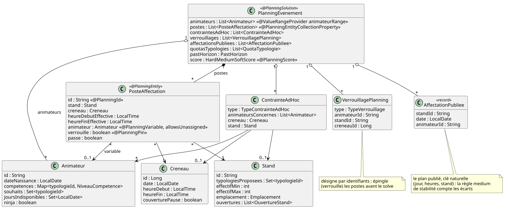

# Modèle de domaine

Pattern Timefold de *shift rostering*, à respecter tel quel pour rester
compatible avec `HardMediumSoftScore`. Les noms de classes et de champs restent
en **vocabulaire métier français** ; commentaires et identifiants non métier en
anglais (glossaire dans [`AGENTS.md`](../AGENTS.md)).

Source : [`diagrammes/domaine.puml`](diagrammes/domaine.puml).

Les classes et leurs champs se lisent dans `domain/`. Ce document porte les
règles de calcul et les arbitrages.

## Deux choses jamais stockées

**Le statut mineur / majeur / moins de 16 ans** est dérivé de `dateNaissance`
**à la date du créneau**, jamais d'un booléen — trois régimes légaux distincts
en dépendent, et un booléen se désynchronise.

**Le drapeau polyvalent** est dérivé au chargement du problème : un animateur
est polyvalent parce que ses compétences contiennent la typologie marquée
`ninja`, pas parce qu'une colonne le dit.

Les typologies elles-mêmes ne sont pas un enum : ce sont des lignes CRUD
référencées par clé étrangère, donc on en ajoute ou en renomme sans toucher au
code.

Une typologie peut porter un **quota** : `maxCreneauxParAnimateur`, le nombre de
créneaux qu'un animateur y tient au maximum sur l'édition entière. Nullable —
vide signifie « pas de plafond » — et lu par la contrainte dure
`plafondCreneauxParTypologie`. Un poste compte pour chaque typologie que son
stand propose, pas pour celles que son animateur maîtrise :
[0042](decisions/0042-quota-par-typologie-sur-la-typologie.md) dit pourquoi le
quota est porté par la typologie plutôt que par un cinquième type de contrainte
ad hoc.

Une typologie porte aussi une **description** libre : la note que l'organisateur
écrit pour lui-même — « cette typologie nécessite d'apprendre 45 jeux ». Elle se
saisit dans le formulaire de l'écran Typologies, se lit dans la fiche et dans la
vue « Planning, par typologie », et nulle part ailleurs : ni sur un PDF, ni dans
l'espace animateur.

## Les bornes de l'édition se dérivent

Une `Edition` ne porte **ni dates ni drapeau « en cours »** : c'est un
cloisonnement, pas un calendrier. L'événement d'une édition court donc du
**premier au dernier créneau** qu'elle contient, bornes comprises, et rien
d'autre ne fait autorité — ni un paramètre, ni la date du jour.

Trois conséquences, et aucune n'est un défaut à corriger plus tard :

- Un jour **creux** entre deux dates de créneaux (un lundi de relâche au milieu
  de deux week-ends) est *dans* l'événement, même s'il ne porte aucun créneau.
  L'intervalle est la borne ; l'ensemble des dates de créneaux, lui, sert à la
  collecte des disponibilités, qui n'a pas la même question à trancher.

  **Être dans l'événement ne veut pas dire être utilisable**, et l'écart se
  paie sur les indisponibilités. Le formulaire de déclaration ne propose que
  les **dates de créneaux**, et appliquer une déclaration remplace
  `joursIndisponibles` en bloc : une indisponibilité posée sur un jour creux
  est donc effacée à la première déclaration acceptée, sans que l'animateur
  l'ait jamais vue dans son espace. C'est la même donnée condamnée que l'import
  CSV **refuse** en rejetant la ligne ; la saisie manuelle, elle, avertit sans
  bloquer (`INDISPONIBILITE_JOUR_SANS_CRENEAU`, voir
  [`api.md`](api.md#avertissements-de-saisie)) — deux traitements différents
  pour deux doctrines assumées, jamais un silence.
- Une édition **sans aucun créneau** n'a **pas** de bornes. Rien ne peut y être
  déclaré « hors événement », et les avertissements de saisie se taisent : la
  seule alternative serait un faux positif sur l'écran par lequel une édition
  commence.
- Ajouter ou supprimer un créneau **déplace** les bornes. C'est voulu — la
  grille *est* l'événement — mais un avertissement déjà affiché ne se
  réévalue pas tout seul : il décrit l'instant de l'écriture.

### Les journées types génèrent les créneaux, elles ne les remplacent pas

Une édition qui tape ses vacations décrit chaque sorte de journée une fois —
« Jour normal », « Nocturne », « Montage » — par son nom et ses vacations,
puis pose ces journées types sur un **calendrier** de dates
([ADR 0032](decisions/0032-journees-types-nommees-vacations-fixes.md)). C'est
le premier objet qui porte des dates indépendamment des créneaux : les dates
de l'édition se saisissent là, avant le premier créneau.

Le calendrier est un **générateur**, jamais la vérité. **Appliquer** le
matérialise par différence sur la clé `(date, début, fin)`, celle que le
contrôle de grille appelle déjà un doublon : un créneau identique garde son
id, ses sièges et ses verrous ; seul son drapeau de relais repas peut être
mis à jour en place ; un créneau manquant est créé ; un créneau que la
journée type ne nomme pas, sur une date gouvernée, est supprimé avec ses
sièges, après un aperçu chiffré. Une date que le calendrier n'affecte pas
n'est jamais touchée. Tout l'aval — postes, verrous, `JoursEvenement` —
continue de lire les créneaux, et l'application déclare la grille en
vacations.

Une journée type modifiée après coup ne propage rien : ses dates passent
**en écart**, et l'organisateur réapplique. La **reconnaissance** lit les
journées types qu'une grille implique — chaque date aux mêmes vacations et
mêmes drapeaux est la même journée — et remplace journées types et
calendrier ; elle suit tout remplacement de la grille (import de scénario,
dérivation depuis les horaires des stands), si bien qu'une édition importée et
une édition tapée se lisent pareil sur l'écran Créneaux. La logique est pure
(`JourneesTypesMaterialisation`), le service ne fait que la persister.

Une **date sous consigne** ([ci-dessous](#consigne-dédition--la-quatrième-couche))
se lit à part : les créneaux qu'une consigne a ajoutés à la grille — la
soirée qu'un arrêté a rendue nécessaire — ne sont ni comptés en écart ni
supprimés à l'application, puisqu'une journée type ne les nomme jamais ; ils
appartiennent à la consigne, qui les retire à sa levée. La carte affiche ces
dates « sous consigne » (`datesSousConsigne`) plutôt qu'« en écart ».

Cette dérivation est écrite une fois (`service/referentiel/JoursEvenement`) et lue à la
fois par la collecte des disponibilités et par les avertissements de saisie
(voir [`api.md`](api.md#avertissements-de-saisie)).

## Un poste = une place

Un `PosteAffectation` est créé **par place à pourvoir**, jamais un par couple
stand × créneau. Un poste non pourvu garde `animateur = null`. Le jour J, une
place d'un créneau en cours peut être **scindée à « maintenant »** en deux
sièges — l'origine écourtée et sa suite (`suiteDe`) — qui restent une seule
place : voir [Le passé est figé](#le-passé-est-figé).

`allowsUnassigned = true` : une place peut rester vide pendant la recherche, et
c'est `posteDoitEtrePourvu` qui en fait une exigence dure. **Conséquence
pratique** : `forEach(...)` *exclut* les postes non pourvus, seul
`forEachIncludingUnassigned(...)` les voit — d'où son usage dans
`posteDoitEtrePourvu`, et l'inutilité d'un test `animateur != null` après un
`forEach`.

## Trois états par jour pour un stand

Décidés indépendamment jour par jour :

- **ni indisponibilité ni ouverture ce jour-là** → ouvert sans restriction, cas
  largement majoritaire ;
- **au moins une indisponibilité** → ouvert par défaut, fermé sur les seules
  fenêtres listées. Le calcul soustrait l'union des fermetures qui chevauchent
  le créneau : une fermeture en plein milieu laisse deux segments ouverts ;
- **au moins une ouverture** → **fermé par défaut**, ouvert sur les seules
  fenêtres listées. Pensé pour un stand normalement fermé n'ouvrant que sur
  quelques créneaux : une seule ouverture au lieu d'une fermeture par créneau.

Un jour ne peut pas structurellement porter les deux : l'écriture le refuse, ce
qui évite d'avoir à arbitrer un conflit au calcul.

**`heureFin` nullable vaut « jusqu'à la fermeture »** : la fenêtre court jusqu'à
la fin du créneau évalué, quelle que soit l'heure de fermeture du jour. C'est ce
qui remplace le contournement `23:59` — une fenêtre ne peut pas chevaucher
minuit, contrairement à un créneau.

Une fenêtre datée d'un jour J+1 n'est lue que par un créneau qui **traverse
réellement minuit**.

### L'effectif se porte sur la fenêtre, pas sur le stand

Un stand dont la charge varie dans la journée — 4 personnes le matin, 4
l'après-midi, 5 le soir — reste **un seul stand** : chaque fenêtre d'ouverture
porte son `effectif`. `null`, le cas très majoritaire, veut dire « hériter de
`effectifMin` », donc une fenêtre qui n'en nomme aucun génère exactement ce
qu'elle générait avant que le champ existe.

Enregistrer un stand depuis la grille de saisie **dérive ses deux bornes de ses
cases** : `effectifMin` est la plus petite valeur saisie, `effectifMax` la plus
grande. C'est ce que le classeur source fait déjà (63 stands sur 63), et cela
vaut dans les deux sens — un stand déclaré à un maximum de 5 dont aucune case
ne dépasse 2 ressort à 2. La fiche du stand reste l'endroit où fixer une
capacité que la grille ne montre pas.

Un effectif de fenêtre ne peut pas dépasser l'`effectifMax` du stand : la
génération rendrait obligatoires plus de sièges que le stand n'est déclaré
capable d'en tenir, et les deux nombres se contrediraient sur chaque écran qui
les montre. Le validateur et le formulaire le refusent tous les deux.

Un créneau à cheval sur deux fenêtres d'effectifs différents produit **deux
groupes de sièges**, chacun portant la [fenêtre effective](#fenêtre-effective)
de son segment. Là où deux fenêtres se recouvrent, le recouvrement prend le
**plus haut** des deux effectifs : deux fenêtres qui se chevauchent énoncent
deux fois le besoin sur les mêmes minutes, et satisfaire le plus grand satisfait
les deux. Les tranches contiguës de même effectif sont refusionnées.

`segmentsOuverts` est le calcul primaire ; `segmentsOuvertsMinutes`
en est la projection et reste la **géométrie d'ouverture pure** — deux segments
que seul l'effectif sépare y redeviennent une ouverture continue, pour que tout
appelant qui demande « quand ce stand est-il ouvert » garde sa réponse.

> Pourquoi ce champ existe : appliquer `effectifMin` à toutes les tranches est
> ce qui faisait couvrir 7 155 h à un planning réel là où son classeur source en
> demandait 10 986. Le minimum est ce qu'un stand exige à son heure la plus
> creuse ; l'appliquer au pic sous-dote d'un tiers.

### Horaires récurrents : trois couches, un seul mode par jour

Les fenêtres datées sont des **exceptions** ; le motif qui se répète se saisit
au-dessus, en règles portant un mode et un sélecteur de jours de spécificité
croissante — `TOUS` (0), `JOURS_SEMAINE` (1), `PLAGE` (2), `DATES` (3).

Sur la fixture de 63 stands, 714 fenêtres datées deviennent 120 règles et 19
exceptions résiduelles.

La résolution se fait jour calendaire par jour calendaire :

1. **une fenêtre datée ce jour-là** gagne seule, et remplace *entièrement* ce
   que les règles disaient de ce jour ;
2. **sinon les règles couvrant ce jour**, à spécificité maximale, union de leurs
   fenêtres. Deux règles de même spécificité et de modes opposés sur des jours
   qui se croisent sont refusées à l'écriture ; le résolveur garde malgré tout
   un arbitrage déterministe pour une donnée arrivée autrement (un scénario
   écrit à la main) : `OUVERTURE` l'emporte, c'est la lecture la plus
   restrictive ;
3. **sinon**, cela dépend de ce que le stand déclare :
   - **il déclare des ouvertures quelque part** dans ses règles → le jour est
     **fermé**. « Ouvert ces douze jours-là » est un horaire, et un jour qui n'y
     est pas est un jour où le stand n'ouvre pas ;
   - **ses règles ne font que fermer** → il décrit des exceptions à un stand
     ouvert, et le défaut historique tient : **ouvert toute la journée**.

Le résultat est toujours **un seul mode par jour** : c'est ce qui préserve
l'invariant des trois états, et ce qui fait que ni le calcul de segments, ni les
contraintes, ni les exports n'ont à connaître les règles.

Ce que la résolution tranche en silence, l'analyse des ouvertures le dit **sans
le refuser** : deux règles de même portée et de même mode qui se recouvrent un
même jour (l'union des fenêtres, **l'effectif le plus haut** sur le
recouvrement — « @4 » puis « @2 » sur les mêmes heures, c'est 4), une règle
qu'aucun jour de l'édition n'applique parce qu'une règle plus spécifique ou une
exception datée l'emporte partout, deux fenêtres d'une même règle qui se
recouvrent à des effectifs différents. Avertir plutôt que refuser : le résultat
est déterministe, certains recouvrements sont voulus (une règle de fond plus une
règle de pic), et un refus casserait des scénarios existants. Seul le cas
réellement ambigu — même portée, modes opposés — reste refusé.
`HoraireStandResolver.resolveDayWithRules` rend, pour cela, les règles qui ont
décidé chaque jour, sans rien changer au verdict.

**Si un seul jour de l'événement reste non énoncé, aucune règle ne peut prendre
`TOUS`** — elle gouvernerait un jour laissé volontairement ouvert par défaut.

> **Ce que la couche 3 a coûté avant d'être lue ainsi** : dire « ouvert ces
> douze dates, et rien d'autre » demandait une **seconde règle** dont le seul
> rôle était de fermer les jours que la première ne nommait pas. Faute de
> pouvoir écrire « fermé toute la journée » sur des jours non listés, elle
> s'écrivait comme une fermeture partant d'une heure assez tôt pour couvrir
> tous les créneaux — `09:00` jusqu'à la fermeture sur une édition réelle, où
> **soixante-cinq stands en portaient une**. C'était du remplissage, et un
> piège : un créneau ajouté à `08:00` les rouvrait tous en silence.
> `HoraireElagage` retire ces fermetures devenues muettes, en vérifiant segment
> par segment qu'aucune ouverture ne bouge — 157 règles deviennent 104 sur
> cette édition, empreinte identique. Il ne retire **jamais** une ouverture,
> même sans effet sur la grille du jour : c'est un énoncé qui attend un
> créneau, pas du poids mort.

> **Limite assumée** : une exception *remplace* la journée au lieu de se
> soustraire aux règles. « Ouvert 10 h-12 h / 14 h-fermeture tous les jours,
> sauf le 14 juillet après-midi » demande de ressaisir la journée entière. C'est
> le prix de l'invariant à un mode par jour ; l'alternative serait de mélanger
> deux modes sur une journée, précisément l'ambiguïté que cet invariant écarte.

L'expansion n'est **jamais écrite** sur les listes datées : elle vit à côté, si
bien qu'un stand résolu peut repasser par une sauvegarde sans figer son
expansion en centaines de lignes. La distinction est explicite côté service :
une vue CRUD brute, et une vue effective résolue sur les jours de l'édition —
c'est celle-là que prennent le solveur, la génération de postes et l'analyse de
faisabilité.

Le **compactage** dérive les règles à la demande et ne réécrit un stand que si
elles reproduisent ses propres segments ouverts. L'écart se mesure en **minutes
d'ouverture** en désaccord, jamais en appariant les segments : un « fermé
10 h-23 h 59 » réécrit en « fermé jusqu'à la fermeture » fait passer le nombre
de segments de 1 à 0, alors que le désaccord réel est la seule minute d'un poste
qui n'aurait jamais dû être à pourvoir. Compter les segments ferait refuser
exactement les stands que la réécriture aide le plus.

### Consigne d'édition : la quatrième couche

Un arrêté préfectoral — canicule, orage — ferme une bande horaire pour
**tous** les stands sur quelques dates, la veille au soir, avec prolongations
et levées. Ce n'est ni une règle du stand ni une exception datée : la décision
vient d'en dehors, s'applique à tous sans qu'aucun l'ait déclarée, et doit se
lever sans rien réécrire. C'est une **consigne d'édition**
([ADR 0043](decisions/0043-consigne-d-edition-fermer-une-bande-sans-rien-detruire.md)),
lue par `ConsigneResolver` **au-dessus des trois couches** et par le seul
point d'entrée `StandService.resolve` — un appelant qui déroulerait les règles
lui-même doterait en silence une bande fermée, et
`ConsigneCoucheStructurelleTest` le refuse.

**Le modèle** : une ligne par date. Une **bande interdite** — début
obligatoire, fin facultative valant « jusqu'à minuit », `00:00` → `null` pour
la journée entière — un **motif obligatoire**, le nom du **préréglage**
d'origine s'il y en a un (« Plan canicule » : bande, motif et fenêtres par
défaut, mémorisé sur l'édition, validé à froid, copié à la duplication ; les
consignes datées ne le sont pas), des **fenêtres de compensation par défaut**
(plusieurs, avant ou après la bande), des **ouvertures** — un stand, une
fenêtre, un effectif facultatif, plusieurs fenêtres par stand — et les
**créneaux ajoutés** à la grille, marqués comme tels.

**Trois règles, dans cet ordre**, pour chaque stand d'une date sous consigne :

1. **la bande ferme tous les stands**, au-dessus de leurs règles et de leurs
   exceptions, **et ne ferme que cela** : un stand garde ses horaires hors de
   la bande, coché ou non. Un 14 h-20 h devient un 18 h-20 h ;
2. **les créneaux que la consigne a ajoutés n'appartiennent aux horaires de
   personne** : un stand y est fermé, sauf si une de ses propres fenêtres de
   consigne les couvre. Sans quoi un stand ouvert par défaut serait doté sur
   une soirée que personne n'a choisie pour lui ;
3. **une ouverture est une extension choisie stand par stand** : le stand
   ouvre sur ses fenêtres en plus de ses horaires, jamais dans la bande, à
   l'effectif saisi **sur cette fenêtre**, sinon au **plus fort effectif qu'il perd dans la bande**,
   sinon à son minimum. Là où une fenêtre recouvre des heures qu'il avait
   déjà, le plus haut des deux effectifs s'applique.

La journée en sort **réénoncée entière** : en ouvertures explicites (fermé par
défaut) quand il reste quelque chose, en fermeture de journée entière quand il
ne reste rien. **Un seul mode par jour**, comme après les trois couches, et
rien en aval n'a à connaître la consigne. L'expansion ne s'écrit que sur les
fenêtres effectives.

**Ce qui est ajouté à la grille, et rien d'autre.** Une fenêtre choisie
qu'aucun créneau ne couvre — 20 h-22 h après une journée qui finit à 20 h —
fait **ajouter** le créneau manquant, marqué comme ajouté par la consigne.
C'est la seule écriture sur la grille, et elle est additive ; un créneau n'est
jamais ajouté sans qu'une ouverture l'exige. Modifier une consigne conserve
un créneau ajouté — avec ses sièges — quand une fenêtre l'exige encore
exactement, et retire les autres.

**Ce qui n'est jamais détruit.** Les créneaux nominaux gardent id, sièges et
verrous ; les vacations de la bande deviennent des vacations **sans siège** —
un stand fermé sur tout un créneau n'y engendre aucun poste, fermé sur une
partie il engendre les postes du reste, à leur
[fenêtre effective](#fenêtre-effective). Lever la consigne, c'est ne plus
l'appliquer : les stands retrouvent leurs horaires, et seuls les créneaux
ajoutés partent, avec leurs sièges — la publication suivante annonce leur
retrait. La règle de stabilité du plan publié fait le reste : le titulaire
d'un 14 h-20 h reste sur le 18 h-20 h pendant l'alerte et retrouve son
après-midi à la levée.

**Le passé reste intact.** Poser, modifier et lever refusent une date passée
ou en cours : une date déjà travaillée garde pour toujours la consigne qui
l'a gouvernée, et ses statistiques sont celles de ce qui a été fait. Poser ou
lever retire la validation de relecture des journées touchées, verrou ou non
— les sièges de la bande n'existent plus, la journée relue n'est plus celle
qui sera travaillée.

**Les heures effectives partout.** Cumuls, repos, « fermer tard puis ouvrir
tôt », heures, équité, indicateurs : tout lit déjà la fenêtre effective, et
une journée sous consigne compte donc ce qui est réellement travaillé sans
qu'aucun calcul change. Un instantané porte les consignes en vigueur à sa
capture (`null` sur un instantané antérieur : « inconnu », jamais « aucune »),
le KPI porte `journeesSousConsigne` et `heuresFermeesParConsigne`, et chaque
journée sous consigne expose ses sièges nominaux et sous consigne, ses
minutes fermées et rouvertes, ses animateurs concernés.

> **Limites assumées** : la bande est obligatoire (une consigne sans bande
> n'est pas une consigne, c'est une journée type) ; une bande par jour ; les
> disponibilités des animateurs restent à la journée — les fenêtres tardives
> se ferment aux mineurs par les règles de nuit et de repos, qui lisent le
> créneau entier, pas la fenêtre effective ; et une fenêtre du soir qui
> prolonge l'après-midi demande deux personnes par siège tant que la coupure
> repas du soir interdit d'enchaîner 18 h-20 h et 20 h-22 h — la consigne
> porte alors ses propres fenêtres repas, datées, avec leur justification
> (voir ci-dessous et l'ADR 0043, « Limites assumées »).

**Une consigne peut restater les fenêtres repas de sa date.** La coupure
repas est la règle de l'organisateur, pas le Code du travail
([`contraintes.md`](contraintes.md#la-coupure-repas)) : une consigne peut
donc dire, pour sa seule date, d'autres fenêtres de midi et du soir et une
autre durée de coupure, avec une justification obligatoire en termes métier.
Les `FenetreRepas` que le solveur reçoit sont alors de deux sortes : celles
de l'édition, qui portent les dates où elles s'effacent, et celles de la
consigne, datées ; `FenetreRepas.appliesTo(date)` est ce que la contrainte
et chaque lecteur (Pauses, Besoin, Intendance, contrôle de grille) demandent.
Lever la consigne retire ses fenêtres avec elle : les paramètres légaux de
l'édition n'ont jamais été écrits, il n'y a rien à remettre. Les plafonds
légaux ne sont pas surchargeables.

### Le passé est figé

La consigne n'est pas seule à tenir le passé intact : depuis
[ADR 0044](decisions/0044-le-passe-est-fige.md), **toute résolution** —
complète, incrémentale, depuis l'écran ou par MCP — reprend du plan enregistré
les places des créneaux déjà commencés et les épingle, quel que soit leur
état : le titulaire est gardé même s'il a depuis déclaré la journée
indisponible ou qu'une indisponibilité forcée le couvre maintenant (il était
là) ; un titulaire supprimé laisse la place vide, et une place passée vide est
épinglée quand même (personne ne peut tenir hier). Un créneau est *commencé*
si sa date est passée, ou si c'est aujourd'hui et que le début effectif de la
place est atteint ; un créneau à cheval sur minuit appartient à sa date de
début. « Aujourd'hui » est celui de l'horloge du jour J — la machine en
production, la date figée depuis Paramètres › Instance sous `quarkus:dev` ou avec
`HORLOGE_SIMULEE_AUTORISEE=true`. Ces places **comptent** dans les règles qui
lient les jours (repos quotidien entre hier et aujourd'hui, repos et durée
hebdomadaires, jours consécutifs, pause entre vacations, « fermer tard puis
ouvrir tôt »…) mais ne sont **jamais reprochées** : un trou d'hier, un mineur
placé la nuit hier ne bloquent pas le zéro dur d'aujourd'hui — règle par
règle dans [`contraintes.md`](contraintes.md#compté-non-reproché--le-passé).
Le périmètre d'une replanification ne rouvre jamais une place passée.

**Le passé ne se modifie plus à la main non plus.** Les gestes qui
réécrivent une place sans solveur — le glisser-déposer des vues journalières
(`deplacer_affectation`), l'acceptation d'un échange, une réparation
appliquée ou suggérée — refusent une place dont le créneau est commencé, au
même horizon, avec la même phrase : « Ce créneau est déjà commencé : le passé
ne se modifie plus » (`400` en REST, refus métier en MCP).

**Le passé est figé à la minute, pas au créneau**
([ADR 0066](decisions/0066-le-passe-est-fige-a-la-minute.md), qui assouplit
0044). Une réparation, un « Placer » ou un « Marquer absent » sur le siège d'un
créneau **en cours** ne sont pas refusés : l'écriture **scinde le siège à
« maintenant »** (la minute courante de l'horloge du jour J) en deux sièges
réels. L'origine est écourtée à cette minute (`heureFinEffective`) et garde
son titulaire — l'historique dit qui a tenu 9 h 00 – 9 h 20 ; la suite couvre
le reste du créneau (`heureDebutEffective`), porte `suiteDe` (l'identifiant de
son origine, persisté dans `poste_affectation.suite_de`) et reçoit
l'écriture. Son identifiant est dérivé : `<origine>~HHmm`. Seul un siège déjà
**terminé** reste refusé.

| Où | Ce que la scission change |
| --- | --- |
| Génération par place | Aucune : le référentiel génère toujours un siège par place ; la suite n'est pas une place de plus |
| Équipage d'un stand premium (`crewByStand`) | La suite n'est pas comptée : une place scindée reste une place |
| Reconstruction (réamorçage, incrémental) | `SeatSplit.restore` rejoue les cellules scindées du plan persisté — fenêtres et titulaires — sur les sièges générés ; le solveur ne rouvre que la suite |
| Instantanés | La suite et son `suiteDe` sont capturés et restaurés avec le plan |
| Export de scénario | Les suites sont omises : un scénario décrit les places à pourvoir, et son siège ne porte pas de fenêtre |
| « Nouveau depuis ce matin » (Aujourd'hui, affichage mural) | La suite est une cellule que le plan publié n'avait pas : sa place vide est nouvelle |

**Rien à planifier.** Une résolution dont **toutes** les places sont passées
— l'édition est terminée, ou la date simulée est après l'événement — est
refusée plutôt que de produire un plan vide à zéro dur. Quand des places
passées sont restées vides (aucun titulaire enregistré : un premier calcul
lancé pendant l'événement, un titulaire supprimé), la résolution a lieu et
son résultat porte `postesPassesVides`, annoncé comme un avertissement.

`PASSE_FIGE=false` coupe la règle entière — épinglage, refus des gestes,
refus d'une résolution sans avenir — pour une recette qui rejoue une édition
ancienne.

### Fenêtre effective

Un poste issu d'un segment partiel porte une fenêtre plus étroite que son
créneau. **Ce n'est pas un sous-créneau** : la clé étrangère vise un créneau
réel et persisté, la fenêtre vit sur le poste, et les accesseurs retombent sur
le créneau quand l'override est absent — un poste non réduit se comporte donc
exactement comme son créneau. Impact sur les contraintes dans
[`contraintes.md`](contraintes.md#fenêtre-effective--ce-qui-la-lit-et-ce-qui-ne-la-lit-pas-délibérément).

### Verrouillage partiel du planning

`@PlanningPin` marque une place **validée et figée** : aucun move ne peut en
changer l'animateur. Le champ n'est ni positionné par le solveur ni persisté sur
le poste — il est recalculé à chaque construction du problème depuis la table
des verrous.

Un verrou porte sur un animateur, un stand, une journée, un créneau, ou un
couple animateur × créneau (posé automatiquement quand un échange est validé).

**Un verrou n'est pas une contrainte ad hoc.** Les deux retirent de la liberté
au solveur, mais pas au même moment ni sur la même matière. La contrainte ad
hoc (voir [plus bas](#contraintes-ad-hoc)) est une règle sur mesure posée
*avant* le calcul — placer ou écarter quelqu'un — que chaque résolution
honore, y compris en repartant de zéro, et qu'un planning en défaut nomme
quand elle n'a pas pu l'être. Le verrou est un geste sur un plan *déjà
calculé* : il conserve ce qu'une résolution a produit sur une partie du
planning, sans rien dire de ce qui devrait s'y trouver, et ne vaut que pour le
plan enregistré. Imposer ou interdire une affectation, c'est une contrainte ad
hoc ; protéger une partie validée d'un plan que l'on relance, c'est un verrou.

**Une cible, jamais deux.** En base, un verrou est une ligne plate — cinq
colonnes cibles nullables et un discriminant — que la contrainte `CHECK` garde
cohérente. Dans le code, la cible est une hiérarchie scellée : une variante ne
porte que ses propres champs, elle ne *peut* pas en désigner deux. Le `switch`
qui écrit les colonnes est exhaustif sans `default` — **ajouter une façon de
verrouiller ne compile pas** tant que personne n'a dit où elle atterrit.

Deux règles :

- **une place non pourvue n'est jamais figée.** Les places couvertes sont
  réamorcées avec l'animateur de la dernière résolution ; celles qui étaient
  vides restent mobiles, sinon geler un trou le rendrait définitivement non
  pourvu ;
- **une place figée est scorée normalement.** Un verrou peut donc laisser une
  écart visible — il ne désactive silencieusement aucune règle.

**Épingler ne suffit pas pour verrouiller un animateur** : cela fige les places
qu'il tient, mais le solveur pourrait lui en attribuer d'autres ailleurs. Ce
sont deux contraintes dures qui l'interdisent, à partir des verrous transmis
comme faits du problème.

**Un verrou de créneau nomme sa vacation, pas son identifiant** (jour, heure de
début, heure de fin — issue #577). `creneau.id` est une identité `BIGINT` :
supprimer les créneaux d'une journée puis les recréer à l'identique — une
régénération de la grille, une journée type réappliquée — leur en donne de
nouveaux. La colonne était déclarée `ON DELETE CASCADE`, si bien que toute
suppression emportait le verrou **sans bruit** ; or valider un échange pose
deux verrous sur le créneau que chacun reçoit, précisément pour que la
régénération suivante ne défasse pas l'échange. L'identifiant reste stocké,
mais comme un cache : il est réécrit à chaque lecture par une jointure sur la
clé naturelle, et vaut `NULL` tant que la grille ne porte pas cette vacation.
Un verrou dans cet état **attend** — l'écran Verrouillages le dit, et le
contrôle de la grille le signale, y compris sur l'aperçu d'une dérivation,
c'est-à-dire avant que « remplacer la grille » ne soit écrit. La portée d'une
contrainte ad hoc suit la même règle, avec une conséquence de plus : une règle
écrite pour un créneau disparu ne vaut **rien** au lieu de valoir pour toute
l'édition.

### Gel du référentiel

Le verrou fige des **sièges** d'un plan calculé ; le gel fige les **fiches**
dont ce plan est calculé, une fois leur préparation terminée
([décision 0052](decisions/0052-gel-du-referentiel-distinct-du-verrou.md)).
Il se pose et se lève par famille, dans une édition, par l'organisateur :

| Famille | Ce qui ne s'écrit plus |
| --- | --- |
| Stands | création, suppression, effectifs min/max, réserve majeurs, typologies proposées, horaires (règles, ouvertures et fermetures datées) |
| Créneaux | création, suppression, date, heures, couverture de pause ; journées types appliquées, dérivation, séries |
| Typologies & emplacements | création, suppression, plafond par typologie, typologie ninja |
| Compétences | niveaux de compétence des animateurs déjà inscrits (fiche, grille, import) |

Une famille figée refuse l'écriture **par tous les chemins** — formulaire,
édition en lot, import CSV, import de grille, MCP — en `409` avec le code
`REFERENTIEL_FIGE`. Restent libres : le nom, le lieu et le niveau d'effort
d'un stand, le libellé et la description d'une typologie, le nom et la
position d'un emplacement, les données des personnes hors compétences
(disponibilités, souhaits, déclarations, e-mail), la **création** d'un
animateur avec ses compétences, les ajustements, les verrous, et les
**consignes** — l'outil prévu pour fermer une bande tard sans rien détruire.
L'import de scénario et la remise à zéro, qui remplacent tout, sont refusés
tant qu'une famille est figée.

Un gel n'est pas recopié par la duplication d'une édition : la nouvelle
repart en préparation. Il ne touche pas un calcul en cours.

### Replanification incrémentale

Répond à « il est 9 h, untel se désiste, que fait-on ? ». Elle **repart du
planning persisté**, épingle tout ce qui reste valable et ne rouvre que le
reste — d'où un budget par défaut de 60 s.

Le rapprochement est **positionnel**, sur stand × créneau, comme celui des
verrous : les places d'un même stand sur un même créneau sont interchangeables,
aucun identifiant de poste n'a donc besoin de survivre à un changement de
référentiel.

| Situation d'une place | Ce qui est fait |
| --- | --- |
| Créneau déjà commencé ([ADR 0044](decisions/0044-le-passe-est-fige.md)) | **Épinglée telle que travaillée**, avant toute autre règle : titulaire gardé même invalidé depuis, vide restée vide, jamais rouverte par le périmètre. Comptée à part (`postesPasses`) |
| Désignée par le périmètre demandé | Libérée quoi qu'il arrive : l'utilisateur dit « refais ça » |
| Titulaire encore valable | **Épinglée** |
| Titulaire invalidé par un changement tardif — supprimé, indisponible, ou couvert par une indisponibilité forcée | Libérée. L'épingler figerait une violation dure que plus personne ne pourrait corriger. Le test de validité **réutilise le prédicat du solveur**, pour que les deux ne puissent pas diverger |
| Jamais pourvue, ou nouvelle | Laissée libre |

Deux choix à connaître :

- **le gel est volatil** : il vit le temps du job et n'écrit rien. Un verrou
  reste ce que l'utilisateur pose délibérément, jamais un artefact laissé par
  une replanification ;
- **tout ce qui est valable est épinglé**, y compris hors verrou explicite. Une
  replanification existe pour *stabiliser* le plan, pas pour le ré-optimiser.
  Rouvrir une zone est un acte explicite : la nommer dans le périmètre, ou
  lancer une résolution complète.

Le résultat porte les statistiques et le **diff des équipes** par stand ×
créneau — replanifier partiellement n'a d'intérêt que si l'on peut dire qui est
impacté. Une permutation entre places interchangeables d'un même stand n'y
figure pas : le planning de personne n'a changé.

### Réamorçage d'une résolution complète

Par défaut, une résolution complète **repart du plan persisté** quand il en
existe un (#174) : chaque place reçoit l'animateur que le plan lui donnait, par
le même rapprochement positionnel stand × créneau que les verrous et la
replanification, et **reste mobile**. Rien n'est épinglé hormis les verrous
explicites. C'est l'exact contraire de la replanification incrémentale sur un
seul point — elle épingle tout ce qui reste valable, le réamorçage n'épingle
rien — et c'est la seule chose qui les sépare : la replanification stabilise,
le réamorçage ré-optimise sans jeter l'acquis.

| Place du plan persisté | Au réamorçage |
| --- | --- |
| Titulaire encore valable | Réamorcée avec lui, **mobile** |
| Couverte par un verrou | Laissée telle que les verrous l'ont mise (épinglée) |
| Titulaire disparu, indisponible ce jour-là, ou couvert par une indisponibilité forcée | Repart vide, comptée « libérée » |
| Jamais pourvue, ou nouvelle | Libre |

Le solveur score la solution de départ en premier et garde la meilleure
rencontrée : à données égales, le résultat ne descend jamais sous le plan de
départ. Il peut descendre quand le référentiel a changé entre-temps — le plan
de départ n'est alors plus une solution du nouveau problème — ou quand on a
demandé un départ à froid (`AUCUN`), le seul geste qui abandonne l'acquis et
qui, pour cela, se confirme à l'écran.

### Demandes d'échange

Un animateur propose un échange depuis son espace ; **rien n'est appliqué sans
validation admin explicite**.

Le poste cédé est référencé par son couple **(créneau, stand)**, jamais par
l'id du `poste_affectation` : ces ids sont renumérotés à chaque résolution, le
couple est ce qui survit.

**L'identité.** Chaque animateur porte un jeton opaque, unique **globalement**,
qui résout à lui seul le couple (édition, animateur) — c'est le lien imprimé sur
son PDF. Le lien seul ne suffit pas : un **code à 6 chiffres envoyé à l'adresse
de la fiche** ouvre une session de 30 jours. Pas de compte ni de mot de passe,
**la boîte mail est le second facteur** — un animateur sans adresse doit la faire
ajouter. Une personne = un lien **par édition** ; dupliquer une édition frappe
des jetons neufs.

**L'accord du collègue.** Une demande naît `EN_ATTENTE_CIBLE`. Le collègue
l'accepte — elle devient `PROPOSEE`, l'admin est notifié, et n'a plus à demander
leur accord aux deux — ou la décline, ce qui est terminal. L'admin peut refuser
une demande encore en attente, mais **ne peut l'accepter qu'après** l'accord du
collègue.

**La simulation** juge sur le **score dur global**, pas sur les seuls postes
touchés : un échange peut casser une contrainte ailleurs — heures
hebdomadaires, repos. Échange croisé si la cible tient aussi un poste sur le
créneau, reprise simple sinon. Un échange **dirigé** troque deux créneaux
distincts (« je te laisse mon lundi, je prends ton mardi »).

**L'application** met à jour chirurgicalement les places concernées, **sans
re-résolution**, puis pose deux verrous sur le créneau que chacun **reçoit** :
la régénération suivante ne défera pas l'échange, sans geler le reste du
planning des deux animateurs.

**L'annonce attend la publication.** Trancher une demande ne mail personne sur
le champ : l'échange a changé le planning de travail, pas celui que le demandeur
a reçu, et son espace montre encore le précédent. La décision — acceptée ou
refusée — voyage avec la publication qui la porte, aux côtés des demandes encore
en attente. Voir *Planning publié* ci-dessous.

**Foire fermée** : soumissions et annulations refusées côté serveur, l'espace
passe en consultation seule — planning visible et téléchargeable, historique
conservé.

### Planning publié

Deux plannings coexistent par édition, et il faut les nommer.

Le **planning de travail** est celui que la résolution écrit et que
l'administration manipule : `poste_affectation`, un seul par édition. Le
**planning publié** est celui que les animateurs ont reçu — le dernier
instantané marqué publié (`plan_snapshot.publie_le`). C'est un instantané et
rien d'autre : le contenu dénormalisé de l'ADR 0007 était déjà exactement « un
planning complet, indépendant de ce qui bouge après ».

**L'espace animateur nomme son édition.** Le nom de l'édition et ses bornes
descendent jusqu'à la page (`editionNom`, `editionDebut`, `editionFin` de
`GET /api/espace-animateur/{jeton}`), jusqu'à l'en-tête du PDF individuel et
jusqu'au nom du calendrier d'abonnement (`X-WR-CALNAME`). Rien n'est stocké
pour cela : le nom vient de l'`Edition`, les bornes se dérivent des créneaux
comme partout ailleurs, et une édition sans créneau porte son nom sans dates.
La raison est un cas précis (#608) : un animateur revenu d'une année sur
l'autre a **deux** liens d'espace valides dans sa boîte mail, et deux pages
rigoureusement identiques ; se tromper de lien donnait un planning parfaitement
cohérent, simplement pas celui de cette année.

**L'espace animateur lit le planning publié.** Ce qu'une personne voit est ce
qu'on lui a envoyé — un échange validé, un remplacement appliqué, une nouvelle
résolution ne déplacent son espace qu'une fois publiés. Tant que rien ne l'a été
sur l'édition, l'espace est **vide** et le dit : replier sur le planning de
travail recréerait l'incohérence que la distinction supprime.

**Publier n'écrit qu'aux personnes concernées.** L'unité de comparaison est la
**vacation** — jour, heures effectives, stand — et l'identité comparée est celle
de la personne, pas celle du siège : un `poste_affectation` renuméroté par une
résolution ne déplace personne. Renommer un stand ne réveille donc personne ;
échanger deux vacations réveille exactement deux personnes. Un écart se dit en
ajout, retrait, ou **déplacement** quand un ajout et un retrait se répondent le
même jour — « Ninja 14h-18h remplace Cirque 14h-18h » est un changement, pas
deux.

**Une vacation supprimée se dit.** Le côté publié porte le jour et la fenêtre
de chaque affectation, copiés au moment de la capture : supprimer un créneau
d'une journée déjà publiée ne retire donc le siège que du planning de travail,
et l'écart qui reste est un retrait, avec un nom dessus. La vacation reste
visible dans l'espace — et dans le PDF, l'abonnement ICS, le rappel de la
veille — jusqu'à la publication qui annonce son retrait : l'espace suit le
planning publié, et ce qui l'a promis est aussi ce qui le reprend. Un instantané
capturé avant que la date soit stockée ne porte pas cette information et se
résout comme avant, contre le référentiel du jour.

Le calcul est volontairement **hors de la comparaison d'instantanés**, qui est
non nominative par choix (l'équité est une dispersion d'heures, jamais un
classement de personnes nommées). Celui-ci ne classe personne : il répond
« votre emploi du temps a-t-il changé depuis ce qu'on vous a envoyé ? », une
personne à la fois, et seulement pour celles à qui il va écrire.

## Une grille est faite de vacations

Un créneau est une **vacation** : une tranche de travail réelle, sur laquelle on
affecte quelqu'un. Il n'y a pas d'autre sorte de créneau.

Il y en a eu une : l'**amplitude**, la journée d'ouverture de bout en bout, que
le *découpage* tranchait en vacations plus courtes avant de résoudre. Un
évènement connaît ses horaires d'ouverture et les projette en vacations par ses
[journées types](#journées-types) ; le découpage, ses paramètres et le mode qui
disait laquelle des deux lectures s'appliquait ont donc été retirés (ADR
[0037](decisions/0037-une-grille-est-toujours-des-vacations.md)).

Ce qui suit décrit les règles qui survivent au mécanisme, parce qu'elles portent
sur la grille que l'organisateur a, quelle que soit la façon dont elle a été
écrite.

### Le plafond de durée d'une vacation

Tant qu'une vacation reste sous `dureeVacationMaxMinutes` (6 h par défaut, seuil
de l'art. [L3121-16]) **et** ne recouvre pas entièrement une fenêtre repas, elle
ne doit aucune pause : une pause n'est jamais un attribut de créneau, c'est soit
le trou entre deux vacations, soit un relais (voir « La pause légale » plus
bas).

Au-delà, le contrôle de la grille (`CreneauGridService`) pose un avertissement
`VACATION_TROP_LONGUE` : **cette vacation contiendra une pause à relayer.** Ce
n'est pas un refus — la vacation est parfaitement légale si un collègue du stand
tient une place pendant la pause — c'est le moment de vérifier que cette place
existe. L'autre réponse est de couper la journée en deux vacations. Le seuil vit avec les autres règles de l'évènement, dans
`ParametresLegaux` — il bornait ce que le découpage produisait, il dit
maintenant à partir de quand la grille est signalée.

Le repos quotidien donne un second plafond, celui-là bloquant : une vacation
plus longue que `1440 − reposQuotidienMinimalMinutes` garantit une violation de
contrainte dure, et le contrôle la remonte en erreur.

### Les familles de relais ont été retirées

La grille a longtemps pu porter plusieurs **familles** de vacations aux coupures
décalées, chaque stand relayant avec sa famille (ADR
[0026](decisions/0026-famille-de-relais-attribut-du-stand.md)). Le mécanisme
n'a jamais servi en production et compliquait tout ce qui touche à la grille :
il est retiré (ADR [0029](decisions/0029-retrait-des-familles-de-relais.md)).
Une grille porte une seule variante de chaque vacation, tout stand se pose
sur tout créneau ouvert, et un scénario qui porte encore `famille:` ou
`nombreFamillesDecalage:` est refusé comme toute clé inconnue.

### Le chevauchement est un pic de demande

Deux vacations consécutives peuvent se recouvrir le temps d'une relève : deux
postes existent alors sur le même stand, et l'effectif est garanti **en
excédent** temporaire, jamais en déficit. C'est la façon normale de couvrir une
journée continue, et deux vacations du même jour qui se chevauchent ne sont
donc jamais une anomalie.

Mais c'est aussi la principale source de pic. **Si tous les stands relèvent au
même instant, le nombre de sièges à pourvoir double à cet instant précis.** Sur
le scénario de référence, 86 sièges réellement ouverts devenaient 172 à pourvoir
à 18 h 30, pour 153 animateurs : infaisable par construction, sans la moindre
pénurie d'animateurs.

Le levier qui désamorce le pic est l'étalement des relèves : une grille se règle
pour qu'elles ne tombent pas toutes sur la même minute. Les grilles décalées par
familles, qui les étalaient en générant plusieurs variantes de chaque vacation,
ont été retirées (ADR
[0029](decisions/0029-retrait-des-familles-de-relais.md)).

> **L'analyse de faisabilité ne voit pas ce pic** : c'est une estimation
> optimiste, agrégée par jour. Elle ne lit pas les compétences ; elle compte en
> revanche un mineur seulement là où il peut siéger — à côté d'un majeur, hors
> de sa nuit, d'un jour férié et d'un stand réservé aux majeurs. Elle peut répondre « réalisable » alors que le
> solveur ne ramène pas le score dur à zéro, précisément parce que trop de
> stands réclament un animateur au même quart d'heure. Le signal fiable après
> résolution est le **score dur réel**, pas `feasible` seul.

### Couvrir un stand pendant le repas

Trois façons de traiter le temps du midi, et chacune s'écrit maintenant à la
main sur la grille — dans le formulaire du créneau, ou dans la journée type qui
la projette :

| Ce qu'on veut | Comment on l'écrit |
| --- | --- |
| Le stand ferme | aucune vacation sur la fenêtre |
| Effectif plein pendant la pause | une vacation ordinaire sur la fenêtre |
| Effectif réduit | une vacation marquée `couverturePause` |

`couverturePause` est un attribut du créneau : la génération des postes n'y crée
que la **moitié de l'effectif du segment ouvert, arrondie au supérieur**
(`Creneau.siegesSegment`). **L'arrondi est au supérieur** pour qu'un stand tenu
par une seule personne la garde au lieu de fermer — fermer reste une décision
explicite, pas l'effet de bord d'une division entière.

Une vacation pleine sur la fenêtre repas est à manier avec prudence sur un
scénario déjà tendu : une équipe de plus par pause, sur *chaque* stand concerné,
concentrée sur la même fenêtre, est exactement le pic décrit ci-dessus.

Un relais posé **hors** de toute fenêtre repas est signalé par le contrôle de la
grille (`RELAIS_REPAS_HORS_FENETRE`) : l'effectif y est divisé par deux sans
qu'aucune coupure ne puisse s'y prendre.

### Sections de scénario

Un fichier peut fixer ses propres `parametresLegaux` et `parametresSolveur`,
avec uniquement les champs à surcharger — les autres gardent le défaut **de la
classe Java, jamais la valeur en base**. C'est ce qui permet à un gros scénario
d'auto-configurer sa durée de résolution plutôt que de dépendre de ce qu'un
scénario précédent a laissé.

Les sections `parametresDecoupage` et `decoupageAuto` ont disparu avec le
découpage, et un fichier qui les porte encore est **refusé par son nom** plutôt
qu'importé de travers : une grille d'amplitudes lue comme des vacations
donnerait des journées de 14 h sans un mot. Formats complets dans
[`import-export.md`](import-export.md).

## Contraintes ad hoc

Exceptions ponctuelles posées par l'administrateur, stockées en base et évaluées
dynamiquement — **jamais de contrainte codée en dur pour un cas particulier**.
Cinq types : indisponibilité forcée, incompatibilité, affectation forcée,
affinité, arrivée groupée.

L'**arrivée groupée** (`ARRIVEE_GROUPEE`) réunit 2 à 4 animateurs qui arrivent
et repartent ensemble — un covoiturage — sans créneau ni stand. Elle naît le plus
souvent d'une demande : dans l'onglet Covoiturage de son espace, pendant la
fenêtre de collecte des disponibilités, un animateur nomme jusqu'à trois
coéquipiers (« Je viens avec… »). La demande est **indépendante de la
déclaration de disponibilités** — son propre envoi, sa propre décision — et
rangée dans `declaration_coequipier` (table générique, `nature` =
`COVOITURAGE`, `BINOME` réservé) ; appliquer ou refuser une déclaration ne la
touche pas. Une seule demande en attente par animateur ; l'administrateur la
**valide** (onglet Covoiturage de la page Disponibilités), ce qui crée
l'ajustement, ou l'**écarte** avec un `motif` facultatif que l'animateur relit
dans son espace avant, s'il le veut, d'en envoyer une autre. Chaque décision est
notifiée par e-mail, au mieux. Un groupe validé ne se change plus depuis
l'espace : l'ajustement appartient à l'organisation, qui peut l'**annuler**
depuis le même onglet, avec un `motif` facultatif. L'annulation supprime
l'ajustement et fait passer, dans la même transaction, toutes les demandes
validées avec lui (`contrainte_id`) au statut `ANNULEE` ; elles restent dans
l'historique, chaque membre est prévenu, et une nouvelle demande obéit à la
règle ordinaire (pendant la fenêtre de collecte seulement).

| `statut` | Sens |
| --- | --- |
| `EN_ATTENTE` | Envoyée depuis l'espace, en attente de l'administrateur |
| `VALIDEE` | Transformée en ajustement `ARRIVEE_GROUPEE` (`contrainte_id`) |
| `ECARTEE` | Classée sans effet, rien n'a été écrit |
| `ANNULEE` | Validée puis annulée : l'ajustement a été supprimé |

Tant qu'une demande `VALIDEE` pointe vers une arrivée groupée, **aucune autre
écriture ne la modifie ni ne la supprime** — page Ajustements manuels, outils
MCP, tout appel de `ContrainteAdHocService` : `409` avec une phrase unique qui
renvoie à l'onglet Covoiturage. Une arrivée groupée saisie à la main reste
modifiable ; l'import d'un scénario et la réinitialisation, qui remplacent les
ajustements de toute l'édition, ne sont pas concernés.

Ce sont des règles sur mesure posées **avant** le calcul, qui disent où placer
ou ne pas placer quelqu'un ; chaque résolution les honore, y compris en
repartant de zéro. À ne pas confondre avec le
[verrouillage partiel](#verrouillage-partiel-du-planning), qui fige *après
coup* ce qu'une résolution a produit sans rien dire de ce qui devrait s'y
trouver.

## Paramètres légaux

`ParametresLegaux` est un fait de problème (`@ProblemFactCollectionProperty` sur
`PlanningEvenement`, même mécanisme que `ContrainteAdHoc`) qui porte les **deux
durées hebdomadaires de travail maximales**, paramétrables depuis la page
« Constraints » et persistées en base (`ReferenceDataService.getParametresLegaux()` /
`updateParametresLegaux(...)`).

| Champ | Défaut | Base légale | Contrainte qui le consomme |
| --- | --- | --- | --- |
| `dureeHebdomadaireMaxMinutes` | 48 h (2880 min) | Code du travail art. [L3121-20] (ordre public) | `dureeHebdomadaireMax` (**majeurs uniquement**) |
| `dureeHebdomadaireMaxMineurMinutes` | 35 h (2100 min) | Code du travail art. [L3162-1] ; art. [D4153-3] pour les 14 à moins de 16 ans | `dureeHebdomadaireMaxMineur` |

La CCN de l'Animation (ÉCLAT, [IDCC 1518]) était citée ici à côté du Code, à
son art. 5.2. C'était faux deux fois : l'art. 5.2 traite des jours de repos, et
la semaine haute à 48 h figure à l'art. 5.7.2.3 (modulation) — et
l'organisation a depuis confirmé qu'elle ne relève pas de cette convention. Le
Code seul fonde la valeur. La même citation subsiste dans le commentaire de
`V7__parametres_legaux.sql` : une migration appliquée ne se modifie pas, son
empreinte est gelée (`FlywayMigrationsFrozenTest`), et un commentaire ne vaut
pas de rompre les déploiements existants.

Les deux contraintes regroupent les `PosteAffectation` par animateur et par
**jour**, puis les jours par semaine ISO (`Creneau.semaineIso(LocalDate)`), et
pénalisent le dépassement au prorata des minutes excédentaires (gradient, pas
simple booléen). Le niveau intermédiaire n'est pas de la décoration : c'est là
que se déduisent les pauses dues, dont le calcul est journalier (voir « La
pause légale » ci-dessous).

Les autres **seuils** légaux (repos quotidien, durée quotidienne, travail
continu, repos hebdomadaire, jours fériés) sont des constantes du code, pas des
paramètres : ce sont des minima/maxima d'ordre public qu'un administrateur n'a
aucune raison légitime d'assouplir. Ils sont déclarés dans `LegalConstraints`,
chacun avec son article.

La **durée de la pause**, elle, est un paramètre depuis l'issue #592 :
`dureePauseMinutes`, un plancher et non un plafond, donc un réglage qui ne peut
qu'aller dans le sens protecteur — voir « La pause légale » ci-dessous.

### Convention de rattachement à la semaine

Un créneau est rattaché **entièrement** à la semaine ISO de sa date de début. Un
créneau du dimanche 20 h → 00 h compte donc dans la semaine qui s'achève.
Convention assumée : elle simplifie le décompte et reste conservatrice tant que
les créneaux de nuit sont courts.

### Amplitude vs travail effectif

La durée d'un créneau mesure une **amplitude**, alors que les articles cités
portent sur le **travail effectif**. Par défaut le modèle ne représente aucune
pause à l'intérieur d'un créneau : les deux grandeurs coïncident, ce qui revient
à supposer qu'aucune pause n'y est prise. C'est précisément pourquoi les pauses
sont modélisées comme des **trous entre deux créneaux**.

### Un seul compte de sièges

Le nombre de sièges qu'un segment ouvert génère — au moins un, la moitié
arrondie au supérieur sur une vacation de couverture de pause — est une méthode
du créneau, `Creneau.siegesSegment`, et le plus chargé des segments d'un stand
sur un créneau est `Creneau.siegesSimultanes`. La génération des postes,
l'analyse de faisabilité (`GET /api/feasibility`), l'analyse de fragilité et la
règle `eviterRoulementStandsPremium` lisent tous cette même méthode : ce que le
solveur doit remplir et ce que les écrans annoncent ne peuvent pas être deux
nombres différents, et un effectif porté par une fenêtre est vu partout.

### La pause légale

Le Code exige que la pause soit **réelle**, pas qu'elle soit planifiée : un
organisateur qui relève chaque animateur trente minutes à l'intérieur d'une
vacation 13 h-20 h est en règle avec l'art. [L3121-16]. L'application connaît
donc deux manières de prendre une pause, et pas de troisième
([ADR 0048](decisions/0048-une-seule-regle-de-pause.md)) :

- **un trou** d'au moins `dureePauseMinutes` entre deux vacations. Il rompt la
  séquence (`PauseSurPoste.sequences`), donc plus rien n'est dû de part et
  d'autre ;
- **un relais** : un autre animateur du **même stand** tenant une place pendant
  toute la pause, à son heure limite (`PauseSurPoste.relayableBy`).

Une pause due qui n'a ni l'un ni l'autre est un **écart dur**, un point par
pause, porté par `travailContinuMaxMajeur` et `travailContinuMaxMineur` — plus
le forfait d'exclusion d'éligibilité pour un mineur. Il n'y a rien à déclarer :
un paramètre `pauseSurPoste` a existé, il éteignait ces deux règles et déplaçait
la vérification du relais dans une troisième, il est retiré.

**La durée est un paramètre**, `dureePauseMinutes` (`PUT /api/parametres-legaux`,
section `parametresLegaux` d'un scénario) : 30 minutes par défaut, plancher de
20 (art. L3121-16), portée à 30 au minimum pour un mineur (art. L3162-3) par
`ParametresLegaux.dureePauseMinutes(mineur)`. Ce n'est plus une constante du
code, et ce n'est plus deux champs par tranche d'âge.

**Le calcul, une seule fois.** `PauseSurPoste.dues(postes, parametres)` rend les
pauses d'un couple (animateur, jour) : une séquence de `L` minutes au-delà du
plafond en doit `ceil((L − cap) / (cap + pause))`, la k-ième au plus tard quand
la séquence atteint son k-ième plafond. Le solveur, l'écran Pauses, le PDF
animateur et le flux ICS lisent tous cette méthode, donc aucun ne peut décrire
une pause qu'un autre ne doit pas.

**La déduction est inconditionnelle.** Une pause due est du repos, pas du
travail effectif (art. L3121-1), donc elle est retranchée de l'amplitude —
plafonds quotidien et hebdomadaires, rapport des heures, équité, Besoin, KPI. Rien
n'est caché par là : dans un plan sans écart dur, toute pause déduite a bien
été prise, et c'est exactement ce que les deux règles dures garantissent. Une
journée 14 h-minuit vaut ainsi 9 h 30 de travail effectif ; 13 h-minuit en vaut
10 h 30 et reste refusée. Le calcul vit dans `EffectiveWork`, et
[`contraintes.md`](contraintes.md#ce-qui-déduit-la-pause-et-ce-qui-compte-lamplitude)
dit les trois endroits qui comptent encore l'amplitude, et pourquoi.

## Fenêtres repas

`FenetreRepas` est un fait de problème (`@ProblemFactCollectionProperty` sur
`PlanningEvenement`), **un par fenêtre déclarée** : le début, la fin et la durée
de la coupure qu'elle exige. Consommé par `coupureRepasObligatoire` et
`coupureRepasPlacementPrefere` — voir [`contraintes.md`](contraintes.md#la-coupure-repas)
pour la règle elle-même.

Un fait par fenêtre plutôt qu'un objet portant les deux : la contrainte joint la
fenêtre qu'elle juge, donc une journée à cheval sur midi *et* sur le soir
produit **une violation par fenêtre**, chacune nommant ses propres horaires,
plutôt qu'un agrégat sur lequel personne ne peut agir.

Les valeurs vivent avec les paramètres légaux, dans `ParametresLegaux`
(`parametres_legaux`, colonnes `coupure_repas_*`) ; `FenetreRepas.from(...)`
les projette. Elles ont d'abord été des paramètres de découpage — c'est là que
l'organisateur les réglait, et là que personne ne les cherchait. La coupure
repas n'est pas une obligation légale mais la règle que l'organisation se
donne, jugée par le solveur sur toute grille : elle se règle donc avec les
autres règles. Le plafond de durée d'une vacation a fait le même chemin quand
le découpage a été retiré. Un scénario les écrit sous `parametresLegaux`
(`coupureRepasMinutes`, `coupureRepasMidiDebut`, `dureeVacationMaxMinutes`…).

**Un scénario est jugé sur les fenêtres qu'il déclare**, pas sur celles de la
base : `ScenarioYamlReader` les pose sur le planning qu'il construit, et les
harnais Java purs en font autant. Sans cela, une grille est taillée avec un jeu
de valeurs et notée avec un autre — sur `festival-realiste-canicule`, une
fenêtre du soir placée à 17 h-18 h pour tomber dans un trou était notée comme
19 h-21 h, en plein milieu du bloc de soirée, que rien ne pouvait satisfaire.
En production la question ne se pose pas : `ReferenceDataService` lit la ligne
de l'édition.

Une fenêtre est écartée si ses bornes manquent, si elle est vide ou inversée, si
la durée est nulle, ou si elle est **plus courte que la coupure qu'elle exige** —
personne ne pourrait la satisfaire, et une règle qu'aucune affectation n'atteint
sanctionnerait une saisie plutôt qu'un planning.

## Paramètres de qualité

`ParametresQualite` est un fait de problème du même type que `ParametresLegaux`,
pour les seuils qui règlent le **confort** d'un planning et non la loi. C'est un
`record`, contrairement à `ParametresLegaux` : un fait de problème est immuable
par nature — le solveur le lit des milliers de fois par seconde et ne l'écrit
jamais.

| Champ | Défaut | Réglage | Contrainte qui le consomme |
| --- | --- | --- | --- |
| `maxEmplacementsDistinctsParJour` | 3 | `planning.contraintes.max-emplacements-par-jour` | `limiterEmplacementsParJour` |
| `heureServiceTardif` | 22 h | `planning.contraintes.heure-service-tardif` | `eviterFermeturePuisOuverture` |
| `heureServiceMatinal` | 10 h | `planning.contraintes.heure-service-matinal` | `eviterFermeturePuisOuverture` |
| `reposSouhaiteApresServiceTardifMinutes` | 720 (12 h) | `planning.contraintes.repos-souhaite-apres-service-tardif-minutes` | `eviterFermeturePuisOuverture` |
| `vitesseMarcheKmH` | 4 | `planning.contraintes.vitesse-marche-km-h` | `trajetInsuffisantEntrePostes` |
| `facteurDetour` | 1,3 | `planning.contraintes.facteur-detour` | `trajetInsuffisantEntrePostes` |
| `toleranceTrajetMinutes` | 5 | `planning.contraintes.tolerance-trajet-minutes` | `trajetInsuffisantEntrePostes` |
| `toleranceArriveeGroupeeMinutes` | 30 | `planning.contraintes.tolerance-arrivee-groupee-minutes` | `arriveeGroupee` |

Une heure laissée **vide** dans la configuration se lit comme absente, pas comme
minuit : c'est ainsi qu'un déploiement neutralise `eviterFermeturePuisOuverture`
sans toucher au catalogue. Un repos souhaité nul, ou inférieur au plancher légal,
rend la règle inerte de la même façon — voir `docs/contraintes.md`, section
*Fermer tard puis ouvrir tôt*.

Différence assumée avec `ParametresLegaux` : ces seuils ne sont **pas stockés
par édition** en base, ils viennent de la configuration de l'application. Ils
n'engagent aucune obligation, seulement un arbitrage d'organisation, et
`SolveRunner.prepareProblem` les écrase systématiquement — un appelant ne
peut donc pas desserrer un seuil de qualité en l'envoyant dans son payload.

## Invariants à ne pas casser

- Un poste = une place, jamais un couple stand × créneau.
- Un stand est toujours rattaché à **au moins une typologie** (#343) : sans
  elle, seuls les polyvalents pourraient le tenir, le goulot le plus serré du
  modèle, né d'une saisie que rien ne signalait. Refusé à l'écriture (CRUD,
  masse, MCP, import) ; une ligne ancienne sans typologie reste lisible et
  solvable, et sera refusée à sa prochaine sauvegarde.
- Le statut mineur/majeur est calculé, jamais stocké.
- `souhaits` est un `Set` sans ordre ni priorité — ne pas le transformer en
  liste ordonnée.
- Les contraintes ad hoc prescriptives restent **dures** ; seules l'affinité et
  l'arrivée groupée sont souples, par conception.
- Un créneau reste toujours l'unité de travail réellement assignable — jamais
  une amplitude d'ouverture brute.
- L'espace animateur ne montre jamais le planning de travail : ce qu'une
  personne voit est ce qu'on lui a envoyé.
- Les bornes d'une édition se dérivent de ses créneaux — une `Edition` ne
  stocke pas de dates, et une édition sans créneau n'a pas de bornes.
- Une place d'un créneau déjà commencé est reprise du plan enregistré et
  épinglée par toute résolution ; elle compte dans les règles, aucune ne la
  reproche ([ADR 0044](decisions/0044-le-passe-est-fige.md)).
- Les noms de domaine restent en français métier.

<!-- Liens vers Légifrance. Chaque référence pointe vers la recherche par
     numéro d'article, qui résout toujours la version en vigueur : un
     identifiant LEGIARTI désigne une version datée, et vieillit en silence. -->
[D4153-3]: https://www.legifrance.gouv.fr/search/code?tab_selection=code&searchField=NUM_ARTICLE&query=D4153-3
[IDCC 1518]: https://www.legifrance.gouv.fr/conv_coll/id/KALICONT000005635177
[L3121-16]: https://www.legifrance.gouv.fr/search/code?tab_selection=code&searchField=NUM_ARTICLE&query=L3121-16
[L3121-20]: https://www.legifrance.gouv.fr/search/code?tab_selection=code&searchField=NUM_ARTICLE&query=L3121-20
[L3162-1]: https://www.legifrance.gouv.fr/search/code?tab_selection=code&searchField=NUM_ARTICLE&query=L3162-1
