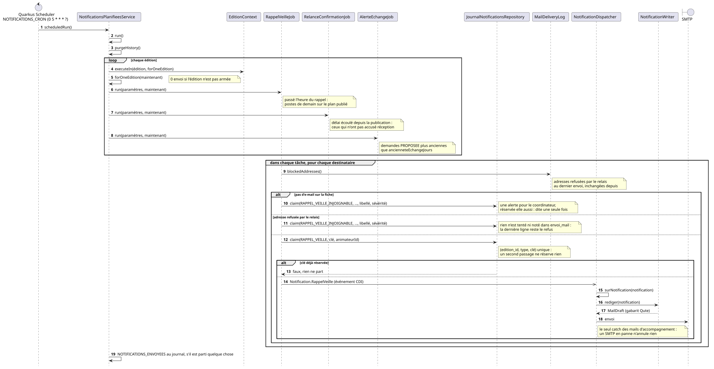
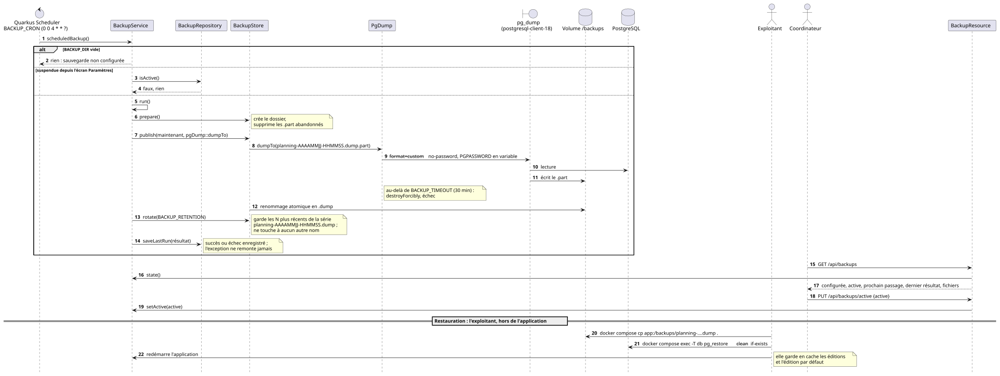

# Exploitation : installer, sauvegarder, tenir pendant l'événement

`securite.md` dit **comment durcir**. Ce document dit **comment exploiter** :
installer chez un organisateur, ne pas perdre ses données, faire arriver les
e-mails, et savoir quoi faire un samedi d'exploitation.

Un événement dure quelques jours pendant lesquels tous les animateurs consultent
leur planning : ce document existe pour que quelqu'un d'autre puisse prendre le
relais.

## 1. Avant d'installer

| Prérequis | Pourquoi |
| --- | --- |
| Un nom de domaine et un certificat TLS | `PUBLIC_URL` construit les liens d'espace **imprimés sur les PDF** : ils doivent être joignables après l'événement, pas seulement pendant |
| Un relais SMTP authentifié | Codes d'accès, liens d'espace, plannings individuels, notifications d'échange : tout passe par l'e-mail (voir §4) |
| Un reverse proxy | Voir la fin de [`securite.md`](securite.md) : TLS, et surtout **origine injoignable autrement que par le proxy** |
| Les informations légales de l'organisateur | Voir §3 — ce sont les siennes, pas les tiennes |

## 2. Les variables d'environnement

Le fichier [`.env.prod.example`](../.env.prod.example) les liste toutes, avec
ce qui est obligatoire et ce qui a un défaut. Deux principes :

- **`docker-compose.prod.yml` échoue au démarrage** si `APP_VERSION`,
  `DB_PASSWORD`, `ADMIN_PASSWORD`, `SESSION_ENCRYPTION_KEY`, `PUBLIC_URL`,
  `MAIL_HOST` ou `MAIL_FROM` manque. C'est voulu : mieux vaut un démarrage
  refusé qu'un identifiant de développement — ou une image de recette — en
  production. **L'application refuse aussi ce démarrage d'elle-même** pour les
  deux mots de passe, de sorte qu'une image lancée hors de ce compose — `docker
  run`, un manifeste Kubernetes — ne puisse pas non plus démarrer sur
  `admin`/`admin`. **Elle refuse de même une page de mentions légales vide**,
  sauf instance déclarée hors service par `LEGAL_DEMO_INSTANCE` (§3) ;
- tout le reste a un défaut **neutre**, pas la marque d'un client. Une instance
  sans variable de marque ne porte le logo de personne.

```bash
docker compose -f docker-compose.prod.yml --env-file .env.prod up -d
```

**On déploie une version nommée — `APP_VERSION=1.2.0` dans le `.env.prod` —
jamais `:main` ni `:latest`.** `:main` est l'image de recette, reconstruite à
chaque fusion ; `:latest` désigne ce que le registre veut bien. Un déploiement
doit être nommable dans un rapport d'incident : « la 1.2.0 » en est un,
« l'image de mardi » non. Ce que promet un numéro de version — et comment se
fait corriger une version antérieure — est dans
[`versioning.md`](versioning.md).

Vérifier ensuite, avec le script livré dans le dépôt (bash, `curl` et `jq`,
lancé depuis le répertoire du `.env.prod`) :

```bash
scripts/verifier-deploiement.sh https://<domaine>          # version lue dans APP_VERSION
scripts/verifier-deploiement.sh https://<domaine> 1.2.0    # ou donnée explicitement
```

Il enchaîne, et s'arrête au premier échec avec un code de sortie non nul :

| Contrôle | Ce qui est vérifié |
| --- | --- |
| Disponibilité | `/q/health/ready` répond `UP` : base joignable, aucune migration en attente ni en échec. Attente bornée (120 s, `--attente`) pour laisser passer les migrations d'un premier démarrage |
| Version | la version exposée par `/api/config` est celle attendue (`--version-libre` tant que `APP_VERSION=main`) |
| Marque et mentions | `/api/branding` et `/api/mentions-legales` répondent |
| Mentions obligatoires | aucune des cinq mentions exigées n'est vide — sauté si l'instance se déclare de démonstration (`demoInstance` de `/api/mentions-legales`, soit `LEGAL_DEMO_INSTANCE=true` tel que l'application l'a lu), ou avec `--instance-demo` |

Le script ne demande ni accès à l'hôte ni identifiant : une CI de déploiement
peut l'appeler telle quelle.

Le **pied de page** de l'application — celui de l'administration comme celui de
l'espace animateur — et la page **Débogage** (hors menu : Ctrl+K ou l'adresse `/debug`, onglet *Résolution*) affichent la version
déployée : le tag `vX.Y.Z` pour une image de release, l'identifiant du commit
pour une image de recette. C'est ce qu'un rapport de faille doit citer — voir
[`../.github/SECURITY.md`](../.github/SECURITY.md).

### Le temps de calcul que chaque édition peut prendre

Le solveur est **un seul pour toute l'instance** : une résolution à la fois,
toutes éditions confondues, la file comprise. Chaque édition règle son budget
sur l'écran *Solveur* (durée maximale, arrêt sans amélioration), mais c'est
l'exploitant qui fixe jusqu'où elle peut aller :

| Variable | Défaut | Rôle |
| --- | --- | --- |
| `SOLVER_SECONDS_LIMIT_MAX` | `3600` | Durée maximale qu'une édition peut régler, ou qu'un lancement peut demander (`?seconds=`, MCP), en secondes. |
| `SOLVER_UNIMPROVED_SECONDS_LIMIT_MAX` | celle de `SOLVER_SECONDS_LIMIT_MAX` | Plafond de l'arrêt sans amélioration, en secondes. |

Au-dessus, la valeur est **refusée**, avec un message qui cite le plafond — pas
rognée en silence, sans quoi un organisateur qui règle trois heures en
obtiendrait deux en croyant le budget épuisé. Abaisser un plafond sous une
valeur qu'une édition a déjà enregistrée ne casse rien : ses calculs tournent
au plafond, et le moniteur du solveur le dit. **Le démarrage est refusé** si un
plafond est inférieur au défaut correspondant (`planning.solver.seconds-limit`,
900 s ; `planning.solver.unimproved-seconds-limit`, 300 s) : chaque édition
restée au défaut se verrait sinon refuser ses propres calculs.

## 3. Mentions légales : à renseigner, pas à laisser vides

Les sept variables `LEGAL_*` valent `""` par défaut, et la page le dit
elle-même : « Aucune information légale n'a été renseignée sur ce
déploiement ». Acceptable sur une instance de démonstration ; **pas sur une
instance en service**, où la LCEN veut un éditeur et un hébergeur identifiés, et
le RGPD un responsable de traitement, une base légale et une durée de
conservation.

C'est pourquoi **cinq d'entre elles font échouer le démarrage** en production
quand elles sont vides — `LEGAL_EDITEUR`, `LEGAL_HEBERGEUR`, `LEGAL_CONTACT`,
`LEGAL_BASE_LEGALE` et `LEGAL_CONSERVATION` — comme `ADMIN_PASSWORD` resté sur
sa valeur d'exemple. Le message les nomme **toutes en une fois** : les
corriger une par une coûterait cinq redémarrages.

Les deux autres restent facultatives, et pas par oubli :
`LEGAL_RESPONSABLE_TRAITEMENT` vide **retombe sur l'éditeur** — l'exiger
contredirait ce repli —, et un directeur de publication n'est pas exigé de tout
éditeur.

Quatre variables de plus, `LEGAL_ACCESSIBILITE_*`, remplissent la page
`/declaration-accessibilite` — l'état de conformité au RGAA, la date de l'audit,
les contenus non accessibles, l'adresse de signalement. Elles ne bloquent pas le
démarrage : l'obligation de l'article 47 de la loi n° 2005-102 ne pèse que sur
certaines organisations, et la page vide dit elle-même qu'aucun audit n'est
déclaré plutôt que d'annoncer une conformité. Leur détail est dans
[`accessibilite.md`](accessibilite.md#la-déclaration-daccessibilité).

Une instance qui n'est pas en service — démonstration, recette — pose
`LEGAL_DEMO_INSTANCE=true` et démarre avec une page vide. Le drapeau est
explicite plutôt que déduit de `PUBLIC_URL` ou du mode de lancement : ce qu'une
instance est *faite pour* ne se lit nulle part dans sa configuration. Voir
[décision 0040](decisions/0040-mentions-legales-exigees-au-demarrage.md).

Un serveur de démonstration ou de recette montre aussi le mode jour J et
l'espace animateur hors saison : lancé avec `HORLOGE_SIMULEE_AUTORISEE=true`,
il affiche dans *Paramètres*, onglet *Instance*, la carte « Date et heure
simulées » — une date, une heure facultative, et « Revenir à l'horloge de la
machine ». Tant qu'une date est posée, un sablier rouge dans la barre du haut
le rappelle et ramène à cette carte. Sans la variable, la carte n'apparaît pas
et l'API refuse l'écriture (`400`) : jamais en production, où elle ferait
mentir l'écran jour J sur un vrai événement. Le détail est dans
[`api.md`](api.md#figer-la-date-du-jour--développement-démonstration-et-recette-uniquement).

> **À la montée de version**, une instance déjà en service qui n'a jamais
> renseigné ces variables **ne redémarrera pas** tant qu'elles ne le sont pas.
> C'est le comportement voulu — l'obligation existait déjà, rien ne la tenait —
> mais il se prépare avant la fenêtre de mise à jour, pas pendant.

Ces informations sont **celles de l'organisateur** : c'est lui l'employeur des
personnes planifiées et le responsable de traitement. L'intégrateur qui héberge
est, lui, **sous-traitant** au sens de l'article 28 — ce qui suppose un écrit
entre les deux parties, dès le premier hébergement, y compris gratuit. Son
contenu imposé et le registre qui l'accompagne sont dans [`rgpd.md`](rgpd.md).

## 4. Faire arriver les e-mails

C'est le point le plus facile à rater, parce qu'il **échoue en silence** : un
lien d'espace classé en indésirable ne produit ni erreur, ni alerte, juste un
animateur qui « n'a rien reçu » la veille de l'événement.

Côté application :

```properties
MAIL_HOST=smtp.example.org
MAIL_PORT=587
MAIL_USERNAME=...
MAIL_PASSWORD=...
MAIL_START_TLS=REQUIRED
MAIL_FROM=planning@<domaine>
```

Côté domaine — l'application n'y peut rien, et c'est pourtant ce qui décide si
le message est accepté :

- **SPF** : autoriser le relais utilisé ;
- **DKIM** : signer, et publier la clé ;
- **DMARC** : au minimum une politique de surveillance, alignée sur le domaine
  de `MAIL_FROM`.

**À faire avant la première diffusion** : envoyer un planning de test vers
**trois boîtes différentes**, dont Gmail et Outlook, qui sont les plus stricts.
Vérifier que le message arrive en boîte de réception, pas seulement qu'il part.

Chaque mail part en **deux parties** : un texte brut, et une version HTML
habillée aux couleurs du déploiement (`BRANDING_PDF_*`, `BRANDING_ORGANISATION`
au pied de page) avec le logo `BRANDING_PDF_LOGO` embarqué dans le message
lui-même — aucune image n'est chargée depuis un serveur à l'ouverture, ce que
les clients de messagerie bloquent et que les filtres antispam pénalisent. Un
client qui refuse le HTML affiche le texte, identique mot pour mot.

### Les envois automatiques de nuit

Trois envois planifiés partagent une tâche unique : le rappel de la veille, la
relance des animateurs qui n'ont pas accusé réception de leur planning, et
l'alerte sur les demandes d'échange qui attendent une décision.

```properties
NOTIFICATIONS_CRON=0 5 * * * ?
NOTIFICATIONS_TIMEZONE=Europe/Paris
```



<sub>Source : [`diagrammes/notifications-planifiees.puml`](diagrammes/notifications-planifiees.puml).</sub>

Le cron est **horaire**, et ce n'est pas une erreur de réglage : l'heure d'envoi
du rappel se décide **par édition** sur l'écran Paramètres, onglet *E-mails
automatiques*, or une tâche unique
ne peut pas partir à quatre heures différentes pour quatre éditions. Le job se
réveille souvent, et chaque édition envoie quand son heure à elle est passée.
C'est sans danger parce que chaque envoi est réservé en base avant de partir :
tourner douze fois dans la soirée n'écrit à personne deux fois.

Le fuseau est celui de l'événement, réglé à part (`NOTIFICATIONS_TIMEZONE`),
et non celui du conteneur (`TZ`, voir § Sauvegarde) : « 18 h » sur l'écran doit
vouloir dire 18 h pour la personne qui lit, quel que soit le fuseau de la
machine.

**L'heure d'envoi du rappel est plafonnée à 23h00**, et l'écran refuse plus
tard. La fenêtre d'envoi va de l'heure réglée à minuit — après, le jour annoncé
a commencé et « demain » serait faux — donc une heure plus tardive laisserait
une fenêtre plus courte que l'intervalle entre deux exécutions : le rappel
tomberait entre deux réveils et ne partirait jamais, sans que rien ne le dise.
Si vous espacez `NOTIFICATIONS_CRON` au-delà d'une exécution par heure, ce
plafond ne suffit plus à le garantir.

**Rien ne part d'une édition qui n'a pas été armée explicitement.** L'écran
Paramètres, onglet *E-mails automatiques*, porte un interrupteur par édition, à
`false` par défaut, et c'est le
seul garde-fou : une `Edition` ne porte ni dates ni drapeau « en cours », donc
sans lui la première nuit après une mise en production rappellerait aux
bénévoles de l'an dernier qu'ils sont attendus demain. Dupliquer une édition ne
recopie pas ce réglage — la nouvelle naît muette, et quelqu'un doit décider de
l'armer.

À surveiller, dans l'ordre où ça casse :

1. **l'interrupteur de l'édition** — la cause de « je n'ai rien reçu » dans neuf
   cas sur dix, et il est silencieux par construction ;
2. **le plan doit être publié** — le rappel lit le planning **publié**, jamais le
   plan de travail : personne n'est rappelé pour un créneau qu'on ne lui a pas
   communiqué ;
3. **les fiches sans adresse** — sautées, comptées dans « À traiter
   aujourd'hui » de l'accueil et nommées dans ses « Messages récents » : ce
   sont les gens à prévenir à la main.

## 5. Sauvegarde et restauration

Tout l'état vit dans PostgreSQL : référentiel, planning résolu, instantanés,
jetons d'espace animateur, sessions. Il n'y a **rien à sauvegarder d'autre** —
et rien qui se reconstruise sans la base.



<sub>Source : [`diagrammes/sauvegarde.puml`](diagrammes/sauvegarde.puml).</sub>

### La sauvegarde automatique

L'application dumpe la base **toute seule, chaque nuit à 4 h**, dès que
`BACKUP_DIR` désigne un répertoire. C'est un `pg_dump --format=custom` complet —
schéma et données, toutes éditions — écrit dans ce répertoire, et seules les
`BACKUP_RETENTION` copies les plus récentes sont gardées : la plus ancienne
part quand une nouvelle arrive.

| Variable | Défaut | Effet |
| --- | --- | --- |
| `BACKUP_DIR` | *(vide)* | Répertoire des sauvegardes. Vide : **rien n'est planifié**, et l'écran *Paramètres*, onglet *Instance*, l'annonce. |
| `BACKUP_RETENTION` | `10` | Nombre de copies conservées, entre 1 et 30. Hors bornes, **le démarrage est refusé** : une rétention rognée en silence ne se découvre que le jour où l'on cherche le dump manquant. |
| `BACKUP_TIMEZONE` | `Europe/Paris` | Fuseau dans lequel « 4 h » se lit, et dans lequel le fichier est nommé — réglé à part, indépendamment de `TZ`. |
| `BACKUP_CRON` | `0 0 4 * * ?` | La planification elle-même, si 4 h ne convient pas. |

`docker-compose.prod.yml` règle aussi **`TZ`** (défaut `Europe/Paris`) sur les
deux conteneurs. Ce fuseau-là n'entre pas dans les deux planifications de
nuit, qui ont chacune le leur, mais décide de **la limite du jour** partout
ailleurs : quels créneaux sont « déjà commencés » et donc figés pendant
l'événement, le jour où la collecte de disponibilités et la foire aux échanges
ouvrent et ferment, l'heure imprimée sur les PDF, la date des fichiers
exportés. Il doit être celui de l'événement : en UTC, tout cela basculerait
une à deux heures après minuit, heure de Paris.

Le répertoire doit appartenir à l'**uid 1000**, l'utilisateur du conteneur —
qui est aussi celui du premier compte d'une machine Linux. `docker-compose.prod.yml`
y monte le répertoire `./backup` de l'hôte, à côté du fichier compose — le
montage du déploiement de référence, et celui qu'un outil de sauvegarde
externe (borgmatic, restic…) recopie hors machine. **Le créer avant le premier
démarrage**, sinon Docker le crée en `root` et la première sauvegarde échoue
sur un refus d'écriture :

```bash
mkdir -p backup && sudo chown 1000:1000 backup
```

> ⚠️ **Installation antérieure à ce changement d'uid** : le conteneur tournait
> en 1001, et le volume de sauvegarde existant appartient encore à cet
> utilisateur-là. Après mise à jour de l'image, la sauvegarde de nuit échouera
> sur un refus d'écriture — visible dans le compte rendu de l'écran
> *Paramètres*, onglet *Instance*. Reprendre la propriété une fois, pile
> arrêtée :
>
> ```bash
> sudo chown -R 1000:1000 backup
> ```
>
> Une installation qui utilisait encore le volume nommé `planning_backups`
> (monté sur `/backups`) garde ses anciens dumps dedans : les recopier une fois
> dans `./backup` (`docker run --rm -v planning_backups:/old -v "$PWD/backup":/new
> alpine sh -c 'cp -a /old/. /new/ && chown -R 1000:1000 /new'`).

> ⚠️ **Mise à jour depuis `/backups`** : le répertoire des sauvegardes dans le
> conteneur s'appelait `/backups`, il s'appelle désormais `/backup`. Un
> `.env.prod` qui écrit encore `BACKUP_DIR=/backups` **continue de
> fonctionner** : l'image fait de `/backups` un lien vers `/backup`, et les
> dumps arrivent donc dans `./backup`. Deux gestes restent à faire une fois,
> sans urgence : recopier les anciens dumps comme ci-dessus, et écrire
> `BACKUP_DIR=/backup` dans `.env.prod` — le lien est une compatibilité, pas
> un chemin à documenter ailleurs.

> ⚠️ Le répertoire survit au conteneur, **pas à la machine**. Une sauvegarde
> qui ne quitte jamais l'hôte ne protège que de la fausse manipulation, pas de
> la perte du serveur : recopier `./backup` ailleurs, chiffré, reste à faire.

L'écran *Paramètres*, onglet *Instance*, montre l'emplacement, la rétention, la prochaine
sauvegarde, les fichiers présents et le compte rendu de la dernière tentative,
succès comme échec — c'est là que « la sauvegarde ne tourne plus depuis trois
semaines » se voit avant que ça ne compte. Un interrupteur la **suspend** ; il
ne la met pas en service, c'est `BACKUP_DIR` qui le fait.

**Une nuit en échec prévient l'administration par e-mail**, sans attendre qu'on
ouvre l'écran : l'adresse `MAIL_ADMIN` reçoit la date de la tentative, la
raison (celle que l'écran affiche), la date de la dernière sauvegarde réussie
et le nombre de nuits consécutives en échec. Un second message part à la
première sauvegarde réussie qui suit, pour fermer la boucle. Rien ne part
quand la sauvegarde est suspendue ou que `BACKUP_DIR` est vide — c'est un
choix, pas une panne — ni quand `MAIL_ADMIN` est vide : l'application le dit
alors une fois au démarrage, et l'écran le rappelle. Si le serveur SMTP est
lui-même en panne, l'échec d'envoi est journalisé et rien de plus. Si c'est la
base qui ne répond plus, le message part quand même : la date de la dernière
réussite est alors lue sur le plus récent dump du répertoire (« inconnue » s'il
n'y en a aucun), et les nuits qui n'ont pas pu être enregistrées sont comptées
dans la série — et dans le message de rétablissement — dès que la base répond
de nouveau, tant que l'application n'a pas redémarré entre-temps. L'exception
de la sauvegarde part aussi au suivi d'erreurs quand `SENTRY_DSN` est
renseigné. Une instance qui ne tourne plus du tout la nuit ne peut pas
s'alerter elle-même : c'est le rôle de la sonde externe (§ 7).

Les fichiers s'appellent `planning-AAAAMMJJ-HHMMSS.dump`. Un dump déposé là à
la main sous un autre nom n'est jamais touché par la rotation.

### Sauvegarder à la main

```bash
docker compose -f docker-compose.prod.yml --env-file .env.prod exec -T postgres \
  pg_dump -U festival -d festival --format=custom \
  > "planning-$(date +%Y%m%d-%H%M).dump"
```

Le service s'appelle `postgres`, la base et son propriétaire `festival` : ils
sont fixés par `docker-compose.prod.yml`, pas par le `.env.prod`.

Rythme conseillé : **quotidien hors événement, horaire pendant**. Le volume est
petit (quelques mégaoctets) ; ce qui coûte cher, c'est la journée de saisie
perdue, pas le stockage.

> ⚠️ Un dump contient des **données personnelles de mineurs** — noms, dates de
> naissance, adresses électroniques, disponibilités. Il se chiffre au repos, se
> range hors de la machine, et ne se dépose jamais sur une instance de
> démonstration ni dans un ticket.

### Restaurer

**La restauration n'est pas une fonctionnalité de l'application, et c'est
délibéré** : elle se fait sur la base PostgreSQL, par l'exploitant, sur l'hôte.
Un bouton « restaurer » dans une interface web serait précisément le geste que
la sauvegarde automatique existe pour rattraper
([décision 0015](decisions/0015-sauvegarde-par-pg-dump-restauration-hors-application.md)).

Le dépôt livre un **script guidé**, `scripts/restaurer.sh`, à lancer depuis le
répertoire de `docker-compose.prod.yml` (bash et `docker compose`, rien
d'autre) :

```bash
tmux new -s restauration                              # d'abord : voir la note ci-dessous
scripts/restaurer.sh                                  # liste les dumps du volume, demande lequel
scripts/restaurer.sh planning-20260308-040000.dump    # un dump du volume, nommé
scripts/restaurer.sh --fichier ./copie.dump           # un fichier de l'hôte
scripts/restaurer.sh --essai planning-20260308-040000.dump   # l'exercice, sans toucher la production
```

| Étape | Ce qu'elle fait |
| --- | --- |
| Contrôle | le fichier est **lu en entier** par `pg_restore` (vers `/dev/null`) : un fichier qui n'est pas un dump `--format=custom`, ou un dump tronqué — même après sa table des matières, que `pg_restore --list` lirait sans broncher — est refusé **avant** tout arrêt. La version du schéma du dump est comparée à celle des migrations de l'image : un dump **plus récent** que l'image est signalé, et une confirmation demandée (`PLUS-RECENT`, réputée donnée sous `--oui`). La pile doit tourner, et le volume avoir la place d'un dump de précaution |
| Précaution | dump de l'état actuel, `planning-avant-restauration-AAAAMMJJ-HHMMSS.dump`, dans le volume — nom que la rotation ignore, donc qui **ne s'efface jamais seul** : à supprimer à la main une fois la restauration validée. Son nom est affiché : c'est le chemin du retour |
| Confirmation | le script dit ce qui sera écrasé (base `festival`, instance `PUBLIC_URL`) et demande de taper `RESTAURER` (`--oui` pour une procédure écrite) |
| Restauration | arrêt de `app`, base supprimée puis recréée, `pg_restore` en **une seule transaction** qui s'arrête à la première erreur, relance de `app`. Échec ou interruption — Ctrl-C, session SSH coupée : le dump de précaution est restauré à la place avant la relance — l'application ne redémarre jamais sur une base vide ou à moitié restaurée |
| Vérification | attente que `app` redevienne `healthy` (`/q/health/ready`), durée de l'interruption affichée |

> ⚠️ **Lancer le script dans `tmux`** (ou `screen`, ou sous `nohup … > restauration.log
> 2>&1 &`) quand on est connecté en SSH. Une session qui tombe pendant la
> restauration ne laisse pas la base à moitié restaurée — le script remet le
> dump de précaution en place et relance l'application même sans terminal —
> mais ce retour arrière se fait alors sans témoin : on se reconnecte sans
> savoir s'il a abouti. Sous `tmux`, rien n'est interrompu, et
> `tmux attach -t restauration` retrouve l'écran là où il en était.

La base est **recréée** plutôt que nettoyée (`--clean`) : `--clean` ne supprime
que les objets présents dans le dump, et restaurer un dump plus ancien que le
schéma — le cas d'un retour arrière — laisserait les tables des migrations
suivantes, que Flyway rejouerait au démarrage pour échouer.

`pg_restore` et `pg_dump` viennent du conteneur `postgres`, donc de la même
majeure que le serveur. Le volume des sauvegardes est lu par un conteneur
jetable de l'image applicative, point d'entrée remplacé : le script marche
aussi le jour où l'application ne démarre plus, et avec un montage de
répertoire hôte comme avec le volume nommé. La copie de travail du dump est
effacée en sortie ; rien ne quitte l'hôte.

**`--essai`** restaure dans un conteneur temporaire de l'image du service
`postgres` de la pile (lue dans `docker-compose.prod.yml`, donc la même majeure
que la production), supprimé en fin d'exécution, et affiche la durée, le nombre
d'éditions et la version du schéma : c'est l'exercice à faire une fois, à
froid, avant d'en avoir besoin.

Un dump plus récent que l'image déployée (retour arrière d'image, dump venu
d'une autre instance) porte un schéma en avance sur les migrations que l'image
connaît : Flyway ignore ces migrations « futures », et l'application
démarrerait sur un schéma qu'elle ne connaît pas. La restauration le signale
**avant** tout arrêt — version lue dans l'historique Flyway du dump, comparée
aux migrations embarquées dans l'image — et demande confirmation ; le bon
geste est presque toujours de déployer d'abord l'image de la version du dump
(`APP_VERSION`).

Restaurer pendant l'événement perd toutes les écritures postérieures au dump :
c'est ce qui justifie le rythme horaire conseillé plus haut.

### Débloquer une migration interrompue

Un démarrage coupé au milieu d'une migration laisse une ligne en échec dans la
table d'historique de Flyway, et toutes les migrations suivantes refusent de
partir. `FLYWAY_REPAIR_AT_START=true` retire cette ligne au démarrage suivant.

**À repasser à `false` une fois l'instance repartie.** Laissée à `true`, la
réparation réaligne aussi les empreintes de l'historique sur les fichiers
livrés : une migration modifiée après coup passerait alors sans un mot, alors
que c'est précisément ce que le refus de Flyway signale.

## 6. Conservation des données

Une seule chose s'efface toute seule : **l'historique des actions**.
`JOURNAL_RETENTION` (90 jours par défaut, au format ISO 8601 — `P30D`, `P1Y`)
borne la table `journal_action`, que la tâche de nuit purge au passage. Hors
des bornes admises — un jour au minimum, dix ans au maximum —
**l'application refuse de démarrer** plutôt que de rogner la valeur en
silence, comme pour `BACKUP_RETENTION` : à `P0D`, chaque nuit viderait
l'historique entier sans autre trace qu'une ligne de journal applicatif. La page
*Historique* la lit ; personne ne l'écrit à la main et rien ne l'efface au
bouton. Allonger cette durée est un choix à assumer : la table entre dans
chaque sauvegarde, et c'est un traitement consigné au registre
(voir [`rgpd.md`](rgpd.md)).

Pour tout le reste, la durée annoncée par `LEGAL_CONSERVATION` s'affiche dans la
politique de confidentialité et **rien dans le code ne l'applique** : aucune
purge automatique n'existe aujourd'hui. Un engagement écrit qui n'est pas tenu
est plus exposant que pas d'engagement du tout, donc la purge se fait à la
main, à date fixe.
C'est délibéré, et ce que l'automatisation devra porter le jour venu est écrit
dans la [décision 0016](decisions/0016-purge-manuelle-avant-automatisation.md).

Procédure, une fois par an après l'événement :

1. exporter un dump (§5) et l'archiver **chiffré** — c'est la trace ;
2. supprimer les **éditions** dont la durée de conservation est échue depuis
   l'écran *Éditions*. La suppression est en cascade sur les 12 tables portant
   `edition_id` : animateurs, plannings, instantanés et jetons partent avec ;
3. vérifier que l'espace animateur d'un jeton supprimé répond bien `404` ;
4. noter la date et le périmètre dans le registre des traitements —
   forme attendue dans [`rgpd.md`](rgpd.md) §5.

Ce que cette procédure ne couvre pas, et qu'il faudra trancher un jour : les
données d'une édition **encore active** mais dont un animateur a demandé
l'effacement. Aujourd'hui, c'est une suppression manuelle de sa fiche — et
automatiser la purge ne le réglera pas, elle raisonne par édition échue.

## 7. Savoir que ça tourne

- **Suivi d'erreurs** — `SENTRY_DSN` vaut `""` par défaut : sans lui, aucune
  erreur ne remonte et les pannes s'apprennent par téléphone. Le câblage existe
  (voir [`observabilite.md`](observabilite.md)), il ne manque que la variable ;
- **Disponibilité** — l'application ne peut pas surveiller sa propre absence.
  Une sonde externe sur **`/q/health/ready`** (sans authentification) suffit à
  savoir qu'une instance est tombée avant que le client ne le découvre. Deux
  sondes, qui ne répondent que `UP`/`DOWN` et le nom de leurs contrôles — ni
  URL JDBC, ni hôte :

  | Sonde | `UP` quand | Usage |
  | --- | --- | --- |
  | `/q/health/live` | le processus répond | redémarrer un conteneur figé ; ne dépend **pas** de la base, qu'un redémarrage ne réparerait pas |
  | `/q/health/ready` | base joignable **et** historique Flyway à jour (aucune migration en attente ni en échec) — un seul contrôle, qui lit l'historique et échoue donc d'abord quand la base ne répond pas | sonde externe, `healthcheck` du service `app` (`docker compose ps` l'affiche `healthy`) |

  Ce que la disponibilité signale avant tout, c'est **la base injoignable**.
  Une migration interrompue (§5), elle, ne produit pas d'instance `DOWN` :
  l'application migre au démarrage et **refuse de démarrer** sur une migration
  en échec ou en attente — c'est `FLYWAY_REPAIR_AT_START` qui la débloque. La
  lecture de l'historique est une défense en profondeur contre un historique
  qui change sous une instance en marche (une autre instance, ou un
  exploitant, qui migre la même base avec un binaire plus récent). Le verdict
  est gardé 5 s : une rafale d'appels anonymes ne relit pas l'historique à
  chaque fois. L'image n'embarque pas `curl` : le `healthcheck` du compose
  écrit la requête en bash sur `/dev/tcp` ;
- **Sauvegarde de nuit** — un échec part par e-mail à `MAIL_ADMIN` (§ 5) :
  laisser cette variable vide, c'est ne l'apprendre qu'en ouvrant l'écran
  *Paramètres* ;
- **Métriques** — `/q/metrics` au format Prometheus, sur le **port 9000**
  (interface de management), que `docker-compose.prod.yml` ne publie pas :
  un Prometheus ajouté à la pile le lit sur `http://app:9000/q/metrics`. Sans
  authentification, donc **jamais** publié sur l'hôte ni routé par le reverse
  proxy ; le port applicatif, lui, répond `404` sur ce chemin. On y lit la
  durée des résolutions et la file du solveur, la latence de l'API, les mails
  refusés par le SMTP et l'âge de la dernière sauvegarde réussie
  (`planning_backup_last_success_timestamp_seconds`) — de quoi alerter sur
  une sauvegarde qui n'a pas tourné même quand le mail d'échec n'est pas
  parti. Liste complète et règles de cardinalité :
  [`observabilite.md`](observabilite.md) § Métriques ;
- **Journaux** — `docker compose logs` reste la première chose à lire ; penser à
  la rotation, une instance en pleine exploitation est bavarde.

## 8. Redéployer sans casser les navigateurs ouverts

Chaque page du frontend est chargée à la demande, sous un nom qui change avec
son contenu (`chunk-*.js`) : un redéploiement remplace tout le lot. Un
navigateur qui garde l'ancien shell en cache demanderait alors des fichiers
qui n'existent plus — chaque lien du menu échouerait en silence, sur mobile
comme sur bureau.

Le détail compte pour diagnostiquer : le routage SPA étant actif
(`quarkus.quinoa.enable-spa-routing`), un chunk disparu ne donne pas un `404`
mais un `200` avec l'`index.html` courant. C'est le mauvais type MIME qui fait
échouer l'import dynamique. Dans la console, chercher *failed to fetch
dynamically imported module* (ou son équivalent Firefox / WebKit), pas un code
d'erreur HTTP.

Deux mécanismes évitent d'avoir à demander aux utilisateurs de « vider leur
cache » :

- le serveur sert en `Cache-Control: no-cache` tout ce qui porte un nom stable
  — `index.html`, les catalogues `/i18n/*.json`, mais aussi le favicon, le
  `robots.txt`, les
  logos et les polices, que le build Angular recopie tels quels depuis
  `public/`. *Revalider avant réutilisation* : une requête conditionnelle
  répondue `304` tant que rien n'a changé. Les fichiers hashés, eux, restent
  cachés longtemps sans risque (`SpaCacheControlFilter`) ;
- si un shell périmé tourne malgré tout (onglet resté ouvert pendant le
  redéploiement), le premier clic dont le chunk a disparu déclenche **un
  rechargement complet vers la page demandée** au lieu d'échouer en silence
  (`core/stale-chunk-reload.ts` côté frontend). Le rechargement *remplace*
  l'entrée d'historique : le shell cassé n'est pas laissé à un retour arrière
  près. Navigateur hors ligne, en revanche, rien ne se déclenche — un tunnel
  produit la même erreur qu'un chunk supprimé, et recharger y échangerait un
  lien mort contre la page « pas de connexion » et toute la session avec.

Aucun réglage : redéployer suffit, les navigateurs se remettent d'aplomb à la
visite suivante ou au premier clic.
