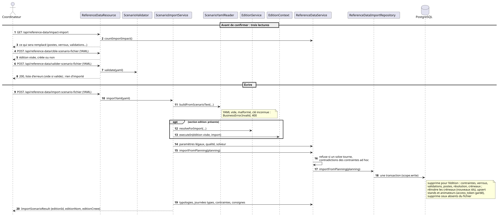
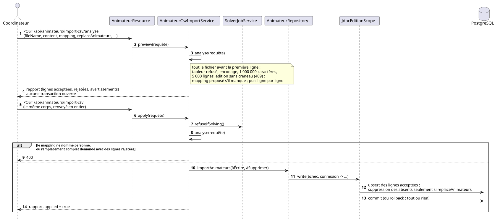

# Import / export de données

La structure d'un fichier de scénario est décrite par
[`schema/scenario-schema.json`](schema/scenario-schema.json), **généré** depuis
les DTO de `dev.sylvain.planning.scenario.dto` — il ne peut donc pas diverger de
ce que le code accepte. Ce document porte les règles que le schéma ne peut pas
exprimer.

Sauf mention contraire, tout est lu et écrit dans l'édition désignée par
`X-Edition-Id`.

Trois voies d'entrée coexistent, et elles ne font pas le même travail : le
**scénario YAML** décrit un événement entier et remplace le référentiel de
l'édition, le **dump SQL** rejoue une base complète, et l'**import CSV des
animateurs** ne touche qu'un seul référentiel, ligne par ligne, sans rien
effacer par défaut. C'est le dernier qu'on utilise quand un organisateur
arrive avec son tableur de bénévoles.

## Trois façons de repartir d'une édition, et ce qu'elles emportent

| Geste | Ce que ça fait | Les personnes |
| --- | --- | --- |
| **Scénario YAML** | décrit un événement entier et **remplace** le référentiel de l'édition visée ; un fichier qu'on s'échange, qu'on versionne, qu'on rejoue en test | oui, la section `animateurs` |
| **Duplication d'édition** (`POST /api/editions/{id}/dupliquer`) | crée une **nouvelle édition** et y recopie tout le référentiel de la source — stands, emplacements, typologies, horaires récurrents, créneaux, dosages de contraintes, paramètres et préréglages de consigne — jamais le planning résolu ni les consignes datées : « 2026 = 2025 moins les affectations » | oui **par défaut** |
| **Modèle d'année** (`…/dupliquer?avecAnimateurs=false`) | la même duplication, **sans les personnes** | non |

La bibliothèque de modèles que l'issue #90 demandait n'existe pas sous ce
nom : c'est la **liste des éditions**, et appliquer un modèle, c'est dupliquer.
Une table de gabarits en parallèle serait un second référentiel redondant pour
le même service.

Ce que le mode « modèle d'année » laisse derrière lui : `animateur` et tout ce
qui pend à une personne — `animateur_competence`, `animateur_jour_indispo`,
`animateur_souhait` — ainsi que **les ajustements manuels**, puisque chaque
type de `contrainte_ad_hoc` nomme au moins un animateur ; une copie pointant
sur des personnes absentes serait pire que pas de copie. `stand_typologie`
reste : elle porte un stand et une typologie, jamais quelqu'un.

**Pourquoi le défaut ne change pas.** Dupliquer avec les gens est le geste de
l'issue #172 : une édition « plan canicule » créée en cours de festival doit
garder son équipe et son « Envoyer à all ». Décocher la case est le cas
inverse — préparer 2027 depuis 2026 — et là, recopier noms, dates de naissance
et courriels de personnes qui ne se sont pas réinscrites est un problème de
minimisation et de durée de conservation (voir [`rgpd.md`](rgpd.md)), pas un
confort.

## Dump SQL

C'est la seule opération **globale à l'instance** : une sauvegarde de la base,
toutes éditions comprises. L'import rejoue le script en une transaction et
n'accepte que `INSERT` / `DELETE` / `TRUNCATE` sur les tables métier.

Les consignes d'édition en font partie — `consigne_edition`,
`consigne_edition_fenetre`, `consigne_edition_ouverture`,
`consigne_edition_creneau` — ainsi que leurs préréglages
(`prereglage_consigne`, `prereglage_consigne_fenetre`) : elles changent les
sièges qu'une résolution reçoit, et une restauration sans elles rebâtirait
une journée nominale que l'organisateur avait fermée. Le scénario YAML les
porte aussi, dans ses deux sections `prereglagesConsigne` et `consignes`
(voir [plus bas](#consignes-et-préréglages)) — ses stands restent décrits
nominalement, la consigne est une couche à part.

L'export cloisonné par édition existe sous une autre forme : l'export de
scénario YAML.

## Où se fait chaque opération de scénario

Tout se passe sur l'écran **Fichiers** (`/fichiers`), qui réunit les deux
moitiés d'un même geste — exporter, corriger, réimporter — et l'archive de fin
d'événement, en trois onglets portés par `?onglet=importer|exporter|archive` ;
la carte de l'onglet Importer est portée par `?cible=`. Les anciennes adresses
`/imports`, `/exports`, `/export-csv` et `/validateur-yaml` y redirigent,
paramètres compris, tout comme `/debug?onglet=donnees` et `?onglet=yaml`.

| Geste | Où | Pourquoi là |
| --- | --- | --- |
| Importer un fichier scénario | **Fichiers**, Importer, carte Scénario (`/fichiers?cible=scenario`) | C'est un fichier qu'un organisateur apporte, comme les CSV d'à côté |
| Vérifier un fichier sans l'importer | **Fichiers**, Importer, carte Vérifier un fichier (`/fichiers?cible=verifier`) | À côté de l'import qu'il prépare, et sans rien écrire |
| Charger un exemple livré | **Fichiers**, Importer, carte Exemples (`/fichiers?cible=exemples`) | La démonstration d'un organisateur autant que le catalogue d'un testeur : chaque fichier y porte un nom lisible et une phrase (taille, jours, particularité), rangé « pour découvrir », « pour tester un cas » ou « extrêmes », et aucun nom de fichier n'est affiché |
| Exporter l'édition en scénario | **Fichiers**, Exporter (`/fichiers?onglet=exporter`) | Là où l'édition écrit ses fichiers |

## Ce que l'import d'un scénario remplace

- **rien ne sort de l'édition courante** ;
- animateurs et stands sont remplacés en totalité — ceux que le fichier
  désigne sont **mis à jour sur place**, les autres supprimés ;
- les créneaux reçoivent de **nouveaux ids en base** — les contraintes ad hoc
  qui les référençaient par leur id de fichier sont réassociées ;
- affectations et contraintes ad hoc de l'édition sont supprimées — ces
  dernières ne sont réécrites que si le fichier porte la section
  `contraintesAdHoc` ;
- consignes et préréglages de consigne sont **remplacés** si le fichier porte
  la section correspondante (`consignes`, `prereglagesConsigne`), et laissés
  tels quels sinon.



<sub>Source : [`diagrammes/import-scenario.puml`](diagrammes/import-scenario.puml).</sub>

Une section `edition: { id?, nom? }` route l'import vers une autre édition :
celle de cet identifiant si elle existe, sinon la seule édition de ce nom,
sinon une édition créée vide sous ce nom — son identifiant, lui, est attribué
par l'application. La réponse dit toujours où les données ont atterri :
l'opérateur peut consulter une édition différente de celle qui vient d'être
écrite.

### Les identifiants d'un fichier sont des références locales

Tous les identifiants sont attribués par l'application
([ADR 0050](decisions/0050-identifiants-generes-par-edition.md)) : `A1`, `A2`…
pour les animateurs, `S…` pour les stands, `T…` pour les typologies, `L…` pour
les emplacements, `C…` pour les contraintes ad hoc, numérotés **dans chaque
édition**. Dans un fichier scénario, l'identifiant d'une ligne ne sert qu'à ce
que le fichier la cite ailleurs — un siège, une contrainte, une consigne,
une compétence. Ce qu'il désigne dans l'édition cible se décide à l'import,
ligne par ligne :

| Ordre | Animateur | Stand, typologie, emplacement |
| --- | --- | --- |
| 1 | la fiche de même identifiant, si elle a la même adresse e-mail (ou, faute d'adresse, les mêmes nom et prénom) | la ligne de même identifiant, si son `code` ne contredit pas celui du fichier |
| 2 | la seule fiche de cette adresse, puis la seule de ces nom et prénom | la ligne de ce `code` — ou de l'identifiant lu comme un code, pour un fichier écrit à la main (`STRATEGIE`) |
| 3 | une fiche nouvelle | une ligne nouvelle, qui garde l'identifiant du fichier comme code quand il est lisible |

C'est la règle 1 qui fait qu'**un scénario exporté puis réimporté dans la même
édition met à jour au lieu de recréer** : les jetons d'espace (les liens
imprimés sur les plannings), les sessions, les demandes d'échange et les
confirmations survivent. La vérification d'identité qui l'accompagne n'est
pas une précaution de style : chaque édition numérote à partir de 1, et `A3`
d'une autre édition est quelqu'un d'autre. Les contraintes ad hoc, remplacées
en bloc, gardent leur identifiant quand l'édition le porte et en reçoivent un
sinon.

## Ce que l'export garantit

« Exporter les données actuelles en scénario » écrit **toutes** les sections que
l'import sait relire — pas seulement les entités, mais aussi `typologies`,
`emplacements`, `parametresLegaux`, `parametresSolveur`, `journeesTypes`,
`contraintes`, `contraintesAdHoc`, `prereglagesConsigne` et `consignes`.

C'est la raison d'être de l'export : **réimporter le fichier reproduit
exactement le même problème**. Un champ oublié dans la section n'est pas « non
surchargeable », il est **remis au défaut** : l'import écrit un objet neuf, si
bien que `heureDebutSoiree`, absente du DTO, ramenait une édition réglée à 22 h
à 20 h et déplaçait toutes les heures de soirée de l'équité sans un mot. Un fichier sans ces sections retombait
silencieusement sur les réglages de l'instance qui l'importe — sa durée de
résolution, ses plafonds légaux — et le « même »
scénario rejoué ailleurs résolvait un autre problème.

**Les créneaux sortent toujours tels qu'ils sont, et la liste de sièges
(`postes`) n'en sort pas.** Absente, elle est regénérée à l'import à partir des
stands et des créneaux, par le constructeur même qu'utilise une résolution : le
fichier ne perd rien. Écrite, elle répétait ce que `effectifMin` et les
fenêtres d'ouverture disaient déjà — dix mille lignes sur une édition réelle —
et figeait la grille contre toute modification ultérieure d'un stand. Une
édition ne peut de toute façon pas produire un staffing qui s'écarte de la
règle, seul cas où la section a un sens (voir plus bas).

Un créneau peut porter `couverturePause: true` : il couvre un service de
repas, et le stand n'y ouvre que la moitié de son effectif, arrondie au
supérieur. Le drapeau n'est écrit que lorsqu'il vaut vrai.

## Horaires d'un stand

Le sélecteur de jours est **à plat** : `jours` nomme lequel des champs voisins
s'applique (`TOUS` par défaut, `JOURS_SEMAINE`, `PLAGE`, `DATES`), et seul
celui-là est lu.

**`heureFin` omise signifie « jusqu'à la fermeture »** : la fenêtre court
jusqu'à la fin du créneau évalué. C'est ce qui permet à une même règle de
couvrir un jour fermant à 20 h et un jour fermant à minuit, et ce qui remplace
le contournement `23:59` qu'imposait une heure de fin concrète — une fenêtre ne
peut pas chevaucher minuit.

**`effectif` omis signifie « hériter de `effectifMin` »** : c'est le cas très
majoritaire. Le renseigner sur une fenêtre est ce qui permet à un stand dont la
charge varie dans la journée — 4 personnes le matin, 5 le soir — de rester un
seul stand plutôt que d'être éclaté en plusieurs. Voir
[`domaine.md`](domaine.md#leffectif-se-porte-sur-la-fenêtre-pas-sur-le-stand).

Le champ existe des deux côtés du modèle horaire : sur une **fenêtre d'une
règle récurrente** et sur une **ouverture datée**. Un fichier qui n'en nomme
aucun se relit exactement comme avant que le champ existe.

Une portée plus précise prime sur une portée plus large ; une exception datée
prime sur toutes les règles, pour le seul jour qu'elle nomme. Arbitrage complet
dans [`domaine.md`](domaine.md#horaires-récurrents--trois-couches-un-seul-mode-par-jour).

## `postes` : absente ≠ vide

**Absente**, la section est générée à partir des stands et créneaux importés —
un poste par place sur chaque créneau × segment réellement ouvert, exactement
comme « Lancer le solveur » depuis le référentiel. Le nombre de places vient de
la fenêtre d'ouverture quand elle porte un `effectif`, et retombe sinon sur
`effectifMin` (jamais `effectifMax`) : voir
[`domaine.md`](domaine.md#leffectif-se-porte-sur-la-fenêtre-pas-sur-le-stand).

**Présente**, elle est reprise telle quelle, y compris vide. C'est ce qui permet
un staffing s'écartant de la règle.

Aucun scénario livré ne s'en sert : tous laissent l'import générer leurs sièges.
Une liste écrite à la main répète ce que `effectifMin` dit déjà, et le jour où
elle dérive des stands, le fichier décrit un problème qu'il ne dit plus.

## `contraintes` : en bloc, pas en fusion

Une règle que la section ne cite pas **redevient active, à son poids par
défaut**. Un scénario qui épingle son réglage décrit le problème contre lequel
il a été vérifié : une fusion laisserait en place les restes de l'édition qui
importe, et le « même » scénario continuerait de résoudre un problème différent
selon l'endroit où il atterrit. Absente, elle ne touche à rien.

Un nom de contrainte absent du catalogue est **refusé (400)**, pas ignoré :
c'est une faute de frappe ou un fichier écrit contre une autre version du
catalogue, et l'ignorer laisserait l'opérateur convaincu qu'une règle est
éteinte alors qu'elle ne l'est pas.

Les scénarios livrés portent tous cette section, avec les deux seuls poids qui
s'écartent du défaut — `appreciationIncompatible: 15` et
`maxJoursConsecutifsTravailles: 25`. Le défaut du déploiement est 1 pour une
règle dure et 5 pour une règle moyenne ou souple : le dosage voyage avec le
scénario.

**Les poids d'un fichier se lisent sur l'échelle actuelle** (faible 1,
normale 5, forte 25 — [0057](decisions/0057-importance-d-une-regle-en-trois-positions.md)).
Un fichier écrit avant ce changement portait ses poids sur l'échelle où le
défaut valait 1 : réimporté tel quel, il ferait peser ses règles citées cinq
fois moins que les autres. Multipliez par cinq les poids des règles moyennes et
souples d'un tel fichier avant de l'importer ; les scénarios livrés l'ont été.

`contraintesAdHoc` **remplace** les contraintes ad hoc de l'édition ; absente,
le fichier n'en installe aucune. Elle désigne animateurs, stands et créneaux par
les ids **du fichier**.

Elles n'étaient auparavant pas conservées mais **héritées de l'édition
courante** — celle de l'appelant, résolue avant même que l'édition cible soit
connue. Une exception ainsi recopiée dans une autre édition y désigne un stand
et un créneau qui n'existent pas : l'import échouait alors sur une clé
étrangère. Et l'héritage n'était pas plus sain dans sa propre édition, puisque
l'import remplace tous les créneaux : les ids visés venaient d'être supprimés.
Ce qui préserve réellement les exceptions d'un aller-retour, c'est l'export, qui
écrit la section dès que l'édition en porte une.

Une exception qui ne peut pas tenir en même temps qu'une autre du même fichier
fait **refuser l'import entier**, avant toute écriture, avec un message qui les
nomme — le même contrôle qu'à la saisie
([`contraintes.md`](contraintes.md#contraintes-ad-hoc--les-contradictions-refusées-à-la-saisie)).

## Typologies

Chaque stand du fichier **propose au moins une typologie** (#343) : une entrée
`typologiesProposees: []` est refusée, par le validateur (`stands[N].typologiesProposees`)
comme par l'import, qui nomme l'entrée et son id.

Une typologie citée sans être déclarée, et que l'édition n'a pas, est créée
avec un libellé et un code égaux à la valeur citée. La section `typologies`
permet de fixer un vrai libellé et un `code` — elle est appliquée **après**
l'import, pour ne pas être écrasée par cette création automatique. Au
plus une typologie porte `ninja: true` ; la déclarer retire le drapeau de la
précédente. Chaque entrée peut aussi porter `maxCreneauxParAnimateur` (le
plafond de créneaux de l'édition entière) et `description` (la note
d'organisation lue sur l'écran Typologies et dans la vue du planning par
typologie). L'export réécrit la section entière, drapeau, plafond et note
compris.

Les sections `parametresDecoupage` et `decoupageAuto` **n'existent plus** : le
découpage automatique a été retiré (ADR
[0037](decisions/0037-une-grille-est-toujours-des-vacations.md)), et un fichier
qui les porte encore est refusé par son nom, avec un message qui dit quoi
écrire à la place. Les accepter en les ignorant serait pire : une grille
d'amplitudes s'importerait comme des vacations de quatorze heures sans un mot.
Le seul réglage qui survit, `dureeVacationMaxMinutes`, a rejoint
`parametresLegaux`.

Quatre **clés de `parametresLegaux`** sont refusées de la même façon depuis
l'[ADR 0048](decisions/0048-une-seule-regle-de-pause.md) : `pauseSurPoste`,
`pauseMinimaleEntreVacationsMinutes`, `dureePauseMajeurMinutes` et
`dureePauseMineurMinutes`. Il n'y a plus de mode — une pause due est un trou
dans la grille ou un relais d'un collègue du même stand, sinon un écart dur —
plus d'écart minimal entre vacations, et une seule durée, `dureePauseMinutes`.
La raison est la même qu'au découpage : un fichier vérifié sous un mode où la
pause devait être un trou serait jugé sous une règle qui accepte le relais, et
son auteur l'apprendrait du solveur.

La section `journeesTypes` (optionnelle) porte les journées types de
l'édition — nom, vacations avec `couverturePause` pour un relais repas, et
les dates que chacune gouverne. Elle est appliquée **après** les créneaux et
remplace journées types et calendrier ; elle n'écrit aucun créneau, un
fichier cohérent avec lui-même listant sous `creneaux` ce que ses journées
types disent. Absente, l'import **reconnaît** les journées types que les
créneaux impliquent, pour qu'une édition importée se lise comme une édition
tapée ([ADR 0032](decisions/0032-journees-types-nommees-vacations-fixes.md)).
L'export écrit la section dès qu'une journée type existe.

## Consignes et préréglages

Deux sections optionnelles portent ce qu'un arrêté a imposé à l'édition
([ADR 0043](decisions/0043-consigne-d-edition-fermer-une-bande-sans-rien-detruire.md)) :
`prereglagesConsigne`, la liste des préréglages nommés (bande, motif,
fenêtres de compensation par défaut, fenêtres repas éventuelles), et
`consignes`, **une entrée par date** — bande interdite, motif, nom du
préréglage d'origine, fenêtres par défaut, ouvertures stand par stand avec
leur effectif, créneaux ajoutés, et le bloc `repas` quand la date roule sous
d'autres fenêtres repas que l'édition. L'export les écrit dès qu'il y en a ;
le bloc `repas` n'est écrit que lorsqu'il surcharge quelque chose, et sa
`justification` est alors obligatoire, à la lecture comme à la saisie — comme
les deux bornes d'une fenêtre repas, ou aucune, et une fenêtre assez longue
pour la coupure qu'elle doit contenir : le fichier est tenu aux règles de
l'écran. Une fin de bande, de fenêtre ou d'ouverture écrite `'00:00'` est
« jusqu'à minuit » et relue comme une fin absente. L'`effectif` d'une
ouverture est celui de cette fenêtre : un stand rouvert sur deux fenêtres à
des effectifs différents s'écrit en deux entrées.

```yaml
prereglagesConsigne:
  - id: 4f1c…
    nom: Plan canicule
    fermetureDebut: '12:00'
    fermetureFin: '16:00'
    motif: Arrêté préfectoral canicule
    fenetres:
      - debut: '18:00'
        fin: '20:00'
consignes:
  - date: '2033-07-08'
    fermetureDebut: '12:00'
    fermetureFin: '16:00'
    motif: Arrêté préfectoral canicule
    prereglage: Plan canicule
    fenetres:
      - debut: '18:00'
        fin: '20:00'
    ouvertures:
      - standId: STAND-A
        debut: '18:00'
        fin: '20:00'
        effectif: 2
    creneauxAjoutes:
      - date: '2033-07-08'
        heureDebut: '18:00'
        heureFin: '20:00'
    repas:
      soirDebut: '18:00'
      soirFin: '22:00'
      justification: Repas pris pendant la bande fermée
```

**Les créneaux ajoutés voyagent par clé naturelle.** Une consigne sait quels
créneaux elle a ajoutés à la grille, et cette liste est une liste d'ids en
base ; or les ids de `creneaux` ne survivent pas à un export — l'import
renumérote la section. Le créneau lui-même sort **tel quel sous `creneaux`**,
comme n'importe quel autre ; `creneauxAjoutes` le désigne par **date, heure de
début et heure de fin**, et l'import rattache la consigne au créneau qu'il
vient d'écrire sous cette clé. Une clé qui ne désigne aucun créneau du
fichier est refusée, comme une ouverture sur un stand que le fichier ne
déclare pas. Un créneau ajouté qu'aucun stand n'ouvre nominalement — le cas
normal : une soirée que seule la consigne ouvre — n'aurait aucun siège, et
l'import du planning l'aurait laissé tomber ; la consigne le recrée alors,
comme elle l'avait créé la première fois.

**L'import écrit directement dans le référentiel**, après les stands et les
créneaux (les ouvertures nomment des stands, les créneaux ajoutés des
créneaux), et jamais par le geste de l'écran Consignes : celui-ci refuse une
date passée ou en cours et ajoute lui-même les créneaux que ses fenêtres
exigent, deux choses qu'un fichier a déjà tranchées. Une consigne sur une
date passée s'importe donc — les statistiques d'une journée sont celles de ce
qui a été fait. Un préréglage écrit à la main peut omettre son `id` ; l'import
en tire un. Chacune des deux sections, présente, **remplace** l'existant de
l'édition ; absente, elle le laisse en place — la règle de tous les
référentiels du fichier.

**Un scénario résolu depuis son fichier ne les applique pas.** La couche
consigne est posée par `StandService.resolve` sur le référentiel ; un
scénario chargé directement depuis `src/main/resources/scenarios/`
(`buildExample`) est résolu sur sa grille nominale. Les consignes
d'un fichier prennent effet une fois le fichier **importé**.

## Import CSV des référentiels

L'onglet **Importer** de l'écran **Fichiers** (`/fichiers`) réunit les sept
imports CSV du produit, une carte chacun, la carte ouverte étant portée par
`?cible=` ; la carte **Scénario** porte l'import du fichier YAML décrit plus
haut — il ne complète pas l'édition, il la remplace —, suivie des **Exemples**
et de la vérification d'un fichier. Chaque écran de référentiel (typologies,
emplacements, stands, créneaux, animateurs) ouvre la même carte dans un
dialogue par son bouton « Importer », sans quitter la liste. Chaque carte de
référentiel accepte aussi un **collage depuis un tableur** : les cellules
copiées, séparées par des tabulations — une cellule que le tableur a mise entre
guillemets parce qu'elle contient un retour à la ligne ou un guillemet reste une
seule cellule —, sont réécrites en CSV à `;` avec chaque
cellule entre guillemets — le serveur, qui reconnaît `,`, `;` et la tabulation
en comptant ceux qu'il trouve hors guillemets, ne peut alors pas prendre les
virgules d'une cellule (« 09:00-12:00, 12:00-13:00 R ») pour le séparateur —
et envoyées comme un fichier `collage.csv`, aperçu compris. Une fois l'import
écrit, « Voir les N lignes importées » ouvre l'écran du référentiel sur ces seules
lignes (`?ids=`, retrouvées par leur code ou leur nom, un créneau par sa date et
ses heures), un filtre que « Tout afficher » retire ; les journées types, qu'aucune
liste ne filtre, ouvrent l'écran Créneaux par « Voir les journées types ». Cinq référentiels s'y
remplissent d'un fichier de quelques colonnes : les **typologies** (`code` et `libelle`
obligatoires, `ninja` facultative), les **emplacements** (`code` et `nom`
obligatoires, `latitude` et `longitude` facultatives), les **stands** (`code`,
`nom` et `typologies` obligatoires, `effectifMin` et `effectifMax`
facultatives), les **créneaux** (`date`, `heureDebut` et `heureFin`
obligatoires, `couverturePause` facultative) et les **journées types** (`nom`
et `vacations` obligatoires, `dates` facultative). Les en-têtes se
reconnaissent à la casse et aux accents près, et plusieurs valeurs dans une
case se séparent par `|`, `;` ou une virgule.

L'ordre des onglets est celui dans lequel les données se tiennent, et les
dates passent **avant** les animateurs : un jour d'indisponibilité importé
n'est conservé que si l'édition porte déjà le créneau correspondant.

Trois règles valent pour les cinq :

- **Une colonne absente, ou une case vide, n'efface rien.** C'est la doctrine
  de l'ancien import de la grille des compétences ([0030](decisions/0030-grille-competences-import-additif.md))
  appliquée à une fiche : un fichier de trois colonnes qui renomme des stands ne
  touche ni leurs horaires, ni leur emplacement, ni leurs indicateurs.
- **Une ligne se reconnaît à son `code`, sinon à son nom**, et une ligne
  connue est mise à jour, pas refusée : réimporter un fichier corrigé est le
  geste normal. La colonne `code` est obligatoire mais une case peut rester
  vide : la ligne désigne alors la seule ligne de l'édition qui porte ce nom
  (ce libellé, pour une typologie), à la casse et aux accents près, et en
  garde le code ; deux homonymes refusent la ligne en demandant un code ; un
  nom inconnu crée une ligne. **Aucune colonne `id` n'est lue**, et l'export
  n'en écrit plus : les identifiants sont numérotés dans chaque édition
  ([ADR 0050](decisions/0050-identifiants-generes-par-edition.md), D7), si bien
  que `S4` désigne un autre stand dans l'édition voisine. Un fichier qui porte
  une colonne `id` sans colonne `code` — un export antérieur, où cette colonne
  tenait ce qui est devenu le code — est refusé en disant de renommer
  l'en-tête `id` en `code`. Une ligne nouvelle reçoit son identifiant de
  l'application.
- **Une typologie qu'un stand cite sans qu'elle existe est créée**, libellé et
  code égaux à la valeur citée, et l'aperçu la nomme avant l'écriture. La
  colonne `typologies` cite une typologie par son code, ou par son libellé
  quand elle n'en a pas — c'est ce que l'export écrit — et que ce libellé
  n'est porté que par elle. Un stand sans effectif tient à une personne, ce
  que l'aperçu dit aussi.
- **Un code est unique dans l'édition**, ne contient ni virgule, ni
  point-virgule, ni barre verticale, et n'a pas la forme d'un identifiant de
  son référentiel (`S4` pour un stand) : un code ne se confond jamais avec
  l'identifiant qu'affichent les écrans.

### Les créneaux et les journées types ne se reconnaissent pas à un identifiant

Les trois premiers référentiels portent un `code` que le fichier nomme. Les deux
derniers n'en ont pas, et c'est ce qui décide de leur clé :

- un **créneau** est reconnu à son triplet `(date, heureDebut, heureFin)` — son
  identifiant est engendré par la base, et un import de scénario le réattribue,
  si bien qu'il ne voyage pas. Une ligne déjà présente n'écrit donc que son
  `couverturePause` : le reste *est* la clé. Une fin antérieure ou égale au
  début passe minuit, comme dans le formulaire ; un début égal à la fin est
  refusé, c'est une vacation sans durée ;
- une **journée type** est reconnue à son `nom`, à la casse près. Ses
  `vacations` tiennent sur une ligne — `09:00-12:00, 12:00-13:00 R,
  14:00-20:00`, `R` marquant un relais repas, la même écriture compacte que
  celle des outils MCP — et ses `dates` sont **fusionnées** dans le calendrier :
  une date que le fichier nomme change de journée type, une date qu'il ne nomme
  pas garde la sienne.

**L'import des journées types ne déplace aucun créneau.** Un modèle est un
générateur, jamais la vérité ([ADR
0032](decisions/0032-journees-types-nommees-vacations-fixes.md)) :
matérialiser le calendrier reste le geste explicite « Appliquer » de l'écran
Journées types, qui montre d'abord ce qu'il changerait. C'est aussi pourquoi
cet import ne marque pas l'édition comme modifiée depuis la dernière
résolution — rien de ce que le solveur lit n'a bougé.

Les dates et les heures se lisent dans les dialectes qu'un tableur écrit :
`2026-07-10`, `10/07/2026`, `10-07-2026`, `10.07.2026` pour une date,
`09:00`, `9:00`, `9h`, `9h30`, `9` ou `09:00:00` pour une heure. Une année sur
deux chiffres est résolue **vers l'avenir** (les dix dernières années et les
quatre-vingt-neuf prochaines) : sur une date d'édition, `27` est la saison
prochaine, pas 1927 — l'inverse de ce que fait une date de naissance.

L'aperçu (`POST …/import-csv/analyse`) n'écrit rien ; l'écriture
(`POST …/import-csv`) relit le fichier et refait tous les contrôles. Chaque
ligne fautive est refusée seule, avec sa raison, sans bloquer les autres — et
une ligne refusée ne laisse rien derrière elle, pas même la typologie qu'elle
citait.

Les deux autres cartes sont les imports historiques, décrits plus bas : les
**animateurs** et la **grille des stands**.

L'onglet **Exporter** (`/fichiers?onglet=exporter`) fait le chemin inverse. Sa première carte,
l'**export CSV** : les six référentiels de l'édition
courante réécrits dans une archive ZIP, un fichier par référentiel et dans la
forme exacte que ces cartes relisent, chacun à cocher. Le fichier des
animateurs reprend l'en-tête de `scenarios/exemple-animateurs.csv`, celui que
la correspondance de colonnes propose d'elle-même ; il ne se réimporte que dans
une édition qui a déjà ses créneaux, puisque sans dates un jour
d'indisponibilité importé serait refusé — et c'est `creneaux.csv`, coché juste
au-dessus, qui les y met. `ReferentielCsvExportServiceTest`
repasse chaque export par son propre import et exige zéro ligne refusée ; sur
les journées types il va plus loin et exige qu'appliquer le calendrier juste
après l'aller-retour ne change **rien**, faute de quoi les deux fichiers ne
décriraient pas la même édition.

Une case qui contient un séparateur possible — `;`, une virgule, une
tabulation — sort **entre guillemets**, et pas seulement quand elle contient
celui du fichier. Le lecteur reconnaît le dialecte en comptant les trois
candidats hors guillemets sur tout le fichier : une colonne de vacations pose
trois virgules par ligne contre deux points-virgules d'en-tête, et le fichier
qu'on vient d'écrire se relisait comme un fichier à virgules.

Sa seconde carte porte l'**export du scénario** : l'édition entière dans un seul
fichier YAML, celui que la carte Scénario de l'onglet Importer relit. Ce que cet
aller-retour garantit — et ce qu'il ne garantit pas — est plus haut, *Ce que
l'export garantit*.

## Import CSV des animateurs

Un import **partiel** : il ne touche que les animateurs, une ligne à la fois, et
il ne supprime rien tant qu'on ne le lui demande pas. Carte Animateurs de
**Fichiers**, onglet Importer, `/fichiers?cible=animateurs`, et bouton
« Importer » de la page Animateurs ; endpoints dans
[`api.md`](api.md#import-csv-des-animateurs).

### Un fichier d'exemple est livré avec l'application

`src/main/resources/scenarios/exemple-animateurs.csv` — téléchargeable depuis
l'écran d'import (bouton « Télécharger un fichier d'exemple », servi par
`GET /api/animateurs/import-csv/exemple`). Il porte **une douzaine de
personnes fictives** sur les **neuf colonnes** que l'import lit, séparateur
`;`, en-têtes reconnus tout seuls par la correspondance proposée. Il est
pédagogique avant d'être volumineux : trois mineurs pendant l'événement (16 et
17 ans, dont une qui devient majeure quatre jours après la fin), un manager,
des compétences avec et sans niveau (`JEUX:DEBUTANT|ENF`,
`DIV|REF:REFERENT|TROPH`), des souhaits, des jours d'indisponibilité sur
plusieurs lignes, une adresse e-mail sur certaines lignes seulement — chaque
règle du format y a une ligne qui la montre.

Ses dates sont écrites **`AAAA-MM-JJ`**, et c'est la même précaution que pour
les bandes de la grille des stands : ouvert puis réenregistré dans un tableur,
`12/09/2026` revient `12/09/26`, l'année sur deux chiffres, alors que la forme
ISO ressort intacte d'Excel comme de LibreOffice. L'import lit tout de même
une telle date (voir [ci-dessous](#lannée-sur-deux-chiffres-est-lue-et-dite)),
mais un fichier qui n'en porte aucune n'a rien à faire vérifier.

Il n'existe **qu'à cet endroit** : l'écran le récupère par l'API plutôt que
par une copie dans le bundle, et `AnimateurCsvExempleTest` réimporte cette
ressource-là par le vrai lecteur CSV. Le test vérifie qu'elle passe avec
**zéro ligne rejetée**, que son en-tête se mappe seul sur les neuf champs, et
qu'elle enseigne bien ce qu'elle prétend : un mineur aux dates de l'événement,
un majeur, un manager, les trois niveaux de compétence, des souhaits, des
jours d'indisponibilité multiples.

Ses jours d'indisponibilité et ses typologies sont ceux de `festival-realiste-canicule`
(dates du 1<sup>er</sup> au 16 septembre 2026, typologies `DIV`, `ENF`,
`LOGISTIQUE`…), parce que l'import refuse une ligne qui nomme autre chose et
que ce scénario est le référentiel de démonstration versionné. Déposé dans une
édition qui a d'autres dates ou d'autres typologies, il se fait donc rejeter
des lignes : c'est un modèle de **forme**, pas un jeu de données à reprendre.
Ses personnes n'existent pas ; le test le verrouille aussi, aucune ligne n'est
tirée de la fixture anonymisée.

### CSV, et seulement CSV

Le lecteur est écrit à la main, sans dépendance. Il suit la RFC 4180 et
reconnaît tout seul ce qu'un tableur produit : séparateur `,`, `;` ou
tabulation (le plus fréquent hors guillemets l'emporte), guillemets et
guillemets doublés, fins de ligne CRLF ou LF, marque d'ordre d'octets d'un
« CSV UTF-8 », retour à la ligne à l'intérieur d'une cellule. Un `.xlsx` ou un
`.ods` déposé est reconnu et **refusé avec la marche à suivre** — pas avec une
erreur technique.

Le fichier doit être en **UTF-8**, et un fichier qui ne l'est pas se le voit
dire *comme tel*. Excel en français enregistre encore en Windows-1252 par
défaut : le navigateur lit alors chaque accent comme un caractère illisible,
bien avant que le serveur reçoive un octet, et plus rien ne permet de le
retrouver. L'import est **refusé en nommant l'encodage** et en citant un
extrait du fichier — pas en répondant « ce n'est pas du CSV » à quelqu'un qui
vient justement d'en enregistrer un. Un fichier réellement binaire (une NUL, ou
plus d'un dixième d'illisible) reste, lui, un refus de format.

Les lignes entièrement vides sont ignorées. Chaque ligne du rapport porte son
**numéro de ligne physique dans le fichier**, retours à la ligne des cellules
compris : c'est le seul repère sur lequel l'organisateur peut agir.

### Le mapping est par index de colonne

L'écran propose une correspondance à partir des en-têtes, en français comme en
anglais, puis **laisse tout modifier** — y compris tout effacer : une
correspondance vide envoyée explicitement est respectée telle quelle, elle ne
se voit pas redessiner par la proposition automatique. La correspondance désigne des colonnes
par leur **rang**, jamais par leur nom : un fichier peut porter deux fois le
même en-tête, ou n'en porter aucun, sans qu'il faille arbitrer à la place de
l'utilisateur. Une colonne déjà prise par un autre champ est déplacée, jamais
partagée.

Une colonne **non associée** n'est pas une colonne vide : le champ
correspondant n'est pas touché sur les fiches déjà en base. C'est ce qui rend
un fichier de rattrapage à trois colonnes inoffensif.

`competences`, `souhaits` et `joursIndisponibles` acceptent plusieurs valeurs
dans une même cellule, séparées par `|`, `;`, `,` ou un retour à la ligne —
**jamais `/`**, qu'une date `18/07/2030` utilise. Une compétence s'écrit
`typologie` ou `typologie:REFERENT`. Les dates se lisent en `JJ/MM/AAAA` comme
en `AAAA-MM-JJ`.

### L'année sur deux chiffres est lue, et dite

Un tableur retape toute cellule qui ressemble à une date et la réenregistre
dans sa forme courte : `2000-01-01` en ressort `01/01/00`. Refuser la ligne
renvoyait l'organisateur vers un fichier d'exemple que le même tableur
réécrirait au prochain enregistrement — un message qui disait d'où repartir,
pas quoi faire. L'import **lit** donc `J/M/AA`, `J-M-AA` et `J.M.AA` (jour et
mois dans l'ordre français, comme les formes à quatre chiffres), avec un pivot
explicite : l'année est **la plus récente possible** parmi celles qui se
terminent par ces deux chiffres, jusqu'à un plafond qui dépend de ce que la
date désigne.

| Date | Plafond | Lecture (aujourd'hui 2026-09-11, événement en septembre 2026) |
| --- | --- | --- |
| Date de naissance `01-01-00` | aujourd'hui | 2000-01-01 |
| Date de naissance `5/3/95` | aujourd'hui | 1995-03-05 |
| Date de naissance `12.09.26` | aujourd'hui | 2026-09-12 — puis refusée comme invraisemblable, en citant cette lecture |
| Date de naissance `12/09/27` | aujourd'hui | 1927-09-12 |
| Jour d'indisponibilité `5/9/26` | dernier jour de l'événement | 2026-09-05 |

Le plafond d'un jour d'indisponibilité est le **dernier jour de l'événement**,
pas aujourd'hui : un événement se prépare l'année d'avant, et lu contre
aujourd'hui `18/07/27` tomberait en 1927, refusé « hors des dates de
l'événement » pour une raison que personne n'a écrite. Une date de naissance,
elle, est dans le passé par construction. La résolution reste stricte dans
tous les dialectes : `31/02/26` n'est pas une date, et le message d'erreur dit
alors quoi faire — ne pas rouvrir le CSV dans un tableur, ou l'ouvrir par
l'assistant d'import du tableur en forçant la colonne des dates au type
« Texte ».

Chaque ligne dont une date de naissance ou un jour d'indisponibilité a été lu
sur deux chiffres porte un **avertissement** dans le rapport, avec la date
telle qu'elle a été comprise : « Date de naissance « 01-01-00 » lue comme le
2000-01-01 (année sur deux chiffres, réécrite par un tableur) : vérifiez-la
avant d'importer. » L'aperçu (`POST /api/animateurs/import-csv/analyse`, pure
lecture) est l'endroit où cette interprétation passe sous un œil humain avant
l'écriture — c'est ce qui rend acceptable de lire une date ambiguë plutôt que
de la refuser. Le contrôle de vraisemblance (future, ou plus de 120 ans) reste
en place sur la date lue.

### Sur quoi une ligne reconnaît une fiche existante

Deux clés, dans cet ordre : l'adresse e-mail, puis « prénom + nom » comparés
sans casse ni accents. Aucune colonne d'identifiant n'est lue, et le fichier
d'exemple comme l'export n'en portent pas : l'identifiant d'une fiche est
attribué par l'application et numéroté dans chaque édition
([ADR 0050](decisions/0050-identifiants-generes-par-edition.md), D7), jamais lu
dans un fichier ni dérivé du nom. Une ligne qui ne reconnaît aucune fiche en
crée une, sous le prochain identifiant de l'édition.

Le nom est le dernier recours **et il peut être ambigu** : sur 150 bénévoles,
les homonymes existent. Une ligne dont le nom désigne deux fiches est
**rejetée** en nommant les identifiants concernés, plutôt que d'en choisir une.
Deux lignes du même fichier qui désignent la même personne : la seconde est
rejetée, en citant le numéro de la première — **la première effectivement
retenue**. Une ligne rejetée pour une autre raison n'occupe pas l'identité :
sinon la bonne ligne serait refusée au profit d'une mauvaise, et l'opérateur
renvoyé vers une ligne qui n'a rien importé.

### Ce qu'une ligne doit porter

Un **prénom**, un **nom** et une **date de naissance** — les trois que le
formulaire de la fiche et l'outil MCP `creer_animateur` refusent d'omettre, et
que l'import applique **ligne par ligne**, en nommant la colonne qui manque :
le CSV n'est pas une porte dérobée vers une fiche que l'écran refuserait. La
date n'est pas négociable pour une raison qui lui est propre : tout le régime
mineur / majeur s'en déduit à la date de chaque créneau, et la colonne est
`NOT NULL`. Une ligne qui met à jour une fiche existante — reconnue par son
adresse — peut laisser l'un des trois vide : la fiche le
porte déjà, et le garde.

Les cellules sont aussi bornées par la **largeur des colonnes de la base** :
128 caractères pour le prénom et pour le nom, 255 pour l'adresse. Une valeur plus longue **rejette la ligne** en donnant sa longueur —
c'est la signature d'une colonne associée au mauvais champ (une colonne
« Commentaires » posée sur `nom`), et sans ce contrôle l'aperçu serait tout
vert avant que l'écriture n'échoue sur le fichier entier.

Les typologies citées — par leur code, ou par leur libellé quand elles n'en
ont pas — sont vérifiées
contre le référentiel par **le même contrôle que la saisie d'une fiche**
(`TypologieService.validateIds`), appelé ligne par ligne : une typologie
inconnue coûte une ligne, pas le fichier.

### Jours d'indisponibilité : quatre situations, quatre réponses

| Situation | Ce que fait l'import |
| --- | --- |
| Jour hors des dates de créneaux | **Ligne rejetée**, motif au rapport. L'espace animateur ne dessine que les jours de l'événement : un tel jour serait stocké, invisible, puis effacé par la première déclaration acceptée |
| Aucun créneau dans l'édition | **Import refusé en bloc** (`409`), avant toute lecture. Sans dates de référence, rien n'est vérifiable ni affichable |
| L'animateur a une déclaration en attente | Ligne **acceptée**, avec un avertissement nominatif : la décision de l'administrateur remplacera les jours importés |
| L'animateur existe déjà | **Ajout par défaut** : les jours du fichier complètent ceux de la fiche. Une case à cocher de l'écran bascule en remplacement |

L'ajout est le défaut parce qu'un import de rattrapage ne doit pas effacer ce
que les animateurs ont déclaré eux-mêmes pendant la collecte. Les compétences
et les souhaits, eux, sont **toujours** ajoutés : retirer une compétence reste
un geste de l'écran de référentiel.

### Ajout ou remplacement complet

Le YAML remplace tout ; **le CSV, non, sauf demande explicite**. Décoché
(défaut), l'import ajoute et met à jour, et personne ne disparaît. Coché, les
animateurs absents du fichier sont supprimés — et leurs postes du planning
persisté sont **libérés**, pas détruits, comme une suppression de fiche.

Le remplacement complet est **refusé tant qu'une ligne est rejetée** : sinon il
supprimerait justement les personnes que ces lignes n'ont pas su décrire. Le
bouton « Importer » est d'ailleurs désactivé dans ce cas, avec le motif écrit
sous la case.

L'aperçu chiffre ce que cette suppression emporte, comme le fait la suppression
d'une fiche à l'unité : places libérées dans le planning persisté,
verrouillages retirés, contraintes ad hoc concernées. Et il nomme le reste,
qui part **en cascade et sans retour** avec la fiche : déclaration de
disponibilités, accusé de réception du planning publié, échanges de la foire au
planning, code d'accès à l'espace animateur, compétences et souhaits. Un
avertissement qui sous-estime ce qu'il détruit vaut moins qu'aucun
avertissement.

### Prévisualiser puis écrire, en deux appels

L'analyse et l'écriture sont deux endpoints, et **le second reçoit le fichier,
pas le rapport**. Il le relit et rejoue toutes les vérifications avant
d'écrire : un rechargement de page, un rejeu de requête ou un corps fabriqué à
la main ne peut pas faire passer une ligne devant un contrôle.



<sub>Source : [`diagrammes/import-csv.puml`](diagrammes/import-csv.puml).</sub>

L'écriture est **atomique** : les lignes acceptées et les suppressions
éventuelles partent dans une seule transaction. Un échec en cours de route
annule tout et remonte, donc le rapport affiché n'annonce jamais 148 lignes
écrites après un retour arrière.

Le fichier est traité **en mémoire de bout en bout** et n'est jamais écrit sur
disque : il porte des noms, des dates de naissance et parfois des mineurs (voir
[`rgpd.md`](rgpd.md)). Deux plafonds explicites le bornent, 1 000 000 de
caractères et 5 000 lignes de données, en plus du plafond de corps HTTP de
[`securite.md`](securite.md).

## Import de la grille des stands

La carte Grille des stands de **Fichiers**, onglet Importer, `/fichiers?cible=grille-stands`,
pour la matrice que l'organisateur tient déjà dans son classeur : stands en lignes, jours et
créneaux en colonnes, un effectif par case. Il transpose les règles de l'import
des animateurs — deux appels, rejoué, en mémoire, sans suppression — et diffère
sur trois points, écrits dans la
[décision 0022](decisions/0022-import-de-la-grille-des-stands.md) : l'identité
d'une ligne est le code du stand, sinon son nom exact — jamais son
identifiant, et le modèle téléchargé écrit le code, ou le nom d'un stand qui
n'en a pas, une colonne sans
créneau est ignorée et listée plutôt que refusée, et un créneau sans colonne
garde la case actuelle du stand. Le bouton « Télécharger la grille actuelle
comme modèle » rend l'édition telle qu'elle est, réimportable telle quelle.

Deux points valent d'être connus avant de verser un fichier. Une colonne
**plus étroite que son créneau** — les sept
tranches du classeur sous quatre ou cinq créneaux — écrit une fenêtre à ses
propres bornes et laisse le reste du créneau tel quel : le classeur s'importe
colonne pour colonne, et la grille de saisie montre ensuite les mêmes colonnes.
Et un créneau sans colonne garde sa case **avec ses segments** : un stand qui
n'y ouvre que de 14 h à 15 h, ou à deux effectifs successifs, en ressort tel
quel, comme à l'enregistrement depuis la grille de saisie. Une bande dont la
minute n'a qu'un chiffre (`9:5`) est refusée plutôt que complétée, comme à la
saisie.

Le fichier d'exemple écrit ses bandes **`10h00-12h00`**, pas `10:00-12:00`, et
c'est délibéré : Excel retype `13:00-16:00` en la date `30/11/1999 13:16:00`, et
la bande est alors perdue — le fichier revient avec des en-têtes qui ne nomment
plus aucun créneau. Les deux formes sont lues à l'import ; seule celle en `h`
survit à un aller-retour par un tableur. Un test verrouille l'absence de `:`
dans la ligne des bandes.
Endpoints dans [`api.md`](api.md#import-de-la-grille-des-stands).

## Grille des compétences

La matrice animateurs × typologies des appréciations **ne s'échange plus par
fichier** : ni export ni import CSV, elle se saisit exclusivement à l'écran
`/competences` ([décision 0050](decisions/0050-identifiants-generes-par-edition.md), D6).
Son import additif ([décision 0030](decisions/0030-grille-competences-import-additif.md))
est retiré.

La grille elle-même s'enregistre par `PUT /api/animateurs/competences/grille`,
une ligne par fiche modifiée, chacune avec sa propre précondition de
modification concurrente ([décision 0023](decisions/0023-modification-concurrente-par-horodatage.md)) :
la réponse est un compte rendu par ligne — écrite, périmée, refusée — et une
fiche refusée n'annule pas les autres. Deux choses refusent l'appel entier,
faute de pouvoir tenir la ligne : un niveau qui n'est pas l'un des trois noms
(la désérialisation le rejette avant le service) et un corps de plus de 2 000
lignes — la grille porte une ligne par animateur.

## Fixtures réalistes anonymisées

`festival-realiste.yaml` et `festival-realiste-canicule.yaml` sont **dérivés
d'une édition réelle**. Ils servent à une démo grandeur nature et à la
régression de convergence de `PlanningServiceScenarioFestivalRealisteTest`.

Réécrits : prénoms, noms, ids et noms d'emplacements et de stands, nom de
l'édition. **Pas** réécrits : heures, effectifs, compétences, horaires,
typologies, paramètres — une fixture qui ne converge pas comme sa source ne
teste pas ce qu'elle prétend tester.

Le calendrier fait exception, et c'est la seule : `--date-debut` translate tout
l'événement en bloc pour le détacher des dates réelles de sa source (ces
fixtures ouvrent le **01/09/2026**, 57 jours après l'original). Les dates de
naissance ne bougent jamais — les décaler changerait qui est mineur, donc le
problème lui-même. Un décalage multiple de 7 conserverait les jours de la
semaine et l'ancrage des semaines ISO ; celui-ci ne l'est pas, il déplace donc
les bornes de semaine et les jours fériés traversés. **La convergence est à
revérifier après tout changement de cette option**, jamais à supposer.

Trois détails avant de les régénérer :

- **les coordonnées sont translatées en longitude, à latitude constante**, pas
  supprimées. Une contrainte de qualité pénalise deux emplacements distants :
  les retirer changerait le score. À latitude et delta inchangés, la haversine
  rend les mêmes distances — vérifié au mètre près ;
- **les ids anonymes sont numérotés dans l'ordre d'apparition**, et l'ordre des
  sections préservé. Timefold épingle `randomSeed=0`, mais un tri ou un hachage
  s'appuyant sur les ids ferait diverger la trajectoire de recherche ;
- **le décalage de calendrier n'est pas mémorisé dans le fichier** autrement que
  par l'en-tête que le script y écrit : régénérer sans repasser `--date-debut`
  ramène les dates de la source.

### `festival-hivernal.yaml`, la même édition en vacations

Troisième fixture dérivée du réel, exportée depuis une édition saisie **en
vacations** — la grille telle que l'organisateur l'écrit : rotation de midi
12-13 / 13-14, relèves du soir portées par les fenêtres d'ouverture des
stands. Jouée par `PlanningServiceScenarioFestivalHivernalTest`, qui est aussi
la mesure sur laquelle la règle unique de pause a été retirée du mode :
zéro écart dur en 210 s, voir « La pause légale, trou ou relais » dans
[`contraintes.md`](contraintes.md). Elle n'épingle aucun poids de contrainte, à
dessein : voir « Le dosage et la faisabilité » au même endroit.

Son anonymisation va plus loin que celle des deux autres, à dessein :

- **les animateurs sont renumérotés dans un ordre tiré au sort**, nommés
  « Animateur NNN », domiciliés sur `example.org`, avec des **dates de
  naissance aléatoires d'adultes** — la source n'a aucun mineur, le problème
  ne change donc pas ;
- **les lieux sont translatés sur une commune de la Creuse** tirée au sort
  (Felletin), les écarts de longitude remis à l'échelle du cosinus de la
  latitude pour que la contrainte de distance voie les mêmes mètres ; ils sont
  renommés d'après des lieux génériques ;
- **le calendrier avance de trente semaines** : le lundi 06/07/2026 devient le
  lundi 01/02/2027, les jours de la semaine et l'ancrage des semaines ISO
  tiennent, aucun jour férié n'est traversé ;
- **stands et typologies sont renommés** de façon aléatoire mais cohérente :
  une zone par préfixe d'origine, un nom de jeu tiré une fois, et chaque
  référence — compétences, souhaits, stands, sièges — remappée.

Le script vit hors du dépôt (il lit l'export d'une édition réelle) ; ce qui
compte est écrit ici et dans l'en-tête du fichier. La convergence se relit
sur le test, pas sur la fixture d'origine : l'ordre des animateurs ayant
changé, la trajectoire de recherche n'est pas celle de l'édition source.

`exemple-animateurs.csv` (voir plus haut) **ne dérive pas** de la fixture :
ses personnes sont inventées, seuls ses typologies et ses jours
d'indisponibilité sont pris dans `festival-realiste-canicule.yaml`. Une régénération
qui renomme une typologie ou déplace les dates de l'événement fait donc
échouer `AnimateurCsvExempleTest` : c'est voulu, et le CSV est alors à
retoucher à la main — douze lignes, pas cent cinquante-trois.

Les sources restent hors dépôt : `docs/reel-*.yaml` et
`scenarios/reel-*.yaml` sont dans `.gitignore`, elles portent des données
personnelles réelles. **Le préfixe `reel-` est précisément ce qui les rend
invisibles à git** — d'où le nom `festival-realiste-…`, sans quoi la fixture
ne serait pas versionnée et le test casserait en CI.

Régénération :

```bash
python3 src/main/resources/anonymiser-scenario.py \
    ~/…/reel-2026-canicule.yaml src/main/resources/scenarios/festival-realiste-canicule.yaml \
    --edition-id festival-realiste-canicule --edition-nom "Festival réaliste — canicule" \
    --date-debut 2026-09-01
```

## Fixture volontairement insoluble

`scenario-avec-erreur-planning.yaml` est la seule fixture livrée qui **ne doit
pas converger** : six stands, cinq animateurs, dix créneaux sur trois jours, et
un défaut d'ouverture par stand (fenêtre hors créneau, effectif minimum
au-dessus de l'effectif total, règle récurrente hors amplitude, exception datée
qui remplace la règle du jour, heure de fin mal saisie, typologie que personne
ne maîtrise). Elle sert à montrer ce que disent les pages Problèmes, Besoin en
animateurs, Ouvertures et l'analyse de faisabilité quand la saisie est fausse.
`PlanningServiceUnsolvableScenarioTest` fige l'intention — le fichier est
accepté à l'import et le solveur ne peut pas atteindre un score dur nul — mais
aucun score.

## Deux notes pour qui touche au format

**Régénérer le schéma** après avoir modifié un DTO :
`./mvnw process-classes -Pgenerate-schema`. Le schéma ne peut pas exprimer les
règles conditionnelles d'un sélecteur d'horaires — celles-là sont vérifiées par
`StandValidator` — ni les références croisées, vérifiées à l'import réel.

**Le fichier est lu en une seule passe**, par un point d'entrée qui rend le
planning et toutes les sections optionnelles ensemble. Ajouter une section
optionnelle = un champ dans `ScenarioSections` et une ligne dans `sectionsOf`,
**pas une méthode publique de plus** : une méthode par section reparserait le
fichier entier à chaque appel, soit sept parses complets pour un seul clic.

## Export des heures

`POST /api/planning/hours/export` rend `heures-planning.csv` — « Heures pour la
paie (CSV) » de la page Planning, par personne : une ligne par animateur, une
colonne par semaine ISO (`2026-W33`), plus un total, puis dimanche, jours
fériés, dimanches fériés et `nuit paie (apres 22h)`. Cette dernière colonne est
la **seule** trace de la borne fixe de 22 h dans l'application : la soirée est
l'heure réglable des paramètres légaux, et la paie garde sa nuit à part
([décision 0055](decisions/0055-une-seule-soiree-la-nuit-de-la-paie-a-part.md)). Les heures
s'écrivent avec une **virgule** (`4,00`), et le séparateur de champs reste `;` —
la paire qu'attend un tableur français. Avec un point, la cellule y était lue
comme du texte : la colonne s'alignait à gauche et `=SOMME()` répondait zéro,
ce qui est pire qu'un total faux, parce que ça ressemble à une réponse.

## Export de l'équité

`GET /api/planning/equite/export` rend `equite-planning.csv` — « Équité (CSV) »
de la page Planning, par personne —, le tableau d'équité lu sur le planning
persisté : une ligne par animateur affecté,
les colonnes dans l'ordre de l'écran — `heuresTotal`, une colonne par semaine
ISO, puis `heuresSoiree`, `heuresWeekEnd`, `heuresJourFerie`, `postes`,
`postesPenibles`, `standsDistincts`, `typologiesDistinctes`,
`emplacementsDistinctsParJourMax`, `tauxSouhaits`, `tauxAppreciation`,
`joursTravailles`, `joursRepos`, `plusLongueSerie`. Mêmes conventions que les
heures : `;` entre les champs, virgule décimale ; les taux sont des rapports
(`0,75`), qu'un tableur met en pourcentage d'un clic. La synthèse (médiane,
min, max, écart-type) n'y figure pas : elle se recalcule dans le tableur, et
l'écran la montre.

## Les quatre CSV sortent avec une marque d'octets

`heures-planning.csv`, `equite-planning.csv`, l'exemple des animateurs et le
modèle de la grille des
stands partent tous par `CsvDownload.attachment`, qui préfixe le contenu d'un
**BOM UTF-8**. Excel ignore le `charset=utf-8` de la réponse dès que le fichier
est sur le disque — l'en-tête voyageait avec le téléchargement, pas avec le
fichier — et retombe sur la page de code du système : un nom accentué s'affiche
alors `Métayer`. La marque est la seule chose qu'il lit. LibreOffice n'en a pas
besoin et ne s'en trouble pas.

Elle ne gêne pas le retour : `CsvParser` retire une marque de tête avant de lire
l'en-tête, donc un modèle téléchargé puis renvoyé tel quel s'importe à
l'identique — deux tests le vérifient sur le fichier réellement servi.

## Exports PDF / ICS

Générés côté serveur. Les deux affichent l'horaire **effectif** du poste, pas
celui, plus large, de son créneau : un poste réduit par une fermeture partielle
montre à l'animateur les heures qu'il couvre réellement, pas la plage fermée.

Quand le stand a un emplacement géocodé, le PDF porte un lien OpenStreetMap et
l'ICS les champs `LOCATION` et `GEO`.

### Le planning individuel

Le document remis à un animateur n'est pas une liste de créneaux : c'est un
livret en **trois parties**, dans cet ordre, chaque page numérotée « n / N ».

1. **Vue d'ensemble.** L'en-tête (nom, nom de l'édition, période, nombre de
   jours dont ceux de repos), quatre chiffres — heures travaillées, créneaux, stands, jours
   travaillés —, puis la frise « Vos N jours en un coup d'œil » : une ligne par
   jour de l'édition, repos compris, sur un axe horaire commun, une barre par
   poste et le total du jour à droite. En dessous, la légende des couleurs,
   puis « Vos N stands, par lieu » : les stands regroupés par emplacement, avec
   leur typologie et « créneaux × heures ». Le cartouche de l'espace en ligne
   ferme la page.
2. **Vos journées.** Un bloc par jour — date en toutes lettres, « Jour n »,
   total —, puis une carte par créneau : heures effectives, stand, typologie,
   lieu (cliquable quand l'emplacement est géocodé), coéquipiers et durée. Les
   repas et les pauses restent sous la vacation qui les doit, dans les mêmes
   mots que l'espace animateur. Un jour de repos garde sa ligne, un jour sous
   consigne porte son bandeau (« Horaires modifiés — … »). **Un jour n'est
   jamais coupé entre deux pages.**
3. **Avec qui, et où.** Les coéquipiers rassemblés et comptés, les plus
   fréquents d'abord ; les vacations en nombre (montage, démontage) avec leur
   effectif ; les lieux avec les dates qui y sont passées.

Deux règles de fond :

- la **couleur** d'une barre porte la **typologie** du stand, jamais le stand
  lui-même : douze stands sur six catégories donnent une légende lisible. Le
  référentiel ne stocke pas de couleur (`TypologieItem`) : `TypologiePalette`
  en attribue huit teintes dans l'ordre des identifiants, ce qui rend le
  document reproductible d'une exécution à l'autre. Un stand à plusieurs
  typologies prend la première ;
- au-delà de **huit coéquipiers** sur la même ligne, le document écrit
  l'effectif (« Avec 104 personnes ») et aucun nom : le montage rassemble une
  centaine de personnes, dont la liste nominative n'apprend rien.

Un animateur sans affectation garde l'état vide (« Aucune affectation pour cet
événement. ») et le lien de son espace.

Le cartouche « Votre espace en ligne » porte un **QR code** (`QrCodeEspace`,
encodage `zxing-core`, modules dessinés en vectoriel plutôt qu'en image
tramée) : le lien est la donnée d'authentification de l'espace, il est long, et
personne ne le recopie depuis une feuille imprimée. L'adresse reste écrite en
dessous — pour une photocopie trop pâle pour être scannée, et pour qui veut
voir où mène le code avant de le suivre. Sur le livret, le cartouche ferme la
vue d'ensemble quand elle lui laisse la place, et ferme le document sinon :
une édition longue remplit la première page, et une bande seule sur sa propre
page coûterait une feuille pour dire une phrase. Sur la feuille recto-verso, le
QR est dans le bandeau d'en-tête, à côté du lien.

#### Deux mises en page : `format=livret` ou `format=feuille`

Le même contenu se demande sous deux formes, par le paramètre `format` :

| `format` | Document | Pour qui |
| --- | --- | --- |
| `livret` (défaut) | A4 portrait, plusieurs pages, les trois parties ci-dessus | l'espace animateur, les mails de publication, l'export d'un animateur |
| `feuille` | **une** feuille A4 paysage recto-verso : recto un calendrier semaine par ligne (lundi → dimanche) avec mini-frise et créneaux, verso les coéquipiers, les grandes équipes et les lieux | l'impression en masse par l'organisation — un tirage par personne au lieu de cinq |

Les deux nomment leur **édition** sous le nom de l'animateur : le nom seul, les
bornes étant déjà sur la ligne de période juste en dessous. Une personne revenue
d'une année sur l'autre a deux documents à distinguer, et le pied de page ne se
lit pas d'un coup d'œil.

Les deux formats sont offerts **à l'animateur comme à l'organisation** :
l'espace animateur propose « Télécharger le livret PDF » et « Télécharger la
feuille recto-verso », l'écran *Diffusion du planning* les mêmes deux sorties
pour toute l'édition.

Le paramètre est accepté sur `GET /api/espace-animateur/{jeton}/planning.pdf`,
`POST /api/planning/export/pdf/animateur/{id}`, `POST
/api/planning/export/pdf/all` et `POST /api/planning/export/bundle/all`. Une
valeur inconnue vaut `livret` : une faute de frappe sur un téléchargement ne
mérite pas un 400.

Les deux mises en page composent la **même** vue interne
(`AnimateurPlanningView`), ce qui est ce qui les empêche de dire deux choses
différentes ; c'est cette vue qui est testée, pas deux extractions de texte.

### Le planning global

Le PDF de l'organisation (`GlobalPlanningPdf`, A4 paysage) est un document à
sommaire, et non deux tableaux : quatre questions du terrain, quatre parties.

1. **Sommaire** — la période, cinq chiffres (jours, stands, sièges et ceux non
   pourvus, animateurs, heures), puis les entrées des sections. Les pastilles
   de jour, les noms de stand et les lettres de l'alphabet sont des **liens
   internes** : un planning de soixante pages qu'il faut faire défiler est un
   planning que personne ne lit jusqu'au bout.
2. **Vue d'ensemble** — la grille stands × jours : le nombre d'animateurs
   *différents* présents sur le stand ce jour-là, sur une échelle de couleur à
   quatre paliers (1–2, 3–4, 5–8, 9 et +), les stands groupés par emplacement,
   et une dernière ligne « Animateurs présents » par jour. Au-delà de
   vingt-quatre jours, la grille est découpée en plusieurs pages plutôt que
   réduite à rien.
3. **Par journée** — un jour par page : les stands en lignes, les fenêtres
   d'ouverture en colonnes, les noms dedans, « — » pour un stand fermé sur ce
   créneau. Au-delà de huit fenêtres distinctes, la journée s'écrit une ligne
   par créneau.
4. **Par stand** — chaque stand, jour par jour, dans la même forme.
5. **Animateurs de A à Z** — une ligne par personne : total d'heures, nombre de
   créneaux, puis les heures de chaque jour, sur la même échelle de couleur.

Les sièges que personne ne tient sont écrits en couleur d'accent (« Aucun
animateur affecté », « 3 non pourvus ») : un stand non pourvu est exactement ce
que l'organisateur ouvre ce document pour trouver.

La marque blanche s'applique aux deux documents : logo, bandeau et palette
viennent de `BRANDING_PDF_*` (`PdfTheme`), l'échelle de couleur du planning
global est l'accent du déploiement dilué dans du blanc, et le pied de page de
provenance — qui a généré le document, quand, depuis quelle édition et de quel
plan — est le même partout.

Le même document ICS se sert de deux façons, et la différence est de mode, pas
de format : en **téléchargement** (une photo à l'instant du clic) ou en
**abonnement**, sur une adresse permanente que l'agenda rappelle tout seul —
`GET /api/abonnements/{token}/planning.ics`, voir [`api.md`](api.md). Les
`UID` des événements sont stables d'un appel à l'autre, ce qui est la condition
pour qu'un client d'agenda mette à jour ses rendez-vous au lieu d'en créer des
doublons à chaque synchronisation.

## Archive de fin d'événement

`GET /api/exports/archive-evenement` (onglet Archive de l'écran Fichiers,
`/fichiers?onglet=archive`) écrit en un seul ZIP les exports d'une édition terminée, partie
par partie. Chaque partie est **opt-in** par un paramètre booléen, comme
l'archive des référentiels : n'en demander aucune est un `400`, pas un ZIP qui
ne porterait que son manifeste.

| Paramètre | Entrée du ZIP | Générateur | Tiré du plan |
| --- | --- | --- | --- |
| — | `LISEZMOI.txt` | le manifeste, toujours présent | — |
| `pdfGlobal` | `planning-global.pdf` | celui de `GET /api/planning/export/pdf/global` | oui |
| `equite` | `equite.csv` | celui de `GET /api/planning/equite/export` | oui |
| `heures` | `heures.csv` | celui de `POST /api/planning/hours/export`, sur le plan persisté | oui |
| `referentiels` | `referentiels/*.csv` | les six fichiers de `GET /api/reference-data/export-csv` | non |
| `scenario` | `scenario.yaml` | celui de `GET /api/planning/export-scenario` | non |
| `publication` | `publication.csv` | celui de `GET /api/planning/publication/export` | non |
| `individuels` (+ `format=livret\|feuille`) | `plannings-individuels/` | le PDF et l'ICS de chaque animateur, ceux de `POST /api/planning/export/bundle/all` | oui |

**Mêmes générateurs, jamais une copie.** Un fichier de l'archive est l'octet
près celui que son écran aurait téléchargé au même instant — marque d'octets
comprise pour les CSV — et `ArchiveEvenementResourceTest` le vérifie pour
`equite.csv`, `heures.csv`, `referentiels/*.csv` et `scenario.yaml`. Le même
test réimporte `scenario.yaml` dans une édition vide : c'est l'équivalent
léger, cloisonné et réimportable, du dump SQL — qui **n'entre pas** dans
l'archive, parce qu'il porte toutes les éditions et tous les jetons.

**Une exception assumée : les plannings individuels n'impriment pas le lien de
l'espace.** Le PDF qu'un animateur reçoit porte l'adresse de son espace en
clair et en QR code, et cette adresse *est* son jeton d'accès ; une archive
gardée un an n'a pas à en contenir cent cinquante. Ils sont donc rendus d'un
plan dont les fiches ne portent aucun jeton — même mise en page, sans
l'encadré. Aucune partie ne contient `accessToken` ni `abonnementToken`, ce que
le test vérifie en cherchant les deux jetons d'une fiche dans chaque entrée.

**Le manifeste** est un texte brut (CRLF, UTF-8), lisible sans l'application :
l'édition, la date de génération, la version, la dernière résolution et son
score (« inconnu » sans analyse en mémoire), la mention d'une résolution en
cours — l'archive porte alors le dernier plan enregistré —, la dernière
publication (« aucune publication »), le nombre de journées relues, la liste
des fichiers et la mention RGPD (responsable de traitement et durée de
conservation, `LEGAL_*`). Le nom du fichier est
`archive-<édition>-<AAAA-MM-JJ>.zip`, le nom de l'édition réduit à des
caractères sans accent.

**Écrit en flux.** Tout ce qui peut refuser — le choix vide, le scénario d'une
édition vide, les lectures du manifeste — se joue avant le premier octet ; les
entrées s'écrivent ensuite une à une dans la réponse, les plannings individuels
en dernier, un document à la fois. Une panne en cours d'écriture ne peut plus
devenir un code d'erreur : elle coupe le téléchargement, et le ZIP tronqué ne
s'ouvre pas.

**Journalisé comme un export** (`EXPORT_ARCHIVE_EVENEMENT`), avec les noms des
parties emportées, refus compris. La ligne est écrite par le filtre de réponse,
donc quand la réponse part et avant le flux : un téléchargement coupé en route
reste inscrit comme réussi.
