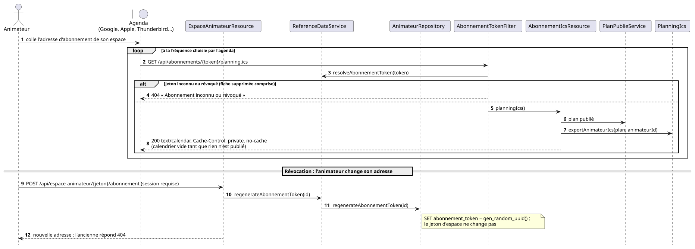

# Durcissement pour une exposition sur Internet

L'application a été écrite pour un usage en réseau de confiance : une seule
personne administre, les animateurs consultent leur planning par un lien. Ce
document rassemble ce que le service applique **de lui-même** quand on
l'ouvre sur Internet, et ce qui reste à la charge du déploiement.

L'authentification (Keycloak pour l'administration, l'espace animateur et MCP,
porte de secours, clé MCP) est résumée plus bas et détaillée dans
[`keycloak.md`](keycloak.md), [`api.md`](api.md) et [`mcp.md`](mcp.md).

## En-têtes de sécurité navigateur

`SecurityHeadersFilter` ajoute à **toute** réponse — fichiers statiques du SPA
compris — les en-têtes suivants :

| En-tête | Valeur | Pourquoi ici |
| --- | --- | --- |
| `Content-Security-Policy` | `planning.securite.csp` (voir ci-dessous) | Le SPA ne charge aucun script tiers hormis la balise Cloudflare Web Analytics : tout ce qui serait injecté dans une page est refusé à l'exécution |
| `Referrer-Policy` | `no-referrer` | Le jeton de l'espace animateur, celui de l'abonnement ICS **et** celui de l'affichage mural voyagent **dans l'URL** ; sans cet en-tête ils partent dans le `Referer` de chaque navigation sortante (lien d'attribution OpenStreetMap, lien vers le dépôt). Une exception pour les tuiles, ci-dessous |
| `X-Frame-Options` | `DENY` | Rien n'est prévu pour être encadré, et détourner un clic dans une session qui peut réécrire tout le planning n'a pas de contrepartie |
| `Cross-Origin-Opener-Policy` | `same-origin` | Isole la fenêtre de tout `window.opener` ouvert depuis un autre site |
| `X-Content-Type-Options` | `nosniff` | Les exports (PDF, ICS, SQL, CSV) sont servis avec leur type ; qu'un navigateur en devine un autre n'apporte rien |
| `Permissions-Policy` | `geolocation=(), camera=(), microphone=(), payment=()` | Aucune de ces API n'est utilisée — le sélecteur de carte place un point à la souris |
| `Strict-Transport-Security` | `planning.securite.hsts`, **seulement sur une visite HTTPS** | Un an, sous-domaines compris. Absent sur la pile locale, qui est en clair |
| `X-Robots-Tag` | `noindex, nofollow` | Un outil de planification interne n'a rien à faire dans un moteur de recherche, et la seule URL qu'un robot peut atteindre sans compte — l'espace d'un animateur — **est** son jeton d'accès. Non réglable, contrairement à la CSP : il n'existe pas de page à référencer ici |

### Ne pas être référencé, dit trois fois

`robots.txt` (à la racine, recopié depuis `src/main/webui/public/`) interdit
tout à tous les robots ; une balise `<meta name="robots">` dans `index.html`
répète la consigne dans la page ; l'en-tête ci-dessus la répète sur **chaque
réponse**. Les trois ne font pas double emploi :

- le **fichier** est une consigne qu'un robot est libre d'ignorer, et il ne dit
  rien d'une URL déjà connue ;
- la **balise** n'existe qu'une fois la page interprétée comme du HTML — elle
  ne couvre ni un PDF exporté, ni un flux ICS, ni une réponse d'API ;
- l'**en-tête** est le seul des trois qui *désindexe* une adresse déjà
  atteinte. C'est le cas qui compte : un lien d'espace circule par courriel,
  et il suffit qu'il soit collé une fois sur une page publique pour être
  visité.

### `script-src` interdit tout `on*=""`, et ce que ça oblige à désactiver

Pas d'`'unsafe-inline'`, pas d'`'unsafe-hashes'` : le navigateur refuse **tout
attribut `on*=""`**. C'est la posture voulue, mais elle rend une optimisation
d'Angular silencieusement destructrice.

L'*inlining du CSS critique* sert la vraie feuille de style en
`media="print" onload="this.media='all'"`. Quand la CSP bloque ce gestionnaire,
**la feuille reste en `print`** : rien ne lève d'erreur, et tout ce que
l'extraction n'a pas retenu disparaît — une police d'icônes, par exemple.

`inlineCritical` est donc **désactivé**, et `scripts/check-csp-index.js` échoue
le build si l'`index.html` produit contient le moindre gestionnaire inline. Ni
le build (le HTML est valide) ni les tests (ils ne chargent jamais
`index.html`) ne peuvent voir le problème : une violation de CSP n'apparaît que
dans un vrai navigateur. Elle est donc vérifiée sur l'artefact.

Trois exceptions volontaires :

- **la CSP s'arrête au seuil de `/q/*`** : Swagger UI y sert des scripts inline
  que le projet ne contrôle pas. Les autres en-têtes s'y appliquent ;
- **HSTS n'est envoyé que sur une visite HTTPS** — un navigateur l'ignorerait
  en clair, et le poser en local épinglerait `localhost` en https ;
- **les tuiles de la carte échappent au `no-referrer`** :
  `tile.openstreetmap.org` [bloque le trafic sans `Referer`](https://osm.wiki/blocked),
  la carte resterait grise. `MapPicker` pose donc
  `referrerPolicy: 'strict-origin-when-cross-origin'` sur sa seule couche de
  tuiles. Le jeton ne fuit pas : cette politique n'envoie que l'origine, jamais
  le chemin ni la requête.

### Réglage

| Variable | Défaut | Usage |
| --- | --- | --- |
| `CSP` | politique ci-dessus | Politique de sécurité du contenu complète. **Vide = en-tête désactivé** |
| `HSTS` | `max-age=31536000; includeSubDomains` | **Vide = en-tête désactivé**. N'ajoutez `preload` qu'après avoir décidé que le domaine ne resservira jamais en clair : c'est irréversible à l'échelle du navigateur |

La CSP par défaut laisse volontairement `connect-src https:` et `img-src https:`
ouverts : l'endpoint Bugsink et le serveur de tuiles sont propres à chaque
déploiement. Un déploiement qui connaît les siens gagne à les nommer dans `CSP`
plutôt qu'à garder `https:` — en y ajoutant `https://api.github.com` s'il tient
à l'indication « nouvelle version disponible » de la barre d'outils, la seule
autre destination qu'un navigateur contacte de lui-même, et seulement une fois
la session d'administration confirmée
([`versioning.md`](versioning.md) § 3).

`style-src` garde `'unsafe-inline'` dans tous les cas : Angular Material écrit
ses styles dans la page.

## Plafonds du serveur HTTP

| Variable | Défaut | Ce qu'elle borne |
| --- | --- | --- |
| `MAX_BODY_SIZE` | `10M` | Taille maximale d'un corps de requête. C'est l'**import de dump SQL** (`POST /api/database/import`, un script rejoué en entier) qui la dimensionne : un déploiement qui n'utilise pas l'import gagne à la descendre franchement |
| `MAX_CONNECTIONS` | `500` | Connexions simultanées acceptées |

Le plafond de connexions est ce qui empêche d'épuiser le serveur en ouvrant des
connexions sans jamais rien envoyer. `500` est large au regard de l'usage réel,
donc sans effet sur le trafic légitime.

L'**import CSV des animateurs** ajoute deux bornes qui lui sont propres, plus
serrées que `MAX_BODY_SIZE` et écrites dans le code plutôt qu'en configuration :
1 000 000 de caractères et 5 000 lignes de données. Le fichier est lu en
mémoire d'un seul tenant, et une liste de bénévoles pèse quelques dizaines de
kilo-octets — un plafond commun avec celui des dumps SQL laisserait dix
mégaoctets de marge à un import qui n'en a aucun besoin. Le fichier n'est
jamais écrit sur disque : voir [`rgpd.md`](rgpd.md).

Ces plafonds ne remplacent pas ceux du reverse proxy, qui doit rester la
première ligne (limitation de débit par IP, plafond de connexions par client,
délais d'attente).

## Authentification : Keycloak, et la porte de secours

Depuis l'[ADR 0049](decisions/0049-keycloak-obligatoire-comptes-nominatifs.md),
tout le monde entre par **Keycloak** — administrateurs, animateurs, clients MCP
en OAuth2 — et le realm impose un second facteur au rôle `admin`. Mise en place
et exploitation : [`keycloak.md`](keycloak.md). Ce qui compte ici :

- **Refus par défaut.** `/api/*` exige le rôle `admin`, nommé : un animateur
  connecté reçoit `403`. Les seules routes ouvertes sans ce rôle sont listées
  dans `application.properties`, chacune avec sa raison, et
  `PolitiquesHttpStructuralTest` refuse toute nouvelle exception qui n'y
  figure pas.
- **Le rôle ordinaire `user` n'ouvre rien**, ni politique HTTP ni espace : il
  est donné à tout compte du realm, et un privilège bâti dessus atteindrait
  chaque futur compte sans que personne ne l'ait accordé.
- **L'espace animateur** exige le rôle `animateur` et une adresse
  **vérifiée** par le realm, égale à celle de la fiche que le lien désigne. Une
  adresse non vérifiée est une adresse que n'importe qui ayant pu créer un
  compte aurait pu taper.
- **Les droits fins vivent dans l'application** : tables `compte` et
  `habilitation`, par édition, avec expiration, jamais supprimées. Désactiver
  un compte dans l'application lui retire tous ses rôles, ceux du realm
  compris — l'interrupteur que l'organisateur tire sans la console Keycloak.
  Les rôles délégués (RH, responsable de stand) n'ouvrent encore aucune route.
- **Le masquage côté écran n'est pas une protection.** Cacher une entrée de
  menu ou garder une route Angular est du confort ; la protection est la
  politique HTTP et la projection servie par l'API.

**La porte de secours.** Le compte embarqué `admin` / `ADMIN_PASSWORD` et son
formulaire ne servent que le jour où le realm ne répond plus. Fermée par défaut
(`ADMIN_SECOURS_ENABLED=false`), `/j_security_check` répond `409` sans lire le
mot de passe, et une session ouverte pendant l'incident perd son rôle dès la
fermeture. Ouverte, c'est la porte la plus faible de l'application — un mot de
passe partagé, sans second facteur — et l'application l'écrit dans son journal
à chaque démarrage. À ouvrir le temps d'un incident, à refermer ensuite.

**Révéler la clé MCP** demande plus qu'une session : pour une session
Keycloak, une connexion au realm de moins de cinq minutes (`auth_time`) ; pour
le compte de secours, le mot de passe retapé.

## Limitation de débit

### Débit des déclarations de disponibilités

`POST /api/espace-animateur/{jeton}/disponibilites` (issue #291) est la
**première route qui écrit** depuis l'espace, et l'espace est ouvert sur
Internet avec une URL pour tout justificatif. Deux bornes, qui ne se remplacent
pas :

- le **volume** est borné par le métier — une seule proposition en attente par
  animateur, garantie par un index unique partiel (`V59`) : renvoyer mille fois
  laisse une ligne, et l'admin n'a jamais deux versions contradictoires de la
  même personne à arbitrer ;
- le **rythme** est borné ici. Sans plafond, une session ouverte écrit et
  notifie à la vitesse du réseau. Personne ne déclare ses disponibilités vingt
  fois en dix minutes ; celui qui se corrige n'atteint jamais le plafond.

| Variable | Défaut | Usage |
| --- | --- | --- |
| `ESPACE_DECLARATION_MAX_ENVOIS` | `20` | Déclarations tolérées par animateur et par fenêtre |
| `ESPACE_DECLARATION_FENETRE` | `PT10M` | Durée de la fenêtre |

La demande de covoiturage (`POST /api/espace-animateur/{jeton}/covoiturage`)
est la seconde écriture de la collecte : même plafond, même fenêtre de temps,
mais un **compteur à part** — se corriger d'un côté n'épuise pas l'autre. Son
volume est borné de la même façon, par une seule demande en attente par
animateur.

Au-delà, `429` avec un `Retry-After`, comme pour les codes. Le compte est tenu
**par animateur** et non par adresse IP : la session nomme déjà l'animateur, et
une IP est ce qu'un téléphone change entre deux cellules. Les deux compteurs
partagent la même arithmétique (`SlidingWindowCounter`) pour qu'ils ne dérivent
pas l'un de l'autre.

Deux garde-fous de plus, côté contenu : un jour hors des dates de l'événement
et une typologie inconnue sont refusés, et la déclaration **n'écrit rien dans
le référentiel** — elle attend une décision explicite de l'admin. Un porteur de
jeton ne peut donc pas modifier les données d'entrée du solveur, seulement
proposer.

### Consultation des postes d'un collègue

`GET /api/espace-animateur/{jeton}/collegues/{id}/postes` alimente le choix
« son créneau que je veux en échange ». L'accès est **large par conception** :
l'espace remet déjà à chaque animateur la liste nominative de ses collègues, et
une réponse ne dit que des créneaux et des stands — ce que le planning global
imprimé fait circuler. Il n'est pas restreint aux « collègues pertinents » :
un échange dirigé peut viser n'importe qui, et un filtre viderait la liste au
moment où l'animateur en a besoin.

Ce qui est borné, c'est **l'énumération** : sans plafond, une session enchaîne
autant de requêtes qu'il y a d'animateurs et reconstitue toute la grille, mineurs
compris. Le plafond compte les **collègues différents**, pas les requêtes :
revoir le même, recharger la page ou hésiter entre trois ne coûte rien, et
quelqu'un qui cherche un échange n'en regarde jamais quarante en une heure.

| Variable | Défaut | Usage |
| --- | --- | --- |
| `ESPACE_COLLEGUES_MAX` | `40` | Collègues différents consultables par animateur et par fenêtre |
| `ESPACE_COLLEGUES_FENETRE` | `PT1H` | Durée de la fenêtre |

Au-delà, `429` + `Retry-After`, compté par animateur comme les déclarations. Un
id inexistant compte comme un vrai : sonder les ids coûte autant que les lire.
Le refus **ne bloque jamais la demande d'échange** : la liste reste vide avec le
délai affiché, et la demande part sans créneau souhaité en retour.

Deux gardes de plus, qui ne comptent rien mais ferment la route :

- **la foire doit être ouverte.** La règle est déclarée **sur la route**
  (`@FoireOpenRequired`), dans la forme des deux gardes voisines : on lit les
  trois exigences d'un coup d'œil au lieu de chercher un contrôle au fond d'une
  méthode. Le filtre tourne **après** l'authentification, donc un appelant
  anonyme reçoit son `401` sans apprendre si la foire est ouverte. Les
  écritures de la foire gardent leur contrôle dans le service — c'est là qu'est
  l'application réelle de la règle, et elle ne doit pas dépendre d'une route
  annotée ; elles portent en outre leur autorisation dans le `WHERE` de leur
  requête, le motif le plus sûr ;
- **le collègue doit exister dans l'édition**, sinon `404` nu. Un `200 []`
  laisserait sonder les identifiants existants, et un corps d'erreur ne
  donnerait à lire qu'à celui qui sonde.

**Reste ouvert** : remplacer le trombinoscope entier par une recherche à la
frappe. C'est le seul resserrement qui s'attaquerait à l'**agrégat** lui-même —
une session pouvant, dans les limites du plafond, reconstituer une part du
planning nominatif de l'événement, mineurs compris.

### Débit du serveur MCP

`/mcp` est la seule surface authentifiée dont l'identifiant est une **clé
partagée à longue durée de vie**, dans un en-tête, sans session ni second
facteur. Rien ne bornait le rythme auquel on pouvait l'essayer, ni celui auquel
son porteur pouvait appeler — et les outils MCP lancent une résolution,
réécrivent les référentiels et lisent le planning de chacun.

`McpRateLimiter` compte **toutes** les requêtes sous `/mcp`, authentifiées ou
non, par adresse. Au-delà du plafond : `429` + `Retry-After`, **y compris avec
la bonne clé**. Ne compter que les échecs laisserait une clé volée appeler au
rythme du réseau, et une clé collée dans un assistant hébergé voyage plus loin
qu'un mot de passe.

| Variable | Défaut | Usage |
| --- | --- | --- |
| `PLANNING_MCP_MAX_REQUESTS` | `120` | Requêtes tolérées par adresse et par fenêtre ; `0` ou moins désactive le plafond |
| `PLANNING_MCP_RATE_WINDOW` | `PT1M` | Durée de la fenêtre |
| `PLANNING_MCP_TRUSTED_PROXIES` | *(la valeur de `CONNEXION_PROXYS_FIABLES`)* | Proxys inverses dont `X-Forwarded-For` est cru |

La fenêtre est **fixe, ouverte à la première requête** : passé le plafond, elle
se referme quand même à l'heure — une requête refusée ne la repousse pas. C'est
l'inverse des deux verrous (celui-ci dessous, et celui de la connexion), dont la
fenêtre court depuis le dernier échec, et la différence tient à ce que chacun
garde : un verrou veut qu'une tentative de plus ne rapporte rien, un plafond de
débit veut qu'un client légitime qui l'a touché sache quand revenir.

#### Le verrou sur les clés refusées

Le plafond ci-dessus **ne rend pas la clé difficile à deviner** : à 120 requêtes
par minute, une adresse dispose de plus de sept mille essais par heure. Ce qui
rend une clé impraticable à deviner, c'est son entropie ; ce second garde fait
qu'une **série d'essais coûte du temps** plutôt que rien.

`McpRateLimiter` compte donc aussi les **clés refusées**, séparément du débit :
au-delà de `PLANNING_MCP_MAX_FAILURES` échecs consécutifs, l'adresse reçoit
`429` pendant `PLANNING_MCP_LOCKOUT_DURATION`, **y compris avec la bonne clé** —
sans quoi il suffirait d'attendre son tour.

| Variable | Défaut | Usage |
| --- | --- | --- |
| `PLANNING_MCP_MAX_FAILURES` | `5` | Clés refusées consécutives tolérées par adresse ; `0` ou moins désactive le verrou |
| `PLANNING_MCP_LOCKOUT_DURATION` | `PT10M` | Durée du blocage, comptée depuis le **dernier** échec |

Deux garde-fous qui évitent qu'il se retourne contre un client légitime :

- **une requête sans clé ne compte pas.** Elle reçoit son `401` et rien d'autre :
  un client pas encore configuré sonde avant d'être réglé, et le verrouiller
  pour ça punirait le seul cas qui n'est pas une attaque ;
- **une requête qui s'authentifie efface la série.** Un en-tête corrigé à
  l'essai suivant ne coûte donc rien.

Un `403` — la session admin d'un navigateur, qui ne porte pas le rôle `mcp` — ne
compte ni n'efface : aucune clé n'y a été essayée.

> **Le succès se lit sur le statut, jamais sur `context.user()`.** Quarkus pose
> une identité sur le contexte de routage même pour une requête qu'il s'apprête
> à refuser, donc `user() != null` est vrai sur les `401` aussi. La première
> version de ce verrou s'en servait comme test de succès : elle effaçait la série
> à chaque tentative et ne comptait rien du tout.

L'adresse retenue est celle que décrit le verrou de connexion, au mot près, et
c'est le même code (`ClientAddress`) qui la calcule : lecture de
`X-Forwarded-For` **par la droite**, et seulement si la connexion elle-même vient
d'un proxy déclaré. `PLANNING_MCP_TRUSTED_PROXIES` reprend par défaut la valeur
de `CONNEXION_PROXYS_FIABLES` — les proxys sont un fait du déploiement, pas d'un
endpoint —, et une valeur **vide** compte comme absente : un fichier compose qui
transmet la variable non renseignée la pose à la chaîne vide, que le repli
`${A:${B:}}` de la configuration ne tient pas pour manquante. Sans ce repli en
Java, tout appel à `/mcp` arrivant par le proxy tombait sur un seul compteur. Voir [`mcp.md`](mcp.md#limitation-de-débit) pour le réglage du
plafond selon l'usage.

> **Derrière un proxy, cette liste n'est pas facultative ici.** Le verrou de
> connexion ne compte que des échecs, et un déploiement qui n'a rien déclaré
> reste utilisable : il faut cinq mauvais mots de passe pour gêner quelqu'un.
> Ce plafond-ci compte **chaque requête**, alors sans la liste tous les appels
> arrivant par le proxy tombent sur un seul compteur, et un appelant anonyme y
> tient le client MCP légitime en `429` à deux requêtes par seconde — sans clé,
> puisque le filtre passe avant l'authentification. Renseignez
> `CONNEXION_PROXYS_FIABLES` en même temps que `PLANNING_MCP_API_KEY`.

### Verrouillage du compte de secours

Le compte de secours, `admin`, n'a pas de second facteur : une seule paire
d'identifiants ouvre les données personnelles de ~150 personnes, mineurs
compris. Fermé par défaut ; quand il s'ouvre pour un incident, ce verrou le
garde. `/j_security_check` acceptait pourtant les tentatives au rythme du
réseau — alors que la révélation de la clé MCP se verrouillait déjà au bout de
cinq essais.

Au-delà de `CONNEXION_MAX_ECHECS` échecs consécutifs, l'adresse reçoit `429`
+ `Retry-After` pendant `CONNEXION_DUREE_BLOCAGE`, **y compris avec le bon mot
de passe** : sans quoi il suffirait d'attendre son tour. Une connexion réussie
efface le compteur, et la fenêtre court depuis le dernier échec réel.

| Variable | Défaut | Usage |
| --- | --- | --- |
| `CONNEXION_MAX_ECHECS` | `5` | Échecs consécutifs tolérés par adresse |
| `CONNEXION_DUREE_BLOCAGE` | `PT15M` | Durée du verrouillage, comptée depuis le dernier échec |

Succès et échec répondent tous deux une redirection vers la **même page**, donc
ni le statut ni `Location` ne les distinguent. Les deux se lisent ailleurs :
l'échec par l'`AuthenticationFailureEvent` de Quarkus, qui porte le contexte
HTTP donc l'adresse ; le succès sur la requête elle-même — l'événement Quarkus
correspondant ne transporte aucun contexte, donc aucune adresse à qui rendre
son crédit.

**L'adresse retenue est l'entrée la plus à droite de `X-Forwarded-For` qui n'est
pas un proxy déclaré**, et l'en-tête n'est lu que si la connexion elle-même
vient d'un proxy déclaré dans `CONNEXION_PROXYS_FIABLES`. Sans cette liste —
le défaut — l'en-tête est entièrement ignoré et c'est l'adresse de connexion qui
compte : sûr par construction, et correct pour un déploiement sans proxy.

Lire l'en-tête **par la gauche** est ce qui rendait le verrou inopérant. Un proxy
*ajoute* son entrée plutôt que de remplacer l'en-tête, donc le premier élément
est celui que le client a écrit : un `X-Forwarded-For` forgé par tentative
achetait un compteur neuf.

`QUARKUS_HTTP_PROXY_TRUSTED_PROXIES` **ne ferme pas ce trou**, et il ne faut pas
compter dessus pour cela : il décide si Quarkus lit l'en-tête, jamais quel
élément il retient — `ForwardedParser` prend toujours le premier. Passer par
`remoteAddress()` ne corrigeait donc rien non plus. C'est la raison pour laquelle
le verrou lit l'en-tête lui-même, par la droite, avec sa propre liste de proxys.

**Renseignez `CONNEXION_PROXYS_FIABLES`** avec les adresses de vos proxys inverses,
telles qu'elles apparaissent côté application. Sans elle, tous les visiteurs
derrière le proxy partagent un compteur, et le premier attaquant venu verrouille
la connexion de tout le monde.

Le réglage accepte des **adresses littérales et des blocs CIDR**, séparés par des
virgules : `172.18.0.0/16`, ou `127.0.0.1,10.0.0.0/8`. Une entrée mal formée
empêche le démarrage plutôt que d'être ignorée — sans quoi vous croiriez avoir
déclaré votre proxy pendant que le verrou compterait tout le monde ensemble.

Déclarer un bloc, c'est faire confiance à toutes les machines qu'il contient.
C'est la bonne granularité pour un réseau privé dont les membres sont vos
propres services, et la mauvaise pour une plage publique.

> **Derrière un tunnel (Pangolin, Cloudflare Tunnel, `newt`…)**, l'adresse à
> déclarer n'est ni celle du client, ni l'IP publique du proxy : c'est celle du
> client de tunnel **tel que votre application le voit**, c'est-à-dire un
> conteneur sur un réseau bridge. Cette adresse est attribuée à l'attachement et
> bouge au redémarrage ; le sous-réseau, lui, est fixé à la création du réseau.
> D'où le bloc :
>
> ```bash
> docker network inspect <réseau> -f '{{(index .IPAM.Config 0).Subnet}}'
> # → 172.18.0.0/16, la valeur à passer en CONNEXION_PROXYS_FIABLES
> ```
>
> Vérifiez d'abord que l'en-tête arrive : si votre client de tunnel relaie en
> TCP sans que rien n'ait posé `X-Forwarded-For` en amont, ce réglage ne vous
> apportera rien et il faut d'abord le faire ajouter côté proxy.

Ce verrou ne remplace pas la limitation de débit par IP du proxy, qui vaut pour
tout le reste — exports, résolution, API entière.

## Abonnement ICS : le second jeton, et ce qu'il permet exactement

`GET /api/abonnements/{token}/planning.ics` est la **seule** route de
l'application qu'une URL seule ouvre. Elle existe parce qu'un client d'agenda
abonné ne porte aucun cookie et ne sait pas répondre à un défi
d'authentification : sans elle, l'abonnement serait un `401` à la première
resynchronisation.



<sub>Source : [`diagrammes/abonnement-ics.puml`](diagrammes/abonnement-ics.puml).</sub>

### Pourquoi un jeton de plus plutôt que le jeton d'espace

Le jeton d'espace ne suffit à rien seul : il faut encore la session Keycloak
de la personne dont la fiche porte l'adresse. Le réutiliser ici en aurait fait, sur cette
route, une preuve d'accès complète et durable au planning nominatif sans second
facteur — et un lien imprimé sur un PDF circule.

Le jeton d'abonnement est donc une clé séparée (`animateur.abonnement_token`),
avec la même génération que l'autre (`gen_random_uuid()`, 122 bits d'aléa,
unicité globale) et un cycle de vie indépendant. Voir
[décision 0019](decisions/0019-jeton-et-chemin-dedies-pour-l-abonnement-ics.md).

### Ce qu'il permet, exactement

Qui détient un jeton d'abonnement peut lire, indéfiniment et sans rien d'autre,
**un seul document** : le planning publié de son propriétaire — ses vacations,
ses stands, et les coéquipiers que son PDF individuel imprime déjà. C'est une
donnée nominative, et il faut le lire ainsi : ce jeton dit *qui travaille où et
quand*, pour une personne.

Il ne permet **rien** d'autre. Il n'ouvre pas l'espace animateur, ne lit ni les
demandes d'échange, ni les disponibilités, ni le trombinoscope, ne télécharge
pas le PDF, et n'écrit nulle part. Le garde qui le résout est lié à une seule
route (`@AbonnementTokenRequired`), et le jeton d'espace ne fonctionne pas sur
cette route — ni l'inverse. `AbonnementIcsTest` vérifie les deux sens.

### Révocation

**L'animateur révoque lui-même**, depuis son espace (« cette adresse a fuité,
la remplacer ») : l'adresse n'est jamais affichée ailleurs que là, donc son
porteur est la seule personne en position de savoir qu'elle a fuité, et
atteindre ce bouton coûte déjà le jeton d'espace **et** la session Keycloak — une
preuve plus forte que celle que l'abonnement demandera jamais. La rotation tue
l'ancienne adresse immédiatement et n'affecte pas le jeton d'espace : le lien
déjà imprimé sur un PDF survit.

Une fiche supprimée ou une édition supprimée emportent leur jeton avec elles :
l'adresse cesse simplement d'exister (`404`). Il n'existe pas d'état « abonné /
non abonné » : le jeton existe toujours, et ne sert que si quelqu'un s'en est
servi.

Ce qui **n'existe pas**, et qui est un manque assumé : un geste côté admin pour
révoquer l'abonnement de quelqu'un d'autre. Un exploitant qui doit couper
l'accès d'une personne partie supprime sa fiche, ce qui coupe tout. Ajouter le
bouton à l'écran Animateurs est un ajout d'écran, pas de modèle.

### Le jeton dans le chemin, et les journaux

Même défaut que le jeton d'espace, et la même conséquence : il atterrit tel
quel dans les journaux d'accès du reverse proxy, **et il y atterrit beaucoup
plus souvent** — un client d'agenda resynchronise seul, plusieurs fois par
jour, depuis chaque appareil. Ces journaux se purgent ou s'écrivent sans ces
chemins (voir la dernière section). `Referrer-Policy: no-referrer` couvre le
reste : le jeton ne part dans le `Referer` d'aucune navigation sortante.

### Pas de limiteur de débit ici, et pourquoi

`AdminLoginLimiter` et `McpRateLimiter` bornent des choses précises : des
tentatives d'authentification et — pour le second — l'usage d'une clé partagée
qui ouvre tout, plus les essais pour la deviner. Cette route ne fait rien de
tout cela — elle lit, sans effet de bord, sur un jeton qui n'ouvre qu'un document.

Un plafond par animateur y serait **contre-productif** : un abonnement se
resynchronise tout seul, depuis un téléphone, un ordinateur et une tablette à
la fois, à un rythme que l'application ne choisit pas. Le plafond ne
distinguerait pas l'abus de l'usage, et un flux coupé au mauvais moment se
manifeste par un agenda silencieusement figé — exactement le symptôme que cette
fonctionnalité supprime.

Reste l'énumération : elle n'est pas praticable sur 122 bits d'aléa, un jeton
inconnu ne répond qu'un `404` portant une phrase fixe (« Abonnement inconnu ou
révoqué »), la même pour un jeton révoqué que pour un jeton inventé — elle ne
renseigne donc sur rien —, et **la limitation par IP du reverse proxy reste la
première ligne**, comme pour les exports et le reste de l'API.

Ce qui **reste ouvert** : rien ne borne le coût d'un client mal réglé qui
appellerait toutes les minutes. Chaque appel reconstruit le plan publié, comme
le fait déjà le téléchargement de l'espace, donc ce n'est pas une classe de
charge nouvelle — mais c'est la première qui soit déclenchée par une machine
plutôt que par un humain.

### La règle côté proxy d'accès

Le préfixe `/api/abonnements/` **n'existe que pour cette route**, et c'est sa
raison d'être : un proxy d'accès qui authentifie ses visiteurs (Pangolin et
consorts) a besoin d'un motif d'URL qui ne désigne que le flux à excepter.

| À configurer | Valeur |
| --- | --- |
| Exception d'authentification | `/api/abonnements/*` — et **ce préfixe seul** |
| Ce qu'il ne faut pas faire | élargir l'exception à `/api/espace-animateur/*` : cela ouvrirait du même geste toutes les routes de l'espace, dont la seule écriture publique |

Côté application, la même exception est déclarée dans `application.properties`
(`quarkus.http.auth.permission.abonnement-ics`), et `AuthentificationAdminTest`
vérifie à la fois qu'elle s'applique et qu'elle **ne déborde pas** du préfixe.

## Affichage mural : un troisième jeton, pour un écran sans surveillance

`GET /api/mural/{jeton}` est la route que lit la TV de la salle de contrôle, et
la **seule** sous le préfixe `/api/mural/`, exempté de l'authentification admin
comme l'est `/api/abonnements/`. Le raisonnement est celui de l'abonnement ICS,
appliqué à un écran : une TV reste allumée des jours dans une pièce où passent
des bénévoles, et une session admin laissée dessus — prolongée par le
rafraîchissement de l'écran lui-même — y donnerait l'écriture sur tout le
planning. Voir la
[décision 0053](decisions/0053-affichage-mural-par-jeton-dedie.md).

### Ce qu'il permet, exactement

Une lecture, pour **une** édition : les stands ouverts du jour, qui les tient
(prénom et initiale du nom, ou nom complet si le lien a été créé ainsi), les
places libres, les pauses sans relais et la consigne du jour. Rien d'autre : pas
le référentiel, pas les exports, pas l'espace animateur, aucune écriture. Ni
téléphone, ni e-mail, ni âge, ni motif d'absence. Le jeton ne fonctionne sur
aucune autre route, et un jeton d'espace ou d'abonnement ne fonctionne pas sur
celle-ci : `AffichageMuralSecurityTest` le vérifie sous la vraie politique
d'authentification.

### Création, stockage, révocation

L'administrateur crée les liens depuis **Paramètres → Affichage mural**, avec un
libellé, l'option des noms complets et, au besoin, les emplacements affichés
(une TV par zone). Le jeton — 256 bits d'aléa — n'est montré **qu'une fois**, à
la création : la base n'en garde que l'empreinte SHA-256, comme les sessions de
l'espace. Une copie de la base ne rouvre donc aucun écran, et une adresse perdue
se remplace par un nouveau lien. La liste montre la date du dernier accès, à la
minute près. Révoquer coupe l'écran à sa lecture suivante ; supprimer l'édition
emporte ses liens. Un jeton inconnu et un jeton révoqué reçoivent le même `404`,
avec la même phrase. Création et révocation sont journalisées ; les lectures ne
le sont pas — une par minute et par écran n'est pas une trace.

Les liens ne voyagent ni dans l'export SQL ni dans la duplication d'une édition :
ce sont des accès de cette instance, pas des données du jeu. Revers attendu :
**importer un dump SQL les supprime tous**, puisque l'import vide les éditions et
que les liens partent avec elles en cascade — y compris pour une édition que le
dump recrée à l'identique. Les liens se recréent depuis Paramètres après chaque
import, et chaque TV se rouvre sur sa nouvelle adresse.

### Débit, cache et journaux

`AffichageMuralRateLimiter` porte deux gardes, et aucune ne compte les
lectures valides d'une adresse :

- **les lectures refusées, par adresse.** Seul un `404` — jeton inconnu ou
  révoqué — compte. Au-delà du plafond, l'adresse reçoit `429` avec un
  `Retry-After` pour tout jeton qu'elle n'a pas déjà lu avec succès, jusqu'à une
  fenêtre après son dernier refus : essayer des jetons coûte du temps, et ne
  touche plus la base ;
- **les lectures, par lien valide** : un plafond large, qui borne ce qu'une
  adresse fuitée peut tirer, un lien pouvant être ouvert sur plusieurs écrans.

Un jeton déjà servi (retenu en mémoire par son empreinte, jamais en clair)
passe donc même quand son adresse est verrouillée : du bruit venu de la même
adresse ne coupe jamais un écran. C'est ce qui compte **derrière un proxy non
déclaré** — `CONNEXION_PROXYS_FIABLES` vide, le défaut —, où toutes les requêtes
portent l'adresse du proxy : un plafond sur toutes les requêtes laissait trente
requêtes au hasard par minute, venues de n'importe où, éteindre toutes les TV de
l'événement. Ce que la déclaration des proxys garde nécessaire : sans elle, un
tel bruit verrouille l'adresse partagée, et un écran **nouveau** — ou le premier
affichage après un redémarrage, qui vide la mémoire — attend la fin de la
fenêtre. L'adresse se lit comme pour les autres plafonds.

| Variable | Défaut | Usage |
| --- | --- | --- |
| `AFFICHAGE_MURAL_MAX_REFUS` | `30` | Lectures refusées tolérées par adresse avant le verrou ; `0` le coupe |
| `AFFICHAGE_MURAL_MAX_LECTURES_PAR_LIEN` | `120` | Lectures servies par lien et par fenêtre ; `0` coupe le plafond |
| `AFFICHAGE_MURAL_FENETRE` | `PT1M` | Durée du verrou (depuis le dernier refus) et de la fenêtre par lien |

La réponse porte `Cache-Control: no-store` (elle nomme des personnes et change
chaque minute) et, comme toutes les réponses, `X-Robots-Tag: noindex`. Le jeton
voyage dans le chemin et revient **toutes les minutes** dans les journaux
d'accès du reverse proxy : mêmes précautions que pour l'abonnement (voir la
dernière section). Côté application, il ne part chez aucun tiers : la page
`/mural/*` ne charge pas le beacon Cloudflare, et les rapports d'erreur des deux
côtés remplacent le jeton de `/mural/…` et de `/api/mural/…` par `<jeton>`,
comme celui de l'espace (`observabilite.md`).

### La règle côté proxy d'accès

| À configurer | Valeur |
| --- | --- |
| Exception d'authentification | `/api/mural/*` — et **ce préfixe seul**, en plus de la route SPA `/mural/*` qui ne porte aucune donnée |
| Ce qu'il ne faut pas faire | élargir l'exception à `/api/affichage-mural/*` : c'est la gestion des liens, réservée à l'admin |

Côté application : `quarkus.http.auth.permission.affichage-mural`.

## Analyse statique : les suppressions et leur justification

Le job `code` de `securite.yml` (Semgrep OSS) fait échouer la CI sur toute
règle qui trouve, quelle que soit sa sévérité. Une règle atteint aujourd'hui
neuf endroits du code, tous pour la même raison, et tous annotés `nosemgrep`
**site par site** plutôt que désactivés en bloc : une nouvelle concaténation
SQL non annotée continue donc de faire rougir la CI.

`java.lang.security.audit.formatted-sql-string` signale toute requête
construite par concaténation. Dans ce dépôt, ce qui est concaténé est
**toujours un identifiant** — un nom de table ou de colonne —, et SQL ne
permet pas de lier un identifiant en paramètre : `SELECT * FROM ?` n'existe
pas. Ces identifiants viennent sans exception de littéraux écrits dans le code
appelant ou de listes constantes (`DatabaseDumpService.TABLES`), jamais d'une
entrée utilisateur ; l'import de dump vérifie même la sienne contre
`ALLOWED_TABLES`. Les **valeurs**, elles, voyagent toutes en paramètres liés
(`ps.setString`, `ps.setLong`, `ps.setObject`).

**Avant d'ajouter un `nosemgrep`**, vérifier les appelants : si un identifiant
peut venir d'une requête HTTP, c'est une injection SQL et non un faux positif.
C'est ce qui a été fait pour ces neuf-là — chaque site d'appel passe une chaîne
littérale.

## Déploiement

`docker-compose.yml` est une pile de **développement** : elle publie PostgreSQL
sur l'hôte, ajoute pgAdmin en `admin/admin` sans mode serveur, un puits SMTP
qui n'envoie rien, et des mots de passe `festival`/`admin`. Rien de tout cela
n'a à exister sur une machine exposée — et « on changera les mots de passe »
n'enlève ni pgAdmin ni le port 5432.

`docker-compose.prod.yml` est la pile correspondante :

```bash
docker compose -f docker-compose.prod.yml --env-file .env.prod up -d
```

Ce qu'elle change :

- **un seul port publié**, sur la boucle locale (`127.0.0.1:8080`) : le reverse
  proxy est le seul chemin d'entrée ;
- **PostgreSQL n'est plus publié du tout** — seul le réseau interne le voit ;
- **ni pgAdmin ni Mailpit** ;
- **aucune valeur par défaut sur les secrets** : `DB_PASSWORD`,
  `OIDC_CLIENT_SECRET`, `SESSION_ENCRYPTION_KEY`, `PUBLIC_URL`, `MAIL_HOST` et
  `MAIL_FROM` font échouer le démarrage si l'environnement ne les fournit pas,
  plutôt que de laisser passer un identifiant de développement ;
- **un répertoire de sauvegarde** de l'hôte (`./backup`) monté sur `BACKUP_DIR`, où la tâche de nuit écrit
  ses `pg_dump`. C'est le seul endroit où l'application écrit sur le disque, et
  ces fichiers sont le jeu de données complet en clair — noms, dates de
  naissance et adresses des animateurs, mineurs compris. Ils se traitent comme
  la base elle-même : accès restreint sur l'hôte, recopie hors machine
  chiffrée, et jamais dans un ticket ni sur une instance de démonstration.
  L'application ne les expose par aucun endpoint, et il ne faut pas les servir
  depuis le reverse proxy non plus.
- **deux sondes publiques**, `/q/health/live` et `/q/health/ready`, sans
  session : une sonde externe ou un orchestrateur ne sait pas s'authentifier.
  Elles ne rendent que `UP`/`DOWN`, le nom de leurs contrôles et deux compteurs
  de migrations. Le contrôle de source de données de Quarkus est coupé pour
  cette raison : en échec, il recopiait le message du pilote — donc l'hôte et
  le port de la base — dans la réponse. Voir [`exploitation.md`](exploitation.md) § 7.
- **le port 9000 n'est pas publié** : c'est l'interface de management, qui
  sert les métriques Prometheus (`/q/metrics`) **sans authentification**. Sa
  seule protection est de n'être joignable que du réseau interne de la pile ;
  l'image ne le déclare pas en `EXPOSE` pour qu'un `docker run -P` ne le
  publie pas par mégarde. Le port applicatif ne sert pas les métriques (`404`,
  `MetricsEndpointTest`), et aucune étiquette ne porte de jeton, d'adresse ni
  d'identifiant — voir [`observabilite.md`](observabilite.md) § Métriques.

### Ce qui reste à la charge du reverse proxy

L'application ne peut pas s'en occuper à sa place, et ces points sont des
**prérequis** de ce qui précède :

| À faire | Pourquoi |
| --- | --- |
| Terminer le TLS et rediriger tout le trafic http vers https | HSTS et le flag `Secure` du cookie de l'espace ne s'activent que sur une visite HTTPS |
| **Renseigner `CONNEXION_PROXYS_FIABLES`** avec les adresses de vos proxys inverses (littérales ou blocs CIDR) | Sans elle, les deux plafonds par adresse ignorent `X-Forwarded-For` et comptent tous les visiteurs derrière le proxy sur un seul compteur — sûr, mais le premier attaquant venu verrouille tout le monde. **Obligatoire dès que `/mcp` sert** : ce plafond-là compte chaque requête, pas les seuls échecs. **Obligatoire aussi dès qu'un lien d'affichage mural existe** : sans elle, quelques requêtes au hasard verrouillent l'adresse du proxy, et un écran nouvellement branché — ou relancé après un redémarrage de l'application — n'affiche rien jusqu'à la fin du verrou. `QUARKUS_HTTP_PROXY_TRUSTED_PROXIES` ne remplace pas ce réglage : il décide si l'en-tête est lu, jamais quel élément est retenu |
| **Rendre l'origine injoignable autrement que par le proxy** (pare-feu, réseau) | Sans cela, `X-Forwarded-Proto` reste forgeable, et un attaquant qui joint l'origine directement est compté sur sa vraie adresse — ce qui est correct, mais le prive du bénéfice de la liste ci-dessus |
| Limiter le débit par adresse IP sur tout le site | Les plafonds de l'application sont ciblés (compte de secours, déclarations et consultations de l'espace, serveur MCP, affichage mural) ; le reste — exports, résolution, API — n'en a pas. Keycloak a ses propres protections contre la force brute, à activer dans le realm |
| Journaliser sans les URL de l'espace animateur, **de l'abonnement ICS ni de l'affichage mural**, ou purger ces journaux | Les trois jetons voyagent **dans le chemin** : ils atterrissent tels quels dans les journaux d'accès, l'abonnement y revient à chaque synchronisation d'un agenda et l'affichage mural chaque minute |
| Ne jamais router le port 9000 (métriques), ni le publier sur l'hôte | Il n'a pas d'authentification : il est protégé par le réseau, pas par un mot de passe. Un scraper hors de la pile passe par un tunnel ou un réseau privé, pas par le proxy public |
| Réserver `/q/health/*` à la source de la supervision, si elle est connue | Rien de sensible n'y est lu, mais une sonde n'a pas à être joignable par le monde entier ; le `healthcheck` du compose passe par la boucle locale et n'en dépend pas |
| Ne pas réintroduire le site dans un index (page d'accueil du proxy, sitemap, annuaire interne) | L'application dit trois fois qu'elle ne veut pas être référencée (voir ci-dessus) ; un lien depuis une page publique, lui, se remarque |

### Avant d'ouvrir : la liste courte

- [ ] Keycloak en place et `OIDC_*` renseignées ([`keycloak.md`](keycloak.md)) :
  `OIDC_CLIENT_SECRET` d'au moins 32 caractères, sinon l'application refuse de
  démarrer ; second facteur des administrateurs vérifié sur une vraie
  connexion ;
- [ ] `ADMIN_SECOURS_ENABLED` laissé à `false`, et `ADMIN_PASSWORD` long,
  généré, propre à ce déploiement quand même — resté sur l'exemple, comme
  `DB_PASSWORD`, il fait **refuser le démarrage** ;
- [ ] `SESSION_ENCRYPTION_KEY` définie (≥ 16 caractères) et gardée ;
- [ ] `DB_PASSWORD` changé ;
- [ ] `PUBLIC_URL` en `https://` ;
- [ ] `PLANNING_MCP_API_KEY` laissée vide tant que le serveur MCP ne sert à
      personne — vide, `/mcp` répond `401` à tout ; renseignée, elle appelle
      `CONNEXION_PROXYS_FIABLES` avec elle (voir ci-dessus) ;
- [ ] `CONNEXION_PROXYS_FIABLES` renseignée avant de créer un lien
      d'affichage mural, derrière un proxy (voir ci-dessus) ;
- [ ] variables `LEGAL_*` renseignées : `/mentions-legales` est public, et une
      page de mentions légales vide vaut absence de mentions légales. Cinq
      d'entre elles — éditeur, hébergeur, contact, base légale, conservation —
      **font échouer le démarrage**, donc cette case se coche toute seule ;
      les deux autres restent à votre main (`exploitation.md` §3) ;
- [ ] jeu de données de production chargé — jamais les fixtures de test.
